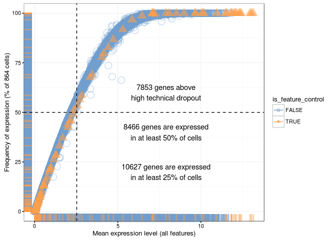
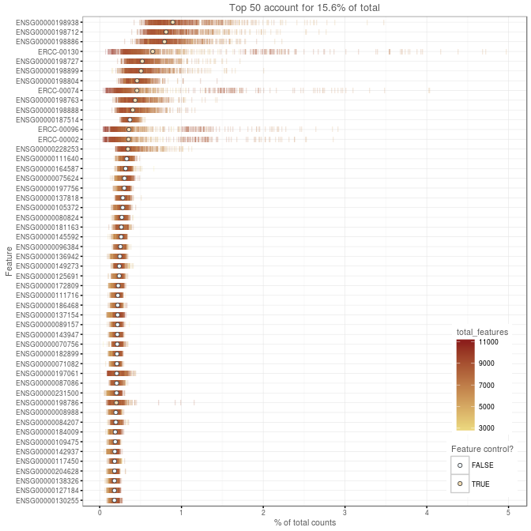
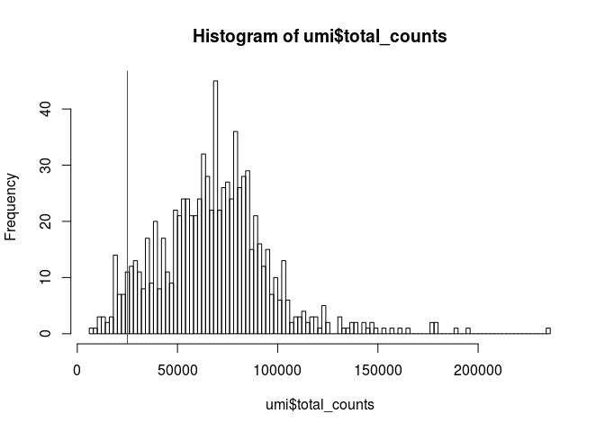
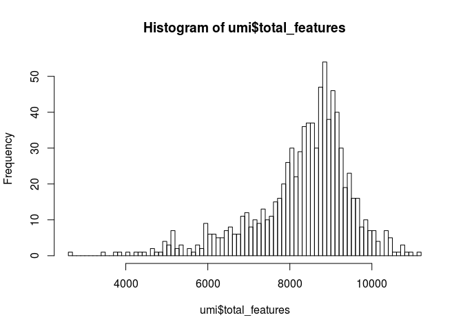
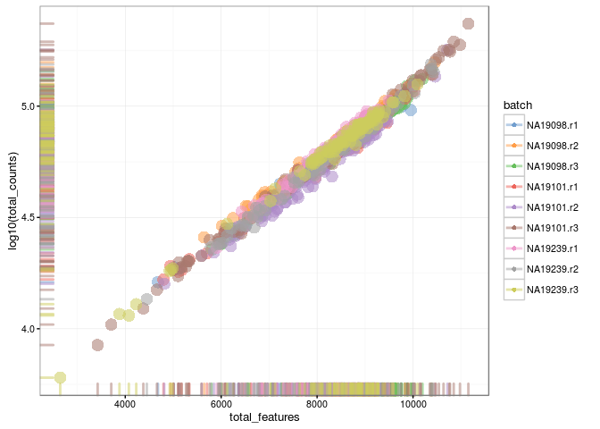
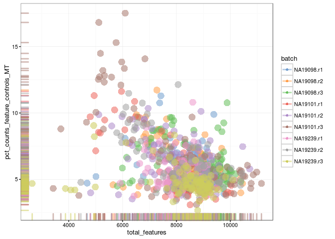
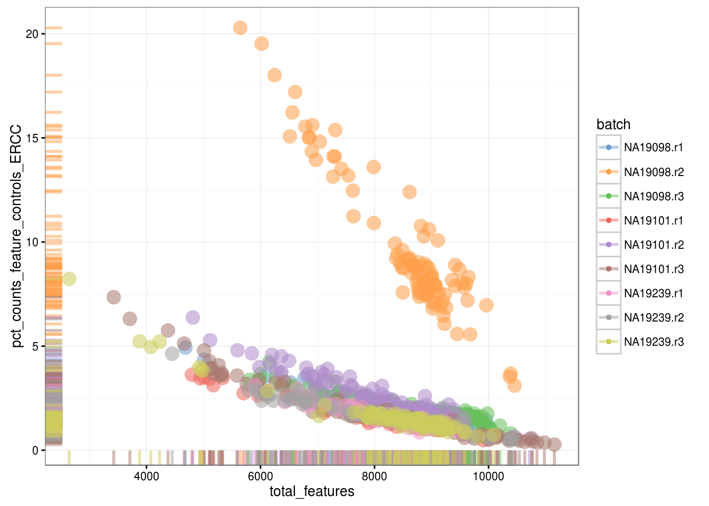
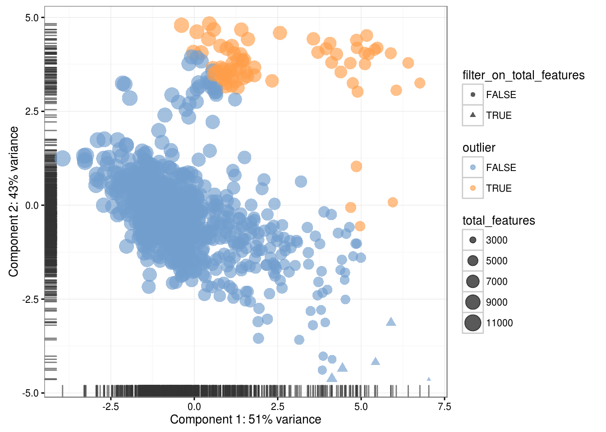
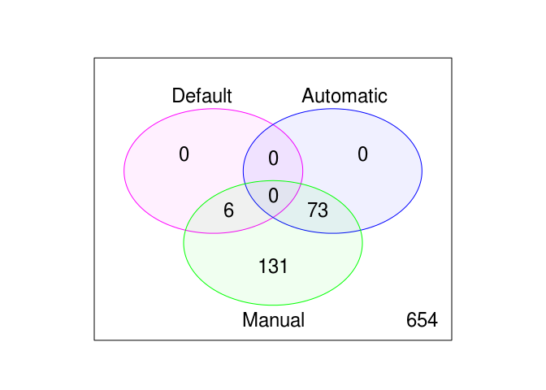

# Expression QC (UMI)

## Introduction

Once gene expression has been quantified the resulting expression
matrix must be examined for poor quality cells which were not detected
from QC of the raw reads. Failure to remove low quality cells at this
stage will add a large amount of technical noise which will obscure
the biological signals of interest in downstream analysis. We will
demonstrate some simple filters that can be applied directly to the
gene expression matrix with minimal extrinsic information.

Typically, the results are summarized using an __expression matrix__. In the expression matrix, each row represents a gene and
each column represents a cell.

To illustrate cell QC, we consider a
[dataset](http://jdblischak.github.io/singleCellSeq/analysis/) from
lymphoblast and induced pluripotent stem cells generated by John
Blischak in [Yoav Gilad](http://giladlab.uchicago.edu/)'s lab at the
University of Chicago. The experiments were carried out on the
Fluidigm C1 platform and to facilitate the quantification both unique
molecular identifiers (UMIs) and ERCC _spike-ins_ were used. For our purposes you need to download the files `annotation.txt`, `molecules.txt`, and `reads.txt` from [here](https://github.com/hemberg-lab/scRNA.seq.course/tree/master/inst/materials/blischak) into the `blischak` folder in your working directory. These files are the copies of the original files made on the 15/03/16. We will use these copies for reproducibility purposes.

To illustrate how one can standardise the analysis of scRNA-seq data we will also be using the [scater](https://github.com/davismcc/scater) package, described in the previous chapter.

## Blischak dataset


```r
library(scater, quietly = TRUE)
options(stringsAsFactors = FALSE)
```

Load the data and annotations:

```r
molecules <- read.table("blischak/molecules.txt", sep = "\t")
anno <- read.table("blischak/annotation.txt", sep = "\t", header = TRUE)
```

How does the data look like?

```r
knitr::kable(
    head(molecules[ , 1:3]), booktabs = TRUE,
    caption = 'A table of the first 6 rows and 3 columns of the molecules table.'
)
```


Table: (\#tab:unnamed-chunk-4)A table of the first 6 rows and 3 columns of the molecules table.

                   NA19098.r1.A01   NA19098.r1.A02   NA19098.r1.A03
----------------  ---------------  ---------------  ---------------
ENSG00000237683                 0                0                0
ENSG00000187634                 0                0                0
ENSG00000188976                 3                6                1
ENSG00000187961                 0                0                0
ENSG00000187583                 0                0                0
ENSG00000187642                 0                0                0

```r
knitr::kable(
    head(anno), booktabs = TRUE,
    caption = 'A table of the first 6 rows of the anno table.'
)
```


Table: (\#tab:unnamed-chunk-4)A table of the first 6 rows of the anno table.

individual   replicate   well   batch        sample_id      
-----------  ----------  -----  -----------  ---------------
NA19098      r1          A01    NA19098.r1   NA19098.r1.A01 
NA19098      r1          A02    NA19098.r1   NA19098.r1.A02 
NA19098      r1          A03    NA19098.r1   NA19098.r1.A03 
NA19098      r1          A04    NA19098.r1   NA19098.r1.A04 
NA19098      r1          A05    NA19098.r1   NA19098.r1.A05 
NA19098      r1          A06    NA19098.r1   NA19098.r1.A06 

The data consists of 3 individuals and 3 replicates and therefore has 9 batches in total.

Let's standardise the analysis by using the scater package described above. First, make scater SCESet classes:

```r
pheno_data <- new("AnnotatedDataFrame", anno)
rownames(pheno_data) <- pheno_data$sample_id
umi <- scater::newSCESet(
    countData = molecules,
    phenoData = pheno_data
)
```

Remove genes that are not expressed in any cell:

```r
keep_feature <- rowSums(is_exprs(umi)) > 0
umi <- umi[keep_feature, ]
```

Define control features (genes) - ERCC spike-ins and mitochondrial genes ([provided](http://jdblischak.github.io/singleCellSeq/analysis/qc-filter-ipsc.html) by the authors):

```r
ercc <- featureNames(umi)[grepl("ERCC-", featureNames(umi))]
mt <- c("ENSG00000198899", "ENSG00000198727", "ENSG00000198888",
        "ENSG00000198886", "ENSG00000212907", "ENSG00000198786",
        "ENSG00000198695", "ENSG00000198712", "ENSG00000198804",
        "ENSG00000198763", "ENSG00000228253", "ENSG00000198938",
        "ENSG00000198840")
```

Calculate the quality metrics:

```r
umi <- scater::calculateQCMetrics(
    umi,
    feature_controls = list(ERCC = ercc, MT = mt)
)
```

## Gene QC

### Gene dropouts

First, one can look at the gene expression frequency versus mean expression level to assess the effects of technical dropout in the dataset.


```r
scater::plotQC(umi, type = "exprs-freq-vs-mean")
```

<div class="figure" style="text-align: center">

<p class="caption">(\#fig:dropout-overview)Dropout rate vs mean expression</p>
</div>

Interestingly, only less than half of the genes are expressed in more than 50% of the cells.

### Gene expression

One can also look at the number of reads consumed by the top 50 expressed genes.


```r
scater::plotQC(umi, type = "highest-expression")
```

<div class="figure" style="text-align: center">

<p class="caption">(\#fig:top50-gene-expr)Number of total counts consumed by the top 50 expressed genes</p>
</div>

Not surprisingly, most of the very top expressed genes are either ERCCs or MT genes (Feature controls).

## Gene filtering

We can remove genes whose expression level is considered __"undetectable"__. We define a detectable gene expression level, in which at least 2 cells contain more than 1 read mapping to the gene.


```r
filter_genes <- apply(counts(umi), 1, function(x) length(x[x > 1]) >= 2)
fData(umi)$use <- filter_genes
```


```r
knitr::kable(
    as.data.frame(table(filter_genes)),
    booktabs = TRUE,
    row.names = FALSE,
    caption = 'The number of genes removed by gene filter (FALSE)'
)
```


Table: (\#tab:unnamed-chunk-10)The number of genes removed by gene filter (FALSE)

filter_genes     Freq
-------------  ------
FALSE            4512
TRUE            14214

Depending on the cell-type, protocol and sequencing depth, other cut-offs may be appropriate.

## Cell QC

### Library size

Next we will look at the total number of RNA molecules detected per
sample (if we were using read counts rather than UMI counts this would
be total reads). Wells with few reads/molecules are likely to have
been broken or failed to capture a cell, thus should be removed.


```r
hist(
    umi$total_counts,
    breaks = 100
)
```

<div class="figure" style="text-align: center">

<p class="caption">(\#fig:total-counts-hist)Histogram of library sizes for all cells</p>
</div>

__Exercise__

Apply a suitable filter to remove the cells that
contain too few molecules. What distribution do you expect that the
total number of molecules for each cell should follow?

__Answer__

```r
filter_by_total_counts <- (umi$total_counts > 10000)
```


```r
knitr::kable(
    as.data.frame(table(filter_by_total_counts)),
    booktabs = TRUE,
    row.names = FALSE,
    caption = 'The number of cells removed by total counts filter (FALSE)'
)
```


Table: (\#tab:unnamed-chunk-12)The number of cells removed by total counts filter (FALSE)

filter_by_total_counts    Freq
-----------------------  -----
FALSE                        2
TRUE                       862

### Detected genes (1)

One of the simplest measures of cell quality is the number of genes
that were detected. Cells with few detected genes may have been broken
or dead prior to capture.


```r
hist(
    umi$total_features,
    breaks = 100
)
```

<div class="figure" style="text-align: center">

<p class="caption">(\#fig:total-features-hist)Histogram of the number of detected genes in all cells</p>
</div>

Here we see that most cells have between 5,000-11,000 detected genes,
which is normal for high-depth scRNA-seq. However this varies by
experimental protocol and sequencing depth with droplet-based methods
or lower sequencing-depth detecting fewer genes per cell. The feature
to note is the __"heavy tail"__ of the left hand side of the
distribution. If detection rates were equal across the cells then the
distribution should be approximately normal. Thus we remove those
cells in the tail of the distribution (<5,000 detected genes).


```r
filter_by_expr_features <- (umi$total_features > 5000)
```


```r
knitr::kable(
    as.data.frame(table(filter_by_expr_features)),
    booktabs = TRUE,
    row.names = FALSE,
    caption = 'The number of cells removed by total features filter (FALSE)'
)
```


Table: (\#tab:unnamed-chunk-14)The number of cells removed by total features filter (FALSE)

filter_by_expr_features    Freq
------------------------  -----
FALSE                        16
TRUE                        848

### Detected genes (2)

Additionally, we can plot the library size as a function of the number of the detected genes. This will also allow us to find other cell outliers.


```r
scater::plotPhenoData(
    umi,
    aes(x = total_features, y = log10(total_counts), colour = batch)
)
```

<div class="figure" style="text-align: center">

<p class="caption">(\#fig:total-features-vs-counts)Library size vs number of detected genes</p>
</div>

### ERCCs and MTs

Another measures of cell quality is the ration between ERCC _spike-in_
RNAs and endogenous RNAs. This can be used to estimate the total amount
of RNA in the captured cells. Cells with a high level of _spike-in_ RNAs
had low starting amounts of RNA, likely due to the cell being
dead or stressed, or the RNA being degraded.


```r
scater::plotPhenoData(
    umi,
    aes_string(x = "total_features",
               y = "pct_counts_feature_controls_MT",
               colour = "batch")
)
```

<div class="figure" style="text-align: center">

<p class="caption">(\#fig:mt-vs-counts)Percentage of counts in MT genes</p>
</div>


```r
scater::plotPhenoData(
    umi,
    aes_string(x = "total_features",
               y = "pct_counts_feature_controls_ERCC",
               colour = "batch")
)
```

<div class="figure" style="text-align: center">

<p class="caption">(\#fig:ercc-vs-counts)Percentage of counts in ERCCs</p>
</div>

This analysis shows that majority of the cells from NA19098.r2 batch have a very high ERCC/Endo ratio. Indeed, it has been shown by the authors that this batch contains cells of smaller size. 

__Exercise__

Create filters for removing batch NA19098.r2 and cells with high expression of mitochondrial genes (>10% of total counts in a cell).

__Answer__


```r
filter_by_ERCC <- umi$batch != "NA19098.r2"
```

```r
knitr::kable(
  as.data.frame(table(filter_by_ERCC)),
  booktabs = TRUE,
  row.names = FALSE,
  caption = 'The number of cells removed by ERCC filter (FALSE)'
)
```


Table: (\#tab:unnamed-chunk-16)The number of cells removed by ERCC filter (FALSE)

filter_by_ERCC    Freq
---------------  -----
FALSE               96
TRUE               768

```r
filter_by_MT <- umi$pct_counts_feature_controls_MT < 10
```

```r
knitr::kable(
  as.data.frame(table(filter_by_MT)),
  booktabs = TRUE,
  row.names = FALSE,
  caption = 'The number of cells removed by MT filter (FALSE)'
)
```


Table: (\#tab:unnamed-chunk-18)The number of cells removed by MT filter (FALSE)

filter_by_MT    Freq
-------------  -----
FALSE             31
TRUE             833

## Cell filtering

### Default

To filter out outlier cells one could use the defaults provided by the scater package:

* __filter_on_total_features__: filter out cells based on their total_features being (by default) more than 5 median absolute deviations from the median total_features for the dataset

* __filter_on_total_counts__: filter out cells based on their log10-total_counts being (by default) more than 5 median absolute deviations from the median log10-total_counts for the dataset?

* __filter_on_pct_counts_feature_controls__: filter out cells on the basis that the percentage of counts from feature controls is higher than a defined threhold (default is 80%)?

* __is_cell_control__: filter out cells that were defined as controls


```r
umi$use_default <- (
    # remove cells with unusual numbers of genes
    !umi$filter_on_total_features &
    # sufficient molecules counted
    !umi$filter_on_total_counts &
    # sufficient endogenous RNA
    !umi$filter_on_pct_counts_feature_controls_ERCC &
    # remove cells with unusual number of reads in MT genes
    !umi$filter_on_pct_counts_feature_controls_MT &
    # controls shouldn't be used in downstream analysis
    !umi$is_cell_control
)
```


```r
knitr::kable(
  as.data.frame(table(umi$use_default)),
  booktabs = TRUE,
  row.names = FALSE,
  caption = 'The number of cells removed by default filter (FALSE)'
)
```


Table: (\#tab:unnamed-chunk-20)The number of cells removed by default filter (FALSE)

Var1     Freq
------  -----
FALSE       6
TRUE      858

This filtering can be performed even without looking at the plots above.

### Automatic

Another option available in __scater__ is to conduct PCA on a set of QC metrics. The advantage of doing this is that the QC metrics focus on technical aspects of the libraries that are likely to distinguish problematics cells. Automatic outlier detection on PCA plots using QC metrics is available to help identify potentially problematic cells.

By default, the following metrics are used for PCA-based outlier detection:

* __pct_counts_top_100_features__
* __total_features__
* __pct_counts_feature_controls__
* __n_detected_feature_controls__
* __log10_counts_endogenous_features__
* __log10_counts_feature_controls__

A particular set of variables to be used can be specified with the selected_variables argument as shown in the example below.


```r
umi <-
scater::plotPCA(umi,
                size_by = "total_features", 
                shape_by = "filter_on_total_features",
                pca_data_input = "pdata",
                detect_outliers = TRUE,
                return_SCESet = TRUE)
```

```
## The following cells/samples are detected as outliers:
## NA19098.r2.A01
## NA19098.r2.A02
## NA19098.r2.A06
## NA19098.r2.A09
## NA19098.r2.A10
## NA19098.r2.A12
## NA19098.r2.B01
## NA19098.r2.B03
## NA19098.r2.B04
## NA19098.r2.B05
## NA19098.r2.B07
## NA19098.r2.B11
## NA19098.r2.B12
## NA19098.r2.C01
## NA19098.r2.C02
## NA19098.r2.C03
## NA19098.r2.C04
## NA19098.r2.C05
## NA19098.r2.C06
## NA19098.r2.C07
## NA19098.r2.C08
## NA19098.r2.C09
## NA19098.r2.C10
## NA19098.r2.C11
## NA19098.r2.C12
## NA19098.r2.D01
## NA19098.r2.D02
## NA19098.r2.D03
## NA19098.r2.D04
## NA19098.r2.D07
## NA19098.r2.D08
## NA19098.r2.D09
## NA19098.r2.D10
## NA19098.r2.D12
## NA19098.r2.E01
## NA19098.r2.E02
## NA19098.r2.E03
## NA19098.r2.E04
## NA19098.r2.E05
## NA19098.r2.E06
## NA19098.r2.E07
## NA19098.r2.E12
## NA19098.r2.F01
## NA19098.r2.F02
## NA19098.r2.F07
## NA19098.r2.F08
## NA19098.r2.F09
## NA19098.r2.F10
## NA19098.r2.F11
## NA19098.r2.F12
## NA19098.r2.G01
## NA19098.r2.G02
## NA19098.r2.G03
## NA19098.r2.G05
## NA19098.r2.G06
## NA19098.r2.G08
## NA19098.r2.G09
## NA19098.r2.G10
## NA19098.r2.G11
## NA19098.r2.H01
## NA19098.r2.H02
## NA19098.r2.H03
## NA19098.r2.H04
## NA19098.r2.H05
## NA19098.r2.H06
## NA19098.r2.H07
## NA19098.r2.H08
## NA19098.r2.H10
## NA19098.r2.H12
## NA19101.r3.A02
## NA19101.r3.C12
## NA19101.r3.D01
## NA19101.r3.E08
## Variables with highest loadings for PC1 and PC2:
## 
##                                            PC1         PC2
## ---------------------------------  -----------  ----------
## pct_counts_top_100_features          0.4771343   0.3009332
## pct_counts_feature_controls          0.4735839   0.3309562
## n_detected_feature_controls          0.1332811   0.5367629
## log10_counts_feature_controls       -0.1427373   0.5911762
## total_features                      -0.5016681   0.2936705
## log10_counts_endogenous_features    -0.5081855   0.2757918
```

<div class="figure" style="text-align: center">

<p class="caption">(\#fig:auto-cell-filt)PCA plot used for automatic detection of cell outliers</p>
</div>


```r
knitr::kable(
  as.data.frame(table(umi$outlier)),
  booktabs = TRUE,
  row.names = FALSE,
  caption = 'The number of cells removed by automatic filter (FALSE)'
)
```


Table: (\#tab:unnamed-chunk-21)The number of cells removed by automatic filter (FALSE)

Var1     Freq
------  -----
FALSE     791
TRUE       73

### Manual

However, since we performed a more detailed analysis, visualized different features and defined our own filters we can use them instead of the default ones:


```r
umi$use <- (
    # sufficient features (genes)
    filter_by_expr_features &
    # sufficient molecules counted
    filter_by_total_counts &
    # sufficient endogenous RNA
    filter_by_ERCC &
    # remove cells with unusual number of reads in MT genes
    filter_by_MT
)
```


```r
knitr::kable(
  as.data.frame(table(umi$use)),
  booktabs = TRUE,
  row.names = FALSE,
  caption = 'The number of cells removed by manual filter (FALSE)'
)
```


Table: (\#tab:unnamed-chunk-23)The number of cells removed by manual filter (FALSE)

Var1     Freq
------  -----
FALSE     141
TRUE      723

## Compare filterings

__Exercise__

Compare the default, automatic and manual cell filters. Plot a Venn diagram of the outlier cells from these filterings.

__Hint__: Use `limma::vennCounts` and `limma::vennDiagram` functions from the [limma](https://bioconductor.org/packages/release/bioc/html/limma.html) package to make a Venn diagram.

__Answer__


```r
def <- colnames(umi)[!umi$use_default]
auto <- colnames(umi)[umi$outlier]
man <- colnames(umi)[!umi$use]
venn.diag <- limma::vennCounts(cbind(colnames(umi) %in% def,
                                     colnames(umi) %in% auto,
                                     colnames(umi) %in% man))
limma::vennDiagram(venn.diag,
                   names = c("Default", "Automatic", "Manual"),
                   circle.col = c("magenta", "blue", "green"))
```

<div class="figure" style="text-align: center">

<p class="caption">(\#fig:cell-filt-comp)Comparison of the default, automatic and manual cell filters</p>
</div>

## Save the data

Dimensions of the QCed dataset (do not forget about the gene filter we defined above):

```r
dim(umi[fData(umi)$use, pData(umi)$use])
```

```
## Features  Samples 
##    14214      723
```

Save the data:

```r
saveRDS(umi, file = "blischak/umi.rds")
```

## Exercise

Perform exactly the same QC analysis with read counts of the same Blischak data. Use `blischak/reads.txt` file to load the reads. Once you have finished please compare your results to ours (next chapter).
