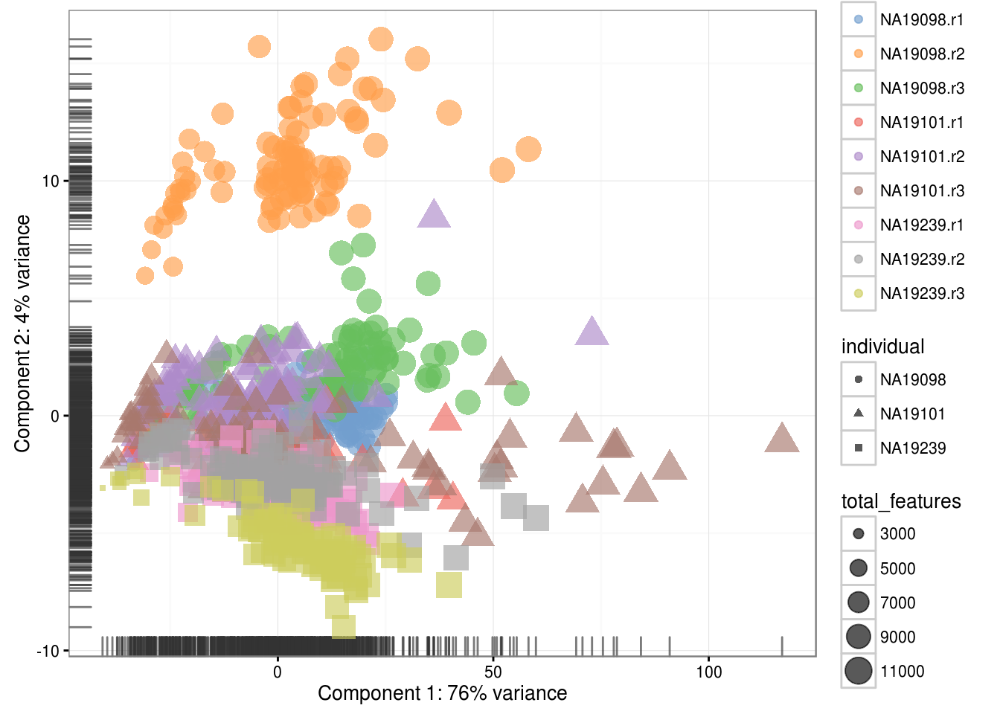
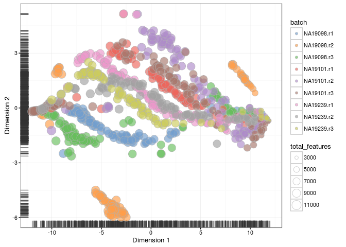
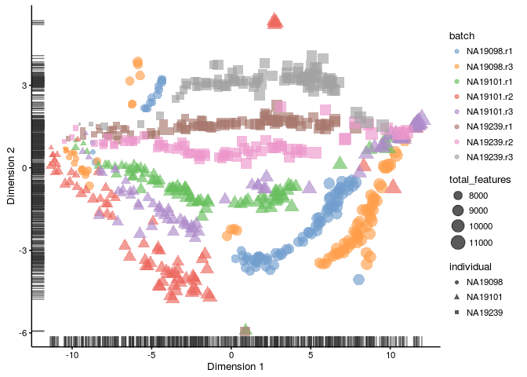

# Expression overview

## Introduction

Here we will continue to work with the filtered __blischak__ dataset produced in the previous chapter. We will look at what happened to the expression matrix after the quality control step.


```r
library(scater, quietly = TRUE)
options(stringsAsFactors = FALSE)
umi <- readRDS("blischak/umi.rds")
umi.qc <- umi[fData(umi)$use, pData(umi)$use]
endog_genes <- !fData(umi.qc)$is_feature_control
```

## PCA plot

The easiest thing to overview the data is to transform it using the principal component analysis and then visualize the first two principal components. Again the [scater](https://github.com/davismcc/scater) package provides several very useful functions to make this analysis straightforward.

### Before QC


```r
scater::plotPCA(umi[endog_genes, ],
                colour_by = "batch",
                size_by = "total_features",
                exprs_values = "counts")
```

<div class="figure" style="text-align: center">

<p class="caption">(\#fig:expr-overview-pca-before-qc)PCA plot of the blischak data</p>
</div>

### After QC


```r
scater::plotPCA(umi.qc[endog_genes, ],
                colour_by = "batch",
                size_by = "total_features",
                exprs_values = "counts")
```

<div class="figure" style="text-align: center">

<p class="caption">(\#fig:expr-overview-pca-after-qc)PCA plot of the blischak data</p>
</div>

## tSNE map

Another way of representing the data is a tSNE map. _We need to explain how tSNE works[dimensionality reduction + nearest neightbour network] & show the effect of changing the parameters (Also these plots look to me like the perplexity parameter is too low.)_

### Before QC


```r
scater::plotTSNE(umi[endog_genes, ],
                 colour_by = "batch",
                 size_by = "total_features",
                 exprs_values = "counts",
                 rand_seed = 123456)
```

<div class="figure" style="text-align: center">

<p class="caption">(\#fig:expr-overview-tsne-before-qc)tSNE map of the blischak data</p>
</div>

### After QC


```r
scater::plotTSNE(umi.qc[endog_genes, ],
                 colour_by = "batch",
                 size_by = "total_features",
                 exprs_values = "counts",
                 rand_seed = 123456)
```

<div class="figure" style="text-align: center">

<p class="caption">(\#fig:expr-overview-tsne-after-qc)tSNE map of the blischak data</p>
</div>

## Exercise

Perform the same analysis with read counts of the Blischak data. Use `blischak/reads.rds` file to load the reads SCESet object. Once you have finished please compare your results to ours (next chapter).
