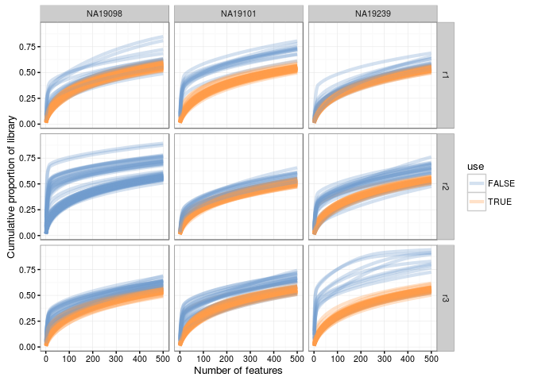
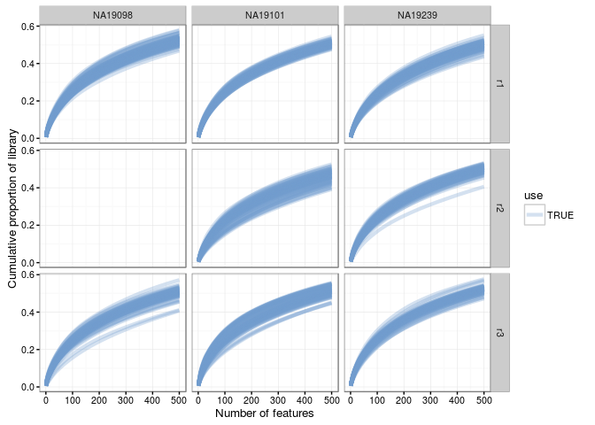
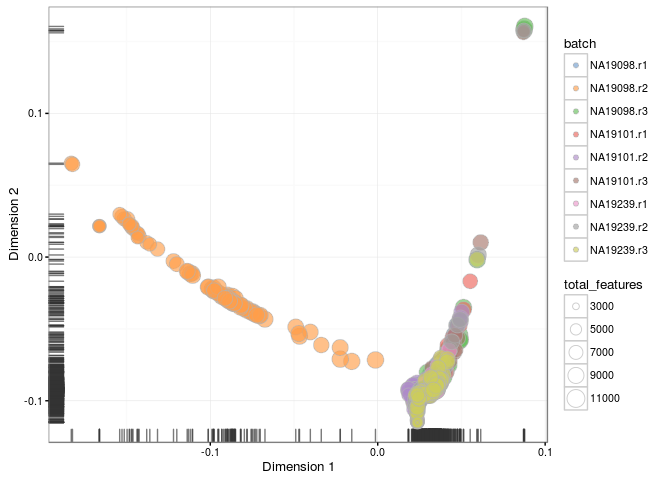
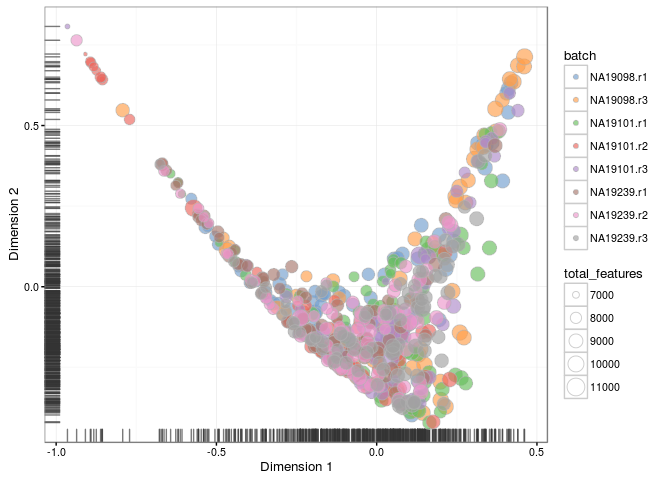

# Expression overview (Reads)

(\#fig:expr-overview-top500-before-qc-reads)Proportion of reads accounted by the top 500

(\#fig:expr-overview-top500-after-qc-reads)Proportion of reads accounted by the top 500

(\#fig:expr-overview-pca-before-qc-reads)PCA plot of the blischak data

(\#fig:expr-overview-pca-after-qc-reads)PCA plot of the blischak data

(\#fig:expr-overview-diff-before-qc-reads)Diffusion map of the blischak data

(\#fig:expr-overview-diff-after-qc-reads)Diffusion map of the blischak data

(\#fig:expr-overview-tsne-before-qc-reads)tSNE map of the blischak data

(\#fig:expr-overview-tsne-after-qc-reads)tSNE map of the blischak data

