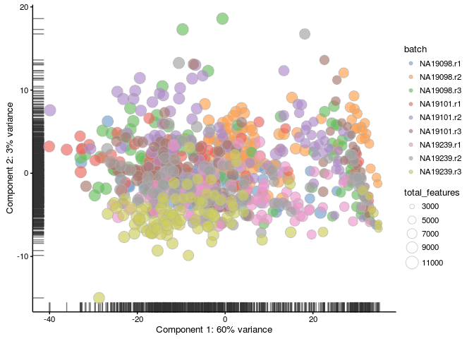
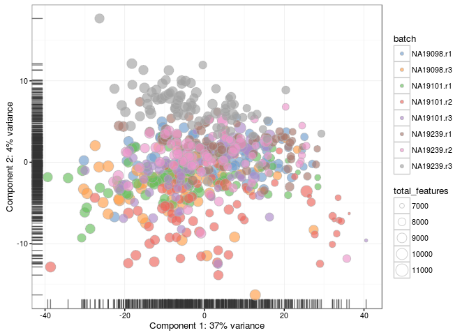
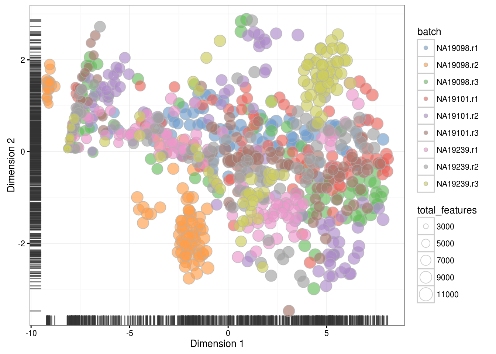
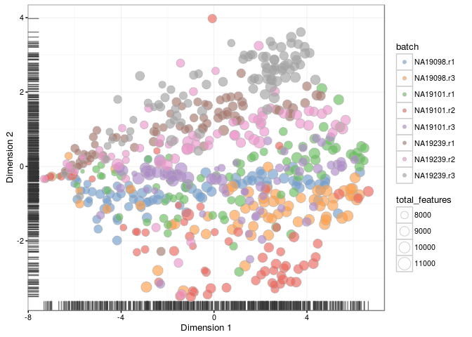
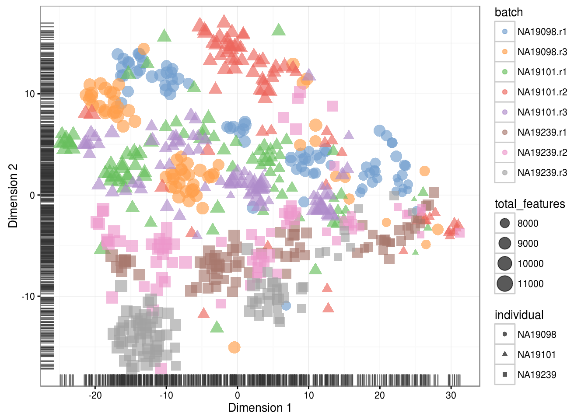

# Expression overview (Reads)

(\#fig:expr-overview-pca-before-qc-reads)PCA plot of the blischak data

(\#fig:expr-overview-pca-after-qc-reads)PCA plot of the blischak data

(\#fig:expr-overview-tsne-before-qc-reads)tSNE map of the blischak data

(\#fig:expr-overview-tsne-after-qc-reads)tSNE map of the blischak data

(\#fig:expr-overview-tsne-after-qc-exercise2-1)tSNE map of the blischak data (perplexity = 10)

(\#fig:expr-overview-tsne-after-qc-exercise2-2)tSNE map of the blischak data (perplexity = 200)

