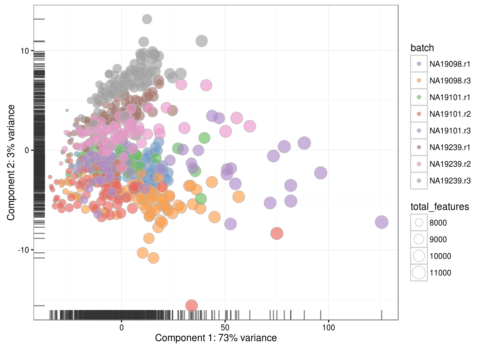
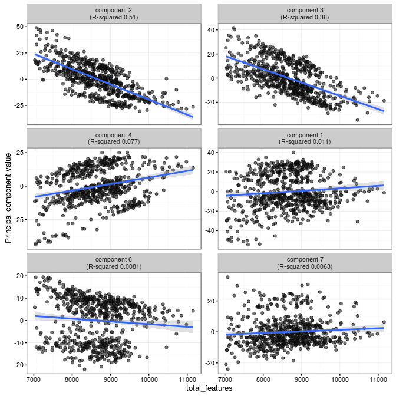
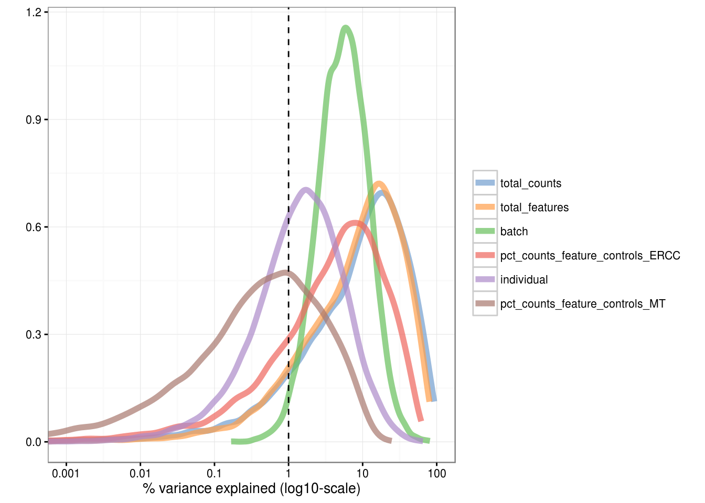

# Confounding factors

## Introduction

There are a very large number of potential confounders, artifacts and biases in sc-RNA-seq data One of the main challenges in analyzing scRNA-seq data stems from the fact that it is difficult to carry out a true technical replicate (why?) to distinguish biological and technical variability. Exploring the effects of such variabilities (both those recorded during the experiment and computed QC metrics) is crucial for appropriate modeling of the data.

The [scater](https://github.com/davismcc/scater) package provides a set of methods specifically for quality control of experimental and explanatory variables.

Here we will continue to work with the Blischak data that was used in the previous chapter.


```r
library(scater, quietly = TRUE)
options(stringsAsFactors = FALSE)
umi <- readRDS("blischak/umi.rds")
umi.qc <- umi[fData(umi)$use, pData(umi)$use]
# after QC we could get some genes with only 0 values
# we need to remove those
keep_feature <- rowSums(is_exprs(umi.qc)) > 0
umi.qc <- umi.qc[keep_feature, ]
endog_genes <- !fData(umi.qc)$is_feature_control
```

The `umi.qc` dataset contains filtered cells and genes. Our next step is to explore technical drivers of variability in the data to inform data normalisation before downstream analysis.

## Correlations with PCs

Let's first look again at the PCA plot of the QCed dataset:

```r
scater::plotPCA(umi.qc[endog_genes, ],
                colour_by = "batch",
                size_by = "total_features",
                exprs_values = "counts")
```

<div class="figure" style="text-align: center">

<p class="caption">(\#fig:confound-pca)PCA plot of the blischak data</p>
</div>

scater allows one to identify principle components that correlate with experimental and QC variables of interest (it ranks principle components by $R^2$ from a linear model regressing PC value against the variable of interest).

Let's test whether some of the variables correlate with any of the PCs.

### Detected genes


```r
scater::plotQC(umi.qc[endog_genes, ],
               type = "find-pcs",
               variable = "total_features")
```

<div class="figure" style="text-align: center">

<p class="caption">(\#fig:confound-find-pcs-total-features)PC correlation with the number of detected genes</p>
</div>

Indeed, we can see that PC1 can be completely explained by the number of the detected genes. In fact, it was also visible on the PCA plot above. This is a well-known issue in scRNA-seq and was described [here](http://biorxiv.org/content/early/2015/12/27/025528).

## Explanatory variables

scater can also compute the marginal $R^2$ for each variable when fitting a linear model regressing expression values for each gene against just that variable, and display a density plot of the gene-wise marginal $R^2$ values for the variables.


```r
scater::plotQC(umi.qc[endog_genes, ],
               type = "expl",
               exprs_values = "counts",
               variables = c("total_features",
                             "total_counts",
                             "batch",
                             "individual",
                             "pct_counts_feature_controls_ERCC",
                             "pct_counts_feature_controls_MT"))
```

<div class="figure" style="text-align: center">

<p class="caption">(\#fig:confound-find-expl-vars)Explanatory variables</p>
</div>

This analysis indicates that the number of detected genes (again) and also the sequencing depth (number of counts) have substantial explanatory power for many genes, so these variables are good candidates for conditioning out in a normalisation step, or including in downstream statistical models. Expression of ERCCs also appears to be an important explanatory variable.

## Other confounders

In addition to correcting for batch, there are other factors that one
may want to compensate for. As with batch correction, these
adjustments require extrinsic information. One popular method is
[scLVM](https://github.com/PMBio/scLVM) which allows you to identify
and subtract the effect from processes such as cell-cycle or
apoptosis.

## Exercise

Perform the same analysis with read counts of the Blischak data. Use `blischak/reads.rds` file to load the reads SCESet object. Once you have finished please compare your results to ours (next chapter).
