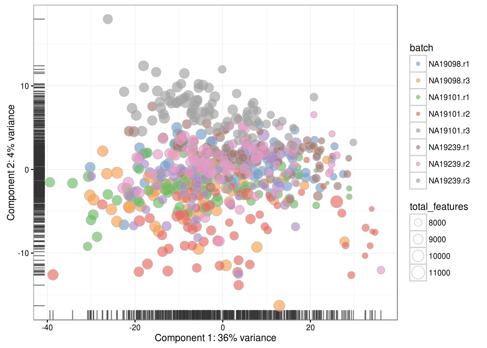
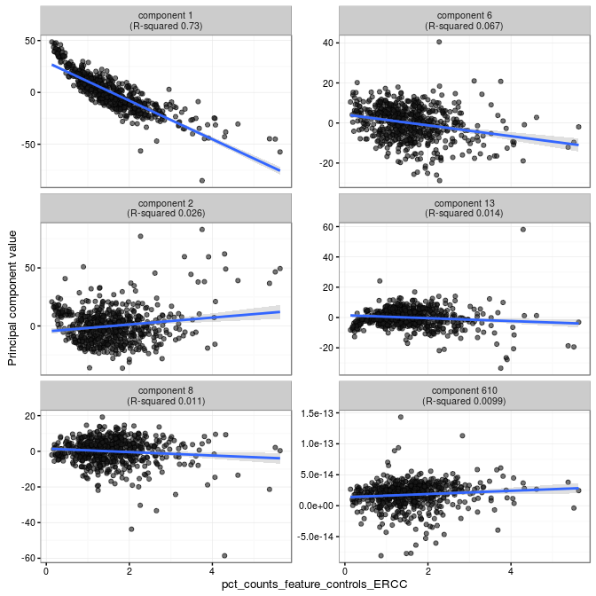
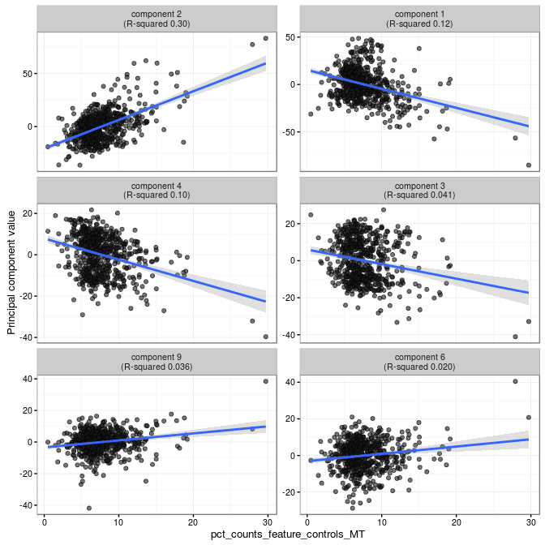

# Confounding factors (Reads)

(\#fig:confound-pca-reads)PCA plot of the blischak data

(\#fig:confound-find-pcs-total-features-reads)PC correlation with the number of detected genes

(\#fig:confound-find-pcs-erccs-reads)PC correlation with the percentage of reads in ERCCs

(\#fig:confound-find-pcs-mts-reads)PC correlation with the percentage of reads in MT genes

