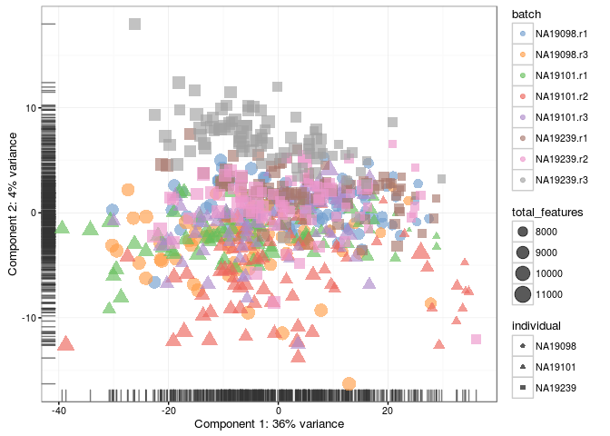
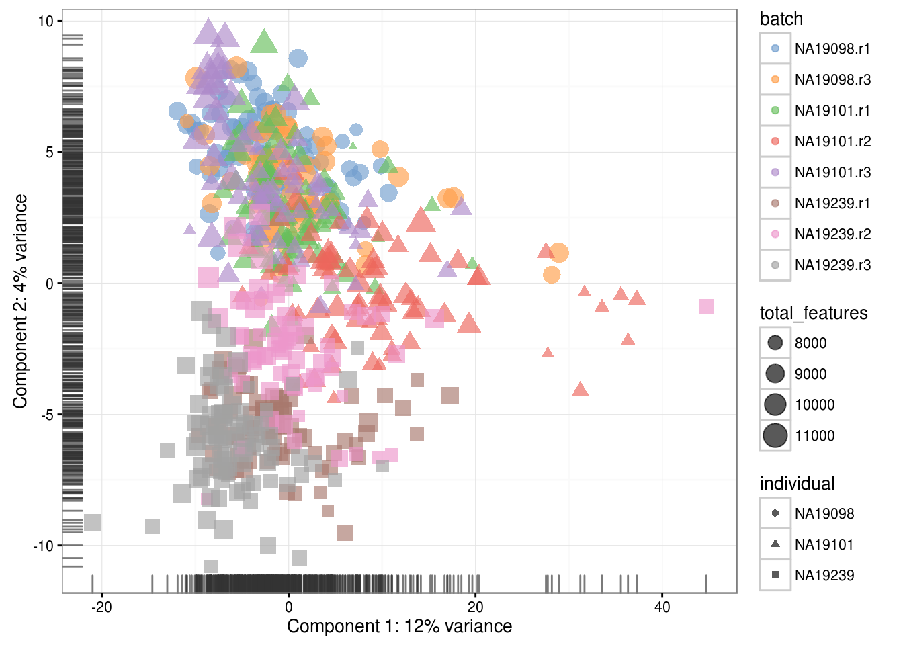
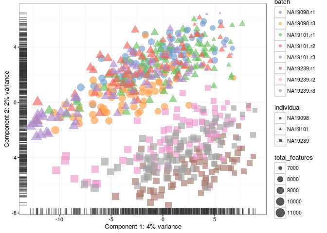
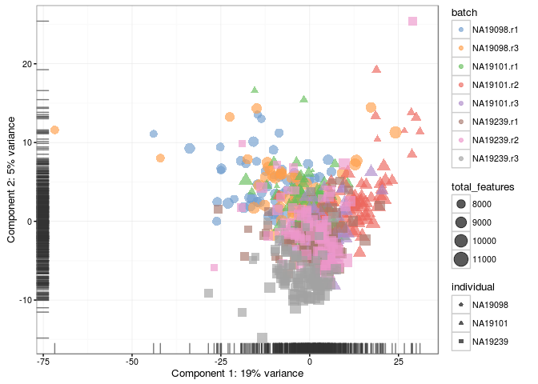
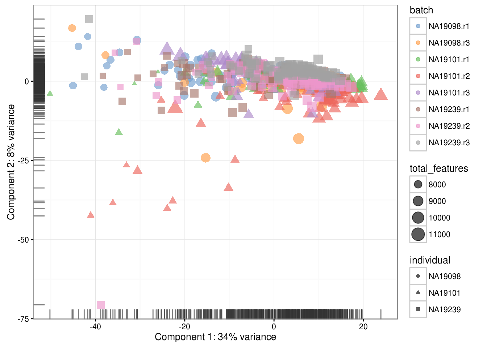
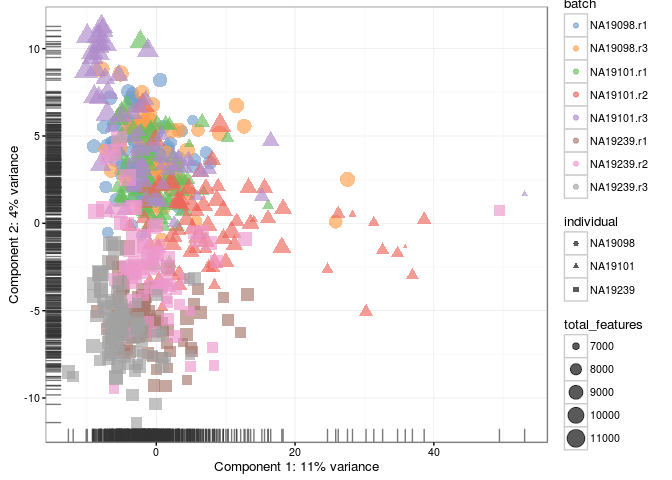

# Normalization for library size (Reads)

(\#fig:norm-pca-raw-reads)PCA plot of the blischak data

(\#fig:norm-pca-cpm-reads)PCA plot of the blischak data after CPM normalisation

(\#fig:norm-pca-log2-cpm-reads)PCA plot of the blischak data after log2(CPM) normalisation

(\#fig:norm-pca-tmm-reads)PCA plot of the blischak data after TMM normalisation

(\#fig:norm-pca-rle-reads)PCA plot of the blischak data after RLE normalisation

(\#fig:norm-pca-uq-reads)PCA plot of the blischak data after UQ normalisation

