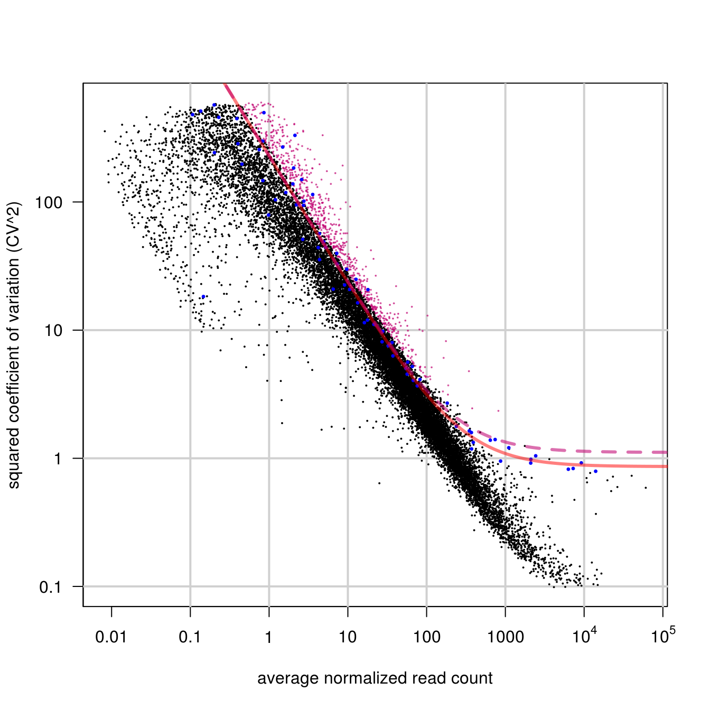
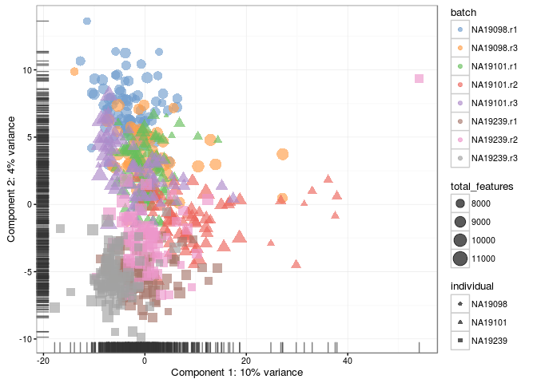
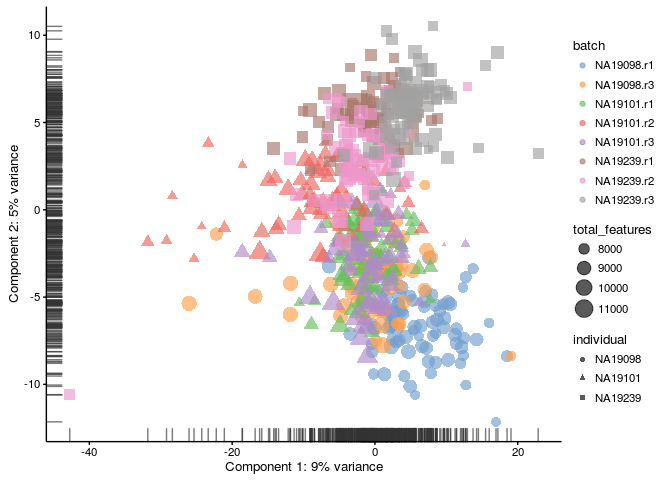
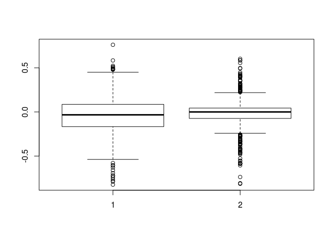

# Remove confounders using controls (Reads)


```
## Loading required package: statmod
```

```
## Warning in scRNA.seq.funcs::Brennecke_getVariableGenes(assayData(reads.qc)
## $norm_counts, : Only 17 spike-ins to be used in fitting, may result in poor
## fit.
```

```
## Warning in xy.coords(x, y, xlabel, ylabel, log): 7 x values <= 0 omitted
## from logarithmic plot
```

<div class="figure" style="text-align: center">

<p class="caption">(\#fig:rm-conf-brennecke-reads)Results of using the Brennecke method on the Blischak dataset</p>
</div>


<div class="figure" style="text-align: center">

<p class="caption">(\#fig:rm-conf-pca-rle-reads)PCA plot of the blischak data after RLE normalisation</p>
</div>

<div class="figure" style="text-align: center">

<p class="caption">(\#fig:rm-conf-pca-rle-ruv-reads)PCA plot of the blischak data after RLE and RUV normalisations</p>
</div>

<div class="figure" style="text-align: center">

<p class="caption">(\#fig:rm-conf-rle-comp-reads)Comparison of the relative log expression of the blischak data before and after the RUV normalisation</p>
</div>
