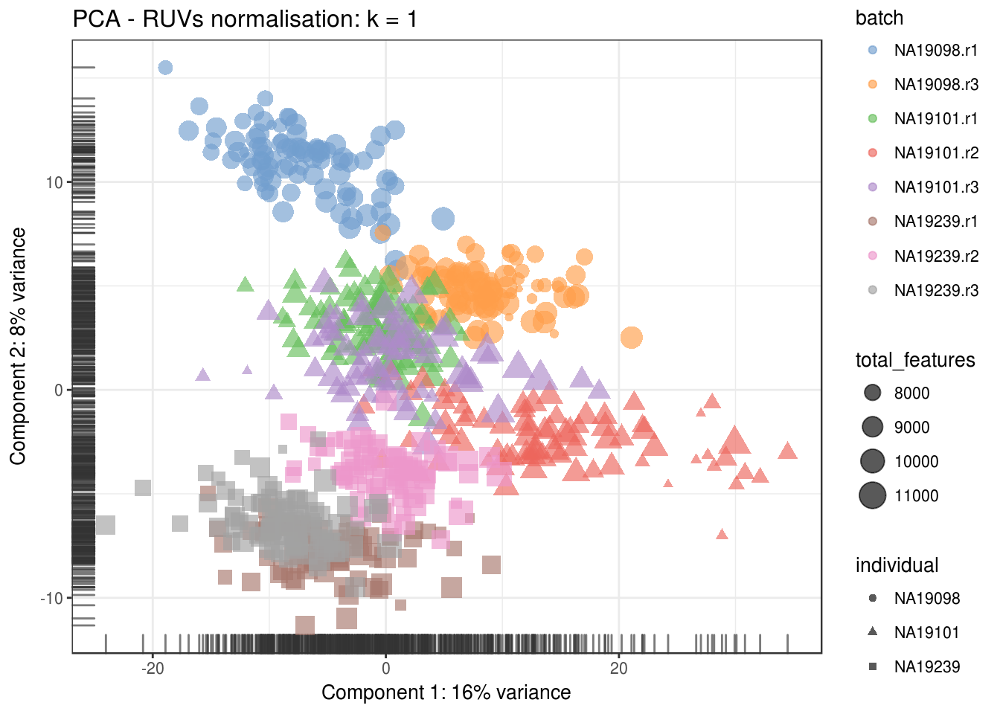
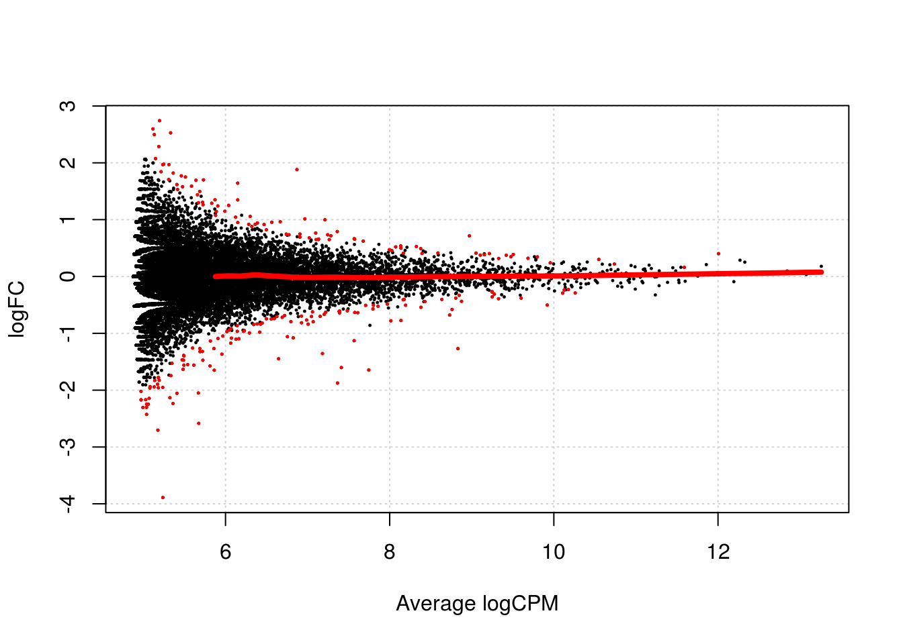
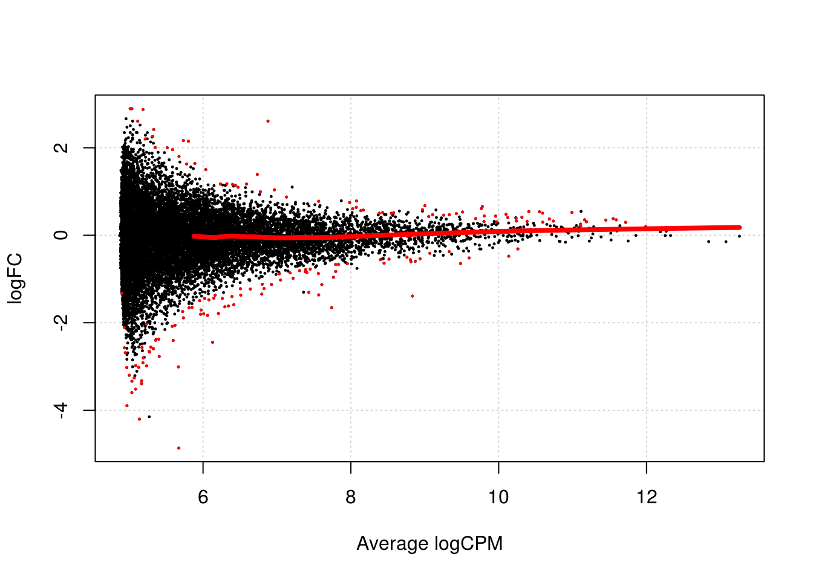

# Dealing with confounders

## Introduction

In the previous chapter we normalized for library size, effectively removing it as a confounder. Now we will consider removing other less well defined confounders from our data. Technical confounders (aka batch effects) can arise from difference in reagents, isolation methods, the lab/experimenter who performed the experiment, even which day/time the experiment was performed. Accounting for technical confounders, and batch effects particularly, is a large topic that also involves principles of experimental design. Here we address approaches that can be taken to account for confounders when the experimental design is appropriate.

Fundamentally, accounting for technical confounders involves identifying and, ideally, removing sources of variation in the expression data that are not related to (i.e. are confounding) the biological signal of interest. Various approaches exist, some of which use spike-in or housekeeping genes, and some of which use endogenous genes.

The use of spike-ins as control genes is appealing, since the same amount of ERCC (or other) spike-in was added to each cell in our experiment. In principel, all the variablity we observe for these genes is due to technical noise; whereas endogenous genes are affected by both technical noise and biological variability. Technical noise can be removed by fitting a model to the spike-ins and "substracting" this from the endogenous genes. There are several methods available based on this premise (eg. [BASiCS](https://github.com/catavallejos/BASiCS), [scLVM](https://github.com/PMBio/scLVM), [RUVg](http://bioconductor.org/packages/release/bioc/html/RUVSeq.html)); each using different noise models and different fitting procedures. Alternatively, one can identify genes which exhibit significant variation beyond technical noise (eg. Distance to median, [Highly variable genes](http://www.nature.com/nmeth/journal/v10/n11/full/nmeth.2645.html)). However, there are issues with the use of spike-ins for normalisation (particularly ERCCs, derived from bacterial sequences), including that their variability can, for various reasons, actually be *higher* than that of endogenous genes.

Given the issues with using spike-ins, better results can often be obtained by using endogenous genes instead. Where we have a large number of endogenous genes that, on average, do not vary systematically between cells and where we expect technical effects to affect a large number of genes (a very common and reasonable assumption), then such methods (for example, the RUVs method) can perform well. 

We explore both general approaches below.


```r
library(scRNA.seq.funcs)
library(RUVSeq)
library(scater, quietly = TRUE)
library(scran)
library(edgeR)
options(stringsAsFactors = FALSE)
umi <- readRDS("blischak/umi.rds")
umi.qc <- umi[fData(umi)$use, pData(umi)$use]
endog_genes <- !fData(umi.qc)$is_feature_control
erccs <- fData(umi.qc)$is_feature_control
```

## Remove Unwanted Variation

Factors contributing to technical noise frequently appear as "batch
effects" where cells processed on different days or by different
technicians systematically vary from one another. Removing technical
noise and correcting for batch effects can frequently be performed
using the same tool or slight variants on it. We will be considering
the [Remove Unwanted Variation (RUVSeq)](http://bioconductor.org/packages/RUVSeq). Briefly, RUVSeq works as follows. For $n$ samples and $J$ genes, consider the following generalized linear model (GLM), where the RNA-Seq read counts are regressed on both the known covariates of interest and unknown factors of unwanted variation:
\[\log E[Y|W,X,O] = W\alpha + X\beta + O\]
Here, $Y$ is the $n \times J$ matrix of observed gene-level read counts, $W$ is an $n \times k$ matrix corresponding to the factors of “unwanted variation” and $O$ is an $n \times J$ matrix of offsets that can either be set to zero or estimated with some other normalization procedure (such as upper-quartile normalization). The simultaneous estimation of $W$, $\alpha$, $\beta$, and $k$ is infeasible. For a given $k$, instead the following three
approaches to estimate the factors of unwanted variation $W$ are used:

* _RUVg_ uses negative control genes (e.g. ERCCs), assumed to have constant expression across samples;
* _RUVs_ uses centered (technical) replicate/negative control samples for which the covariates of interest are
constant;
* _RUVr_ uses residuals, e.g., from a first-pass GLM regression of the counts on the covariates of interest.

We will concentrate on the first two approaches.

### RUVg


```r
ruvg <- RUVg(counts(umi.qc), erccs, k = 1)
set_exprs(umi.qc, "ruvg1") <- ruvg$normalizedCounts
ruvg <- RUVg(counts(umi.qc), erccs, k = 2)
set_exprs(umi.qc, "ruvg2") <- ruvg$normalizedCounts
set_exprs(umi.qc, "ruvg2_logcpm") <- log2(t(t(ruvg$normalizedCounts) / 
                                           colSums(ruvg$normalizedCounts)) + 1)
```

### RUVs


```r
scIdx <- matrix(-1, ncol = max(table(umi.qc$individual)), nrow = 3)
tmp <- which(umi.qc$individual == "NA19098")
scIdx[1, 1:length(tmp)] <- tmp
tmp <- which(umi.qc$individual == "NA19101")
scIdx[2, 1:length(tmp)] <- tmp
tmp <- which(umi.qc$individual == "NA19239")
scIdx[3, 1:length(tmp)] <- tmp
cIdx <- rownames(umi.qc)
ruvs <- RUVs(counts(umi.qc), cIdx, k = 1, scIdx = scIdx, isLog = FALSE)
set_exprs(umi.qc, "ruvs1") <- ruvs$normalizedCounts
ruvs <- RUVs(counts(umi.qc), cIdx, k = 2, scIdx = scIdx, isLog = FALSE)
set_exprs(umi.qc, "ruvs2") <- ruvs$normalizedCounts
set_exprs(umi.qc, "ruvs2_logcpm") <- log2(t(t(ruvs$normalizedCounts) / 
                                           colSums(ruvs$normalizedCounts)) + 1)
```

## Effectiveness 1

We evaluate the effectiveness of the normalization by inspecting the
PCA plot where colour corresponds the technical replicates and shape
corresponds to different biological samples (individuals). Separation of biological samples and
interspersed batches indicates that technical variation has been
removed. 


```r
plotPCA(
    umi.qc[endog_genes, ],
    colour_by = "batch",
    size_by = "total_features",
    shape_by = "individual",
    exprs_values = "ruvg1") +
    ggtitle("PCA - RUVg normalisation: k = 1")
```


```r
plotPCA(
    umi.qc[endog_genes, ],
    colour_by = "batch",
    size_by = "total_features",
    shape_by = "individual",
    exprs_values = "ruvg2") +
    ggtitle("PCA - RUVg normalisation: k = 2")
```


```r
plotPCA(
    umi.qc[endog_genes, ],
    colour_by = "batch",
    size_by = "total_features",
    shape_by = "individual",
    exprs_values = "ruvs1") +
    ggtitle("PCA - RUVs normalisation: k = 1")
```



```r
plotPCA(
    umi.qc[endog_genes, ],
    colour_by = "batch",
    size_by = "total_features",
    shape_by = "individual",
    exprs_values = "ruvs2") +
    ggtitle("PCA - RUVs normalisation: k = 2")
```


```r
plotPCA(
    umi.qc[endog_genes, ],
    colour_by = "batch",
    size_by = "total_features",
    shape_by = "individual",
    exprs_values = "ruvs2_logcpm") +
    ggtitle("PCA - RUVs normalisation log2-cpm: k = 2")
```


Plotting log2-normalized CPM from RUVs with k = 2 looks to give the best separation of cells by individual.

## Effectiveness 2

We can also examine the effectiveness of correction using the relative log expression (RLE) across cells to confirm technical noise has been removed from the dataset.


```r
boxplot(
    list(
        "Raw counts" = calc_cell_RLE(counts(umi.qc), erccs),
        "RUVg (k = 1)" = calc_cell_RLE(assayData(umi.qc)$ruvg1, erccs),
        "RUVg (k = 2)" = calc_cell_RLE(assayData(umi.qc)$ruvg2, erccs),
        "RUVs (k = 1)" = calc_cell_RLE(assayData(umi.qc)$ruvs1, erccs),
        "RUVs (k = 2)" = calc_cell_RLE(assayData(umi.qc)$ruvs2, erccs)
    )
)
```


## Effectiveness 3

Another way of evaluating the effectiveness of correction is to look at the differentially expressed (DE) genes among the batches of the same individual Theoretically, these batches should not differ from each other. Let's take the most promising individual (__NA19101__, whose batches are the closest to each other) and check whether it is true.

For demonstration purposes we will only use a subset of cells. You should not do that with your real dataset, though.

```r
keep <- c(
    sample(which(umi.qc$batch == "NA19101.r1"), 20), 
    sample(which(umi.qc$batch == "NA19101.r2"), 20),
    sample(which(umi.qc$batch == "NA19101.r3"), 20)
)
design <- model.matrix(~umi.qc[, keep]$batch)
```

We will use the [edgeR](http://bioconductor.org/packages/edgeR) package to calculate DE genes between plates for this particular individual. Recall that the input data for edgeR (and similar methods like DESeq2) must always be raw counts.

The particular coefficient that we test for DE in each case below tests to for genes that show a difference in expression between replicate plate 3 and replicate plate 1.

### DE (raw counts)

```r
dge1 <- DGEList(
    counts = counts(umi.qc[, keep]), 
    norm.factors = rep(1, length(keep)),
    group = umi.qc[, keep]$batch
)
dge1 <- estimateDisp(dge1, design = design, trend.method = "none")
plotBCV(dge1)
```


```r
fit1 <- glmFit(dge1, design)
res1 <- glmLRT(fit1)
topTags(res1)
```

```
## Coefficient:  umi.qc[, keep]$batchNA19101.r3 
##                      logFC   logCPM       LR       PValue          FDR
## ENSG00000185885 -1.2067191 8.831589 70.05543 5.766129e-17 8.108907e-13
## ENSG00000008311 -1.1824349 7.456445 48.36507 3.538141e-12 2.487844e-08
## ENSG00000163106 -1.2554081 7.045995 46.58539 8.771178e-12 4.111636e-08
## ENSG00000131969 -1.1121983 7.403842 36.93487 1.221419e-09 4.294205e-06
## ENSG00000164265 -1.8810575 5.654981 33.93185 5.707678e-09 1.605342e-05
## ENSG00000009950 -1.2392969 6.476471 30.44172 3.440490e-08 8.063936e-05
## ENSG00000145423  0.5713251 8.963965 28.58597 8.962915e-08 1.800650e-04
## ENSG00000198518 -1.3497330 6.904961 28.15760 1.118278e-07 1.965792e-04
## ENSG00000171532 -2.9207884 5.137467 27.65480 1.450120e-07 2.265893e-04
## ENSG00000018625  1.1757425 6.986810 27.35577 1.692586e-07 2.380283e-04
```

```r
summary(decideTestsDGE(res1))
```

```
##    [,1] 
## -1   137
## 0  13833
## 1     93
```

```r
plotSmear(
    res1, lowess = TRUE,
    de.tags = rownames(topTags(res1, n = sum(abs(decideTestsDGE(res1))))$table)
)
```



### DE (RUVg, k = 2)

```r
design_ruvg <- model.matrix(~ruvg$W[keep,] + umi.qc[, keep]$batch)
head(design_ruvg)
```

```
##   (Intercept) ruvg$W[keep, ]W_1 ruvg$W[keep, ]W_2
## 1           1       0.060478978      0.0283775855
## 2           1       0.027831228      0.0454296483
## 3           1       0.058780915      0.0274402851
## 4           1      -0.002397352      0.0018673416
## 5           1       0.048299101     -0.0006341382
## 6           1       0.017779972      0.0091231865
##   umi.qc[, keep]$batchNA19101.r2 umi.qc[, keep]$batchNA19101.r3
## 1                              0                              0
## 2                              0                              0
## 3                              0                              0
## 4                              0                              0
## 5                              0                              0
## 6                              0                              0
```

```r
dge_ruvg <- estimateDisp(dge1, design = design_ruvg, trend.method = "none")
plotBCV(dge_ruvg)
```


```r
fit2 <- glmFit(dge_ruvg, design_ruvg)
res2 <- glmLRT(fit2)
topTags(res2)
```

```
## Coefficient:  umi.qc[, keep]$batchNA19101.r3 
##                      logFC   logCPM       LR       PValue          FDR
## ENSG00000185885 -1.2642188 8.831440 55.97619 7.335409e-14 1.031579e-09
## ENSG00000008311 -1.0705179 7.455150 29.25311 6.351429e-08 3.728192e-04
## ENSG00000100604  1.9664293 6.119064 28.81743 7.953194e-08 3.728192e-04
## ENSG00000145423  0.6242780 8.963158 26.08854 3.261137e-07 9.535374e-04
## ENSG00000163106 -1.1084577 7.044916 26.01358 3.390235e-07 9.535374e-04
## ENSG00000131203 -1.6888019 6.162007 25.60365 4.192450e-07 9.826405e-04
## ENSG00000164265 -2.0155092 5.654671 24.51103 7.388559e-07 1.484362e-03
## ENSG00000132872 -3.4610358 5.153232 22.95993 1.654134e-06 2.907761e-03
## ENSG00000112874  2.9315687 5.303514 22.19421 2.464158e-06 3.597167e-03
## ENSG00000170889 -0.6235905 8.566039 22.12253 2.557894e-06 3.597167e-03
```

```r
summary(decideTestsDGE(res2))
```

```
##    [,1] 
## -1    52
## 0  13982
## 1     29
```

```r
plotSmear(
    res2, lowess = TRUE,
    de.tags = rownames(topTags(res2, n = sum(abs(decideTestsDGE(res2))))$table)
)
```


### DE (RUVs, k = 2)

```r
design_ruvs <- model.matrix(~ruvs$W[keep,] + umi.qc[, keep]$batch)
head(design_ruvs)
```

```
##   (Intercept) ruvs$W[keep, ]W_1 ruvs$W[keep, ]W_2
## 1           1         0.1901468       -0.07107390
## 2           1         0.2447665       -0.10344432
## 3           1         0.2228644       -0.09824831
## 4           1         0.2749968       -0.09825953
## 5           1         0.2727943       -0.09046069
## 6           1         0.2695799       -0.09943721
##   umi.qc[, keep]$batchNA19101.r2 umi.qc[, keep]$batchNA19101.r3
## 1                              0                              0
## 2                              0                              0
## 3                              0                              0
## 4                              0                              0
## 5                              0                              0
## 6                              0                              0
```

```r
dge_ruvs <- estimateDisp(dge1, design = design_ruvs, trend.method = "none")
plotBCV(dge_ruvs)
```


```r
fit3 <- glmFit(dge_ruvs, design_ruvs)
res3 <- glmLRT(fit3)
topTags(res3)
```

```
## Coefficient:  umi.qc[, keep]$batchNA19101.r3 
##                      logFC    logCPM       LR       PValue          FDR
## ENSG00000174748  0.5417149 10.690489 49.71176 1.780758e-12 2.504279e-08
## ENSG00000162244  0.6922743  9.853557 45.21174 1.768419e-11 1.243464e-07
## ENSG00000181163  0.3882809 11.505039 44.25627 2.880802e-11 1.350424e-07
## ENSG00000137818  0.3760531 11.621714 41.25444 1.336478e-10 4.698724e-07
## ENSG00000241468  1.9139912  6.667414 40.77843 1.705048e-10 4.795619e-07
## ENSG00000089157  0.3712545 11.178083 39.68099 2.990221e-10 7.008579e-07
## ENSG00000131203 -2.4652978  6.162094 32.84707 9.970105e-09 2.002994e-05
## ENSG00000144713  0.4527589 10.592731 32.34952 1.287888e-08 2.263946e-05
## ENSG00000119899  2.8591144  5.436812 31.83794 1.675873e-08 2.618645e-05
## ENSG00000231500  0.3586149 11.163076 30.93139 2.673126e-08 3.759217e-05
```

```r
summary(decideTestsDGE(res3))
```

```
##    [,1] 
## -1    48
## 0  13971
## 1     44
```

```r
plotSmear(
    res3, lowess = TRUE,
    de.tags = rownames(topTags(res3, n = sum(abs(decideTestsDGE(res3))))$table)
)
```



In the above analyses, we have ignored size factors between cells. A typical edgeR analysis would always include these.


```r
umi.qc <- scran::computeSumFactors(umi.qc, sizes = 15)
dge_ruvs$samples$norm.factors <- sizeFactors(umi.qc)[keep]
dge_ruvs_sf <- estimateDisp(dge_ruvs, design = design_ruvs, trend.method = "none")
plotBCV(dge_ruvs_sf)
```


```r
fit4 <- glmFit(dge_ruvs_sf, design_ruvs)
res4 <- glmLRT(fit4)
topTags(res4)
```

```
## Coefficient:  umi.qc[, keep]$batchNA19101.r3 
##                      logFC    logCPM       LR       PValue          FDR
## ENSG00000241468  1.9601522  6.592550 43.02952 5.392016e-11 7.582793e-07
## ENSG00000174748  0.6097747 10.768044 32.68751 1.082303e-08 7.610216e-05
## ENSG00000162244  0.7544961  9.891622 31.70833 1.791520e-08 8.398050e-05
## ENSG00000119899  2.8918093  5.316339 31.03292 2.536895e-08 8.919090e-05
## ENSG00000131203 -2.3652999  6.064529 29.07062 6.978738e-08 1.962840e-04
## ENSG00000173812  0.6645177  9.423475 24.86021 6.164162e-07 1.444777e-03
## ENSG00000181163  0.4614277 11.621689 22.38204 2.234539e-06 4.489190e-03
## ENSG00000231500  0.4387164 11.273871 21.56588 3.418801e-06 6.009824e-03
## ENSG00000197958  0.4927169 10.326428 21.03262 4.515312e-06 6.368395e-03
## ENSG00000108294  0.8286626  8.548754 20.72200 5.310240e-06 6.368395e-03
```

```r
summary(decideTestsDGE(res4))
```

```
##    [,1] 
## -1    12
## 0  14024
## 1     27
```

```r
plotSmear(
    res4, lowess = TRUE,
    de.tags = rownames(topTags(res4, n = sum(abs(decideTestsDGE(res4))))$table)
)
```


## Exercise

Perform the same analysis with read counts of the Blischak data. Use `blischak/reads.rds` file to load the reads SCESet object. Once you have finished please compare your results to ours (next chapter). Additionally, experiment with other combinations of normalizations and compare the results.
