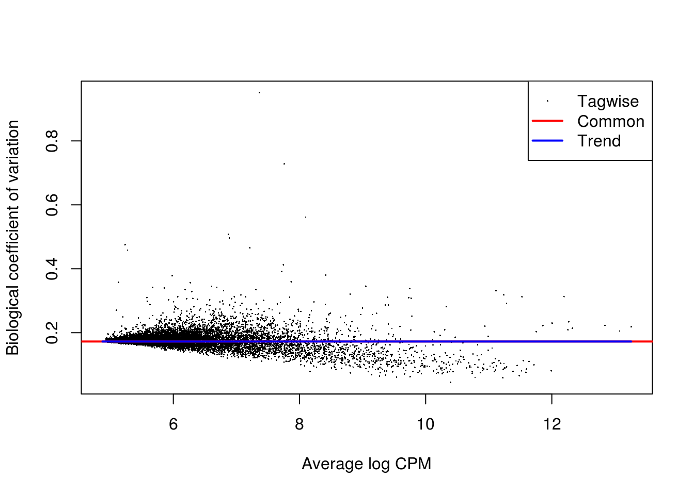

# Remove confounders using controls

## Introduction

In the previous chapter we normalized for library size, effectively removing it as a confounder. Now we will consider removing other less well defined confounders from our data using the ERCC spike-in controls. Technical confounders (aka batch effects) can arise from difference in reagents, isolation methods, the lab/experimenter who performed the experiment, even which day/time the experiment was performed. 

Since the same amount of ERCC spike-in was added to each cell in our experiment we know that all the variablity we observe for these genes is due to technical noise; whereas endogenous genes are affected by both technical noise and biological variability. Technical noise can be removed by fitting a model to the spike-ins and "substracting" this from the endogenous genes. There are several methods available based on this premise (eg. [BASiCS](https://github.com/catavallejos/BASiCS), [scLVM](https://github.com/PMBio/scLVM), [RUV](http://bioconductor.org/packages/release/bioc/html/RUVSeq.html)); each using different noise models and different fitting procedures. Alternatively, one can identify genes which exhibit significant variation beyond technical noise (eg. Distance to median, [Highly variable genes](http://www.nature.com/nmeth/journal/v10/n11/full/nmeth.2645.html))


```r
library(scRNA.seq.funcs)
library(RUVSeq)
library(scater, quietly = TRUE)
library(scran)
library(edgeR)
options(stringsAsFactors = FALSE)
umi <- readRDS("blischak/umi.rds")
umi.qc <- umi[fData(umi)$use, pData(umi)$use]
endog_genes <- !fData(umi.qc)$is_feature_control
erccs <- fData(umi.qc)$is_feature_control
```

## Remove Unwanted Variation

Factors contributing to technical noise frequently appear as "batch
effects" where cells processed on different days or by different
technicians systematically vary from one another. Removing technical
noise and correcting for batch effects can frequently be performed
using the same tool or slight variants on it. We will be considering
the [Remove Unwanted Variation (RUVSeq)](http://bioconductor.org/packages/RUVSeq). Briefly, RUVSeq works as follows. For $n$ samples and $J$ genes, consider the following generalized linear model (GLM), where the RNA-Seq read counts are regressed on both the known covariates of interest and unknown factors of unwanted variation:
\[\log E[Y|W,X,O] = W\alpha + X\beta + O\]
Here, $Y$ is the $n \times J$ matrix of observed gene-level read counts, $W$ is an $n \times k$ matrix corresponding to the factors of “unwanted variation” and $O$ is an $n \times J$ matrix of offsets that can either be set to zero or estimated with some other normalization procedure (such as upper-quartile normalization). The simultaneous estimation of $W$, $\alpha$, $\beta$, and $k$ is infeasible. For a given $k$, instead the following three
approaches to estimate the factors of unwanted variation $W$ are used:

* _RUVg_ uses negative control genes (e.g. ERCCs), assumed to have constant expression across samples;
* _RUVs_ uses centered (technical) replicate/negative control samples for which the covariates of interest are
constant;
* _RUVr_ uses residuals, e.g., from a first-pass GLM regression of the counts on the covariates of interest.

We will concentrate on the first two approaches.

### RUVg


```r
ruvg <- RUVg(counts(umi.qc), erccs, k = 1)
set_exprs(umi.qc, "ruvg1") <- ruvg$normalizedCounts
ruvg <- RUVg(counts(umi.qc), erccs, k = 2)
set_exprs(umi.qc, "ruvg2") <- ruvg$normalizedCounts
```

### RUVs


```r
scIdx <- matrix(-1, ncol = max(table(umi.qc$individual)), nrow = 3)
tmp <- which(umi.qc$individual == "NA19098")
scIdx[1, 1:length(tmp)] <- tmp
tmp <- which(umi.qc$individual == "NA19101")
scIdx[2, 1:length(tmp)] <- tmp
tmp <- which(umi.qc$individual == "NA19239")
scIdx[3, 1:length(tmp)] <- tmp
cIdx <- rownames(umi.qc)
ruvs <- RUVs(counts(umi.qc), cIdx, k = 1, scIdx = scIdx, isLog = FALSE)
set_exprs(umi.qc, "ruvs1") <- ruvs$normalizedCounts
ruvs <- RUVs(counts(umi.qc), cIdx, k = 2, scIdx = scIdx, isLog = FALSE)
set_exprs(umi.qc, "ruvs2") <- ruvs$normalizedCounts
```

## Effectiveness 1

We evaluate the effectiveness of the normalization by inspecting the
PCA plot where colour corresponds the technical replicates and shape
corresponds to different biological samples (individuals). Separation of biological samples and
interspersed batches indicates that technical variation has been
removed. 


```r
plotPCA(
    umi.qc[endog_genes, ],
    colour_by = "batch",
    size_by = "total_features",
    shape_by = "individual",
    exprs_values = "ruvg1") +
    ggtitle("PCA - RUVg normalisation: k = 1")
```


```r
plotPCA(
    umi.qc[endog_genes, ],
    colour_by = "batch",
    size_by = "total_features",
    shape_by = "individual",
    exprs_values = "ruvg2") +
    ggtitle("PCA - RUVg normalisation: k = 2")
```


```r
plotPCA(
    umi.qc[endog_genes, ],
    colour_by = "batch",
    size_by = "total_features",
    shape_by = "individual",
    exprs_values = "ruvs1") +
    ggtitle("PCA - RUVs normalisation: k = 1")
```


```r
plotPCA(
    umi.qc[endog_genes, ],
    colour_by = "batch",
    size_by = "total_features",
    shape_by = "individual",
    exprs_values = "ruvs2") +
    ggtitle("PCA - RUVs normalisation: k = 2")
```


## Effectiveness 2

We can also examine the effectiveness of correction using the relative log expression (RLE) across cells to confirm technical noise has been removed from the dataset.


```r
boxplot(
    list(
        "Raw counts" = calc_cell_RLE(counts(umi.qc), erccs),
        "RUVg (k = 1)" = calc_cell_RLE(assayData(umi.qc)$ruvg1, erccs),
        "RUVg (k = 2)" = calc_cell_RLE(assayData(umi.qc)$ruvg2, erccs),
        "RUVs (k = 1)" = calc_cell_RLE(assayData(umi.qc)$ruvs1, erccs),
        "RUVs (k = 2)" = calc_cell_RLE(assayData(umi.qc)$ruvs2, erccs)
    )
)
```


## Effectiveness 3

Another way of evaluating the effectiveness of correction is to look at the differentially expressed (DE) genes among the batches of the same individual Theoretically, these batches should not differ from each other. Let's take the most promising individual (__NA19101__, whose batches are the closest to each other) and check whether it is true.


```r
keep <- umi.qc$individual == "NA19101"
design <- model.matrix(~umi.qc[, keep]$batch)
```

We will use the [edgeR](http://bioconductor.org/packages/edgeR) package to calculate DE genes.

### DE (raw counts)

```r
dge1 <- DGEList(
    counts = counts(umi.qc[, keep]), 
    norm.factors = rep(1, sum(keep)),
    group = umi.qc[, keep]$batch
)
dge1 <- estimateDisp(dge1, design = design, trend.method = "none")
plotBCV(dge1)
```



```r
fit1 <- glmFit(dge1, design)
res1 <- glmLRT(fit1, coef = 2)
topTags(res1)
```

```
## Coefficient:  umi.qc[, keep]$batchNA19101.r2 
##                      logFC    logCPM       LR       PValue          FDR
## ENSG00000145423  1.0437082  8.930360 354.3682 4.741536e-79 6.668021e-75
## ENSG00000185885 -1.4704261  8.871862 312.6361 5.820571e-70 4.092734e-66
## ENSG00000104332  0.7942726  9.732365 284.9588 6.237725e-64 2.924037e-60
## ENSG00000214265 -0.7737881  9.237431 282.8562 1.791432e-63 6.298226e-60
## ENSG00000106554 -0.6836208  9.262132 241.4285 1.919657e-54 5.399226e-51
## ENSG00000167283 -0.4769965 10.083626 227.0334 2.644427e-51 6.198096e-48
## ENSG00000165502 -0.5248241 10.028994 224.9492 7.531484e-51 1.331865e-47
## ENSG00000087460  0.5510932  9.392753 224.9374 7.576560e-51 1.331865e-47
## ENSG00000121207  1.9353719  6.736511 211.5649 6.258142e-48 9.778694e-45
## ENSG00000112695 -0.5505989  9.637643 210.3241 1.167217e-47 1.641458e-44
```

```r
summary(decideTestsDGE(res1))
```

```
##    [,1]
## -1 2109
## 0  9355
## 1  2599
```

```r
plotSmear(
    res1, 
    de.tags = rownames(topTags(res1, n = sum(abs(decideTestsDGE(res1))))$table)
)
```


### DE (RUVg, k = 2)

```r
dge2 <- DGEList(
    counts = get_exprs(umi.qc[, keep], "ruvg2"), 
    norm.factors = rep(1, sum(keep)),
    group = umi.qc[, keep]$batch
)
dge2 <- estimateDisp(dge2, design = design, trend.method = "none")
plotBCV(dge2)
```


```r
fit2 <- glmFit(dge2, design)
res2 <- glmLRT(fit2, coef = 2)
topTags(res2)
```

```
## Coefficient:  umi.qc[, keep]$batchNA19101.r2 
##                      logFC    logCPM       LR       PValue          FDR
## ENSG00000185885 -1.2940992  8.848299 259.3045 2.432853e-58 3.421322e-54
## ENSG00000112695 -0.5984239  9.654469 242.6075 1.062090e-54 7.468083e-51
## ENSG00000127922 -0.4599139 10.172643 235.9477 3.008274e-53 1.410179e-49
## ENSG00000198865  2.0844092  7.464237 235.3096 4.144451e-53 1.457085e-49
## ENSG00000131969 -1.5918311  7.373035 222.2564 2.912221e-50 8.190913e-47
## ENSG00000145423  0.8311869  8.944623 205.1051 1.606381e-46 3.765090e-43
## ENSG00000167283 -0.4236592 10.077512 187.4446 1.148540e-42 2.307416e-39
## ENSG00000184674 -2.2466016  6.268906 183.6732 7.646216e-42 1.344109e-38
## ENSG00000014641 -0.5878931  9.230097 168.2078 1.822302e-38 2.847448e-35
## ENSG00000026025  1.4699885  7.256207 167.1312 3.131671e-38 4.404069e-35
```

```r
summary(decideTestsDGE(res2))
```

```
##    [,1] 
## -1  1757
## 0  10072
## 1   2234
```

```r
plotSmear(
    res2, 
    de.tags = rownames(topTags(res2, n = sum(abs(decideTestsDGE(res2))))$table)
)
```


### DE (RUVs, k = 2)

```r
dge3 <- DGEList(
    counts = get_exprs(umi.qc[, keep], "ruvs2"), 
    norm.factors = rep(1, sum(keep)),
    group = umi.qc[, keep]$batch
)
dge3 <- estimateDisp(dge3, design = design, trend.method = "none")
plotBCV(dge3)
```


```r
fit3 <- glmFit(dge3, design)
res3 <- glmLRT(fit3, coef = 2)
topTags(res3)
```

```
## Coefficient:  umi.qc[, keep]$batchNA19101.r2 
##                      logFC    logCPM        LR       PValue          FDR
## ERCC-00096       0.3565316 14.413429 135.99061 2.004766e-31 2.819303e-27
## ERCC-00130       0.2943996 15.221291 111.41547 4.798340e-26 3.373953e-22
## ERCC-00002       0.3122361 14.275886  83.78178 5.525179e-20 2.590020e-16
## ERCC-00113       0.3688776 12.596908  69.48107 7.715159e-17 2.712457e-13
## ENSG00000108518  0.8294795  9.840062  67.23541 2.409469e-16 6.776873e-13
## ENSG00000114315 -1.8333183  8.584396  66.12574 4.230542e-16 9.915686e-13
## ERCC-00074       0.2295402 14.587069  61.07973 5.480964e-15 1.101126e-11
## ENSG00000240972  0.6549418 10.188124  55.38987 9.884438e-14 1.737561e-10
## ENSG00000142871 -1.3716646  8.753340  52.06089 5.380592e-13 8.407475e-10
## ENSG00000125144 -2.3428345  8.845632  50.17383 1.407117e-12 1.978829e-09
```

```r
summary(decideTestsDGE(res3))
```

```
##    [,1] 
## -1   328
## 0  13449
## 1    286
```

```r
plotSmear(
    res3, 
    de.tags = rownames(topTags(res3, n = sum(abs(decideTestsDGE(res3))))$table)
)
```


## Exercise

Perform the same analysis with read counts of the Blischak data. Use `blischak/reads.rds` file to load the reads SCESet object. Once you have finished please compare your results to ours (next chapter). Additionally, experiment with other combinations of normalizations and compare the results.
