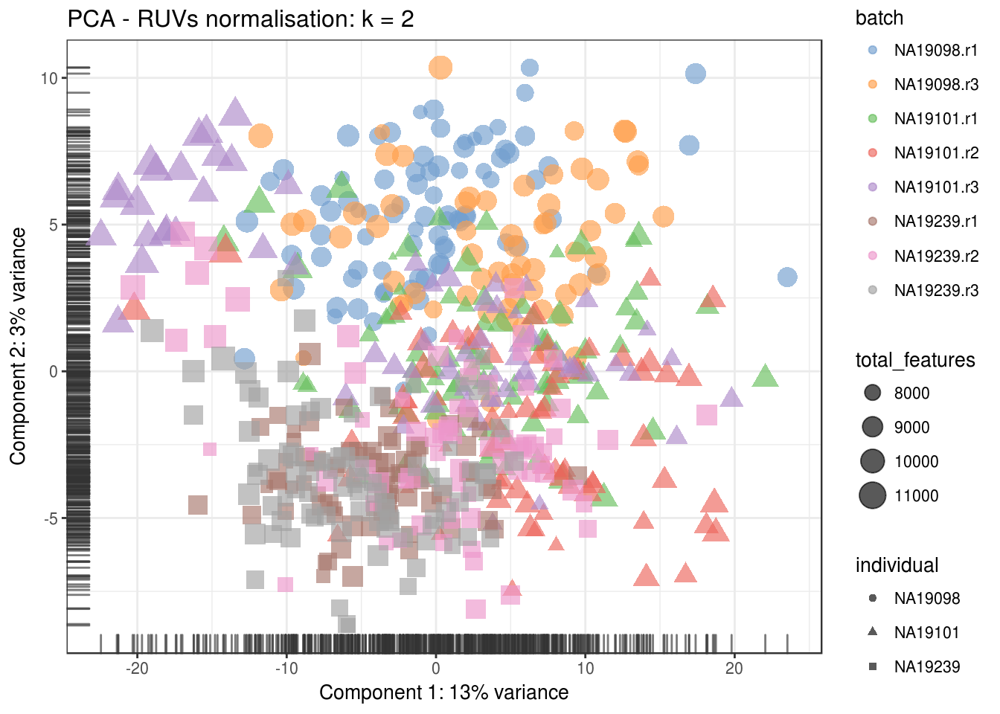

# Dealing with confounders (Reads)


```r
library(scRNA.seq.funcs)
library(RUVSeq)
library(scater, quietly = TRUE)
library(scran)
library(edgeR)
options(stringsAsFactors = FALSE)
reads <- readRDS("blischak/reads.rds")
reads.qc <- reads[fData(reads)$use, pData(reads)$use]
endog_genes <- !fData(reads.qc)$is_feature_control
erccs <- fData(reads.qc)$is_feature_control
```

## Remove Unwanted Variation

### RUVg


```r
ruvg <- RUVg(counts(reads.qc), erccs, k = 1)
set_exprs(reads.qc, "ruvg1") <- ruvg$normalizedCounts
ruvg <- RUVg(counts(reads.qc), erccs, k = 2)
set_exprs(reads.qc, "ruvg2") <- ruvg$normalizedCounts
set_exprs(reads.qc, "ruvg2_logcpm") <- log2(t(t(ruvg$normalizedCounts) / 
                                           colSums(ruvg$normalizedCounts)) + 1)
```

### RUVs


```r
scIdx <- matrix(-1, ncol = max(table(reads.qc$individual)), nrow = 3)
tmp <- which(reads.qc$individual == "NA19098")
scIdx[1, 1:length(tmp)] <- tmp
tmp <- which(reads.qc$individual == "NA19101")
scIdx[2, 1:length(tmp)] <- tmp
tmp <- which(reads.qc$individual == "NA19239")
scIdx[3, 1:length(tmp)] <- tmp
cIdx <- rownames(reads.qc)
ruvs <- RUVs(counts(reads.qc), cIdx, k = 1, scIdx = scIdx, isLog = FALSE)
set_exprs(reads.qc, "ruvs1") <- ruvs$normalizedCounts
ruvs <- RUVs(counts(reads.qc), cIdx, k = 2, scIdx = scIdx, isLog = FALSE)
set_exprs(reads.qc, "ruvs2") <- ruvs$normalizedCounts
set_exprs(reads.qc, "ruvs2_logcpm") <- log2(t(t(ruvs$normalizedCounts) / 
                                           colSums(ruvs$normalizedCounts)) + 1)
```

## Effectiveness 1


```r
plotPCA(
    reads.qc[endog_genes, ],
    colour_by = "batch",
    size_by = "total_features",
    shape_by = "individual",
    exprs_values = "ruvg1") +
    ggtitle("PCA - RUVg normalisation: k = 1")
```


```r
plotPCA(
    reads.qc[endog_genes, ],
    colour_by = "batch",
    size_by = "total_features",
    shape_by = "individual",
    exprs_values = "ruvg2") +
    ggtitle("PCA - RUVg normalisation: k = 2")
```


```r
plotPCA(
    reads.qc[endog_genes, ],
    colour_by = "batch",
    size_by = "total_features",
    shape_by = "individual",
    exprs_values = "ruvs1") +
    ggtitle("PCA - RUVs normalisation: k = 1")
```


```r
plotPCA(
    reads.qc[endog_genes, ],
    colour_by = "batch",
    size_by = "total_features",
    shape_by = "individual",
    exprs_values = "ruvs2") +
    ggtitle("PCA - RUVs normalisation: k = 2")
```



```r
plotPCA(
    reads.qc[endog_genes, ],
    colour_by = "batch",
    size_by = "total_features",
    shape_by = "individual",
    exprs_values = "ruvs2_logcpm") +
    ggtitle("PCA - RUVs normalisation log2-cpm: k = 2")
```


## Effectiveness 2


```r
boxplot(
    list(
        "Raw counts" = calc_cell_RLE(counts(reads.qc), erccs),
        "RUVg (k = 1)" = calc_cell_RLE(assayData(reads.qc)$ruvg1, erccs),
        "RUVg (k = 2)" = calc_cell_RLE(assayData(reads.qc)$ruvg2, erccs),
        "RUVs (k = 1)" = calc_cell_RLE(assayData(reads.qc)$ruvs1, erccs),
        "RUVs (k = 2)" = calc_cell_RLE(assayData(reads.qc)$ruvs2, erccs)
    )
)
```


## Effectiveness 3


```r
keep <- c(
    sample(which(reads.qc$batch == "NA19101.r1"), 20), 
    sample(which(reads.qc$batch == "NA19101.r2"), 20),
    sample(which(reads.qc$batch == "NA19101.r3"), 20)
)
design <- model.matrix(~reads.qc[, keep]$batch)
```

### DE (raw counts)

```r
dge1 <- DGEList(
    counts = counts(reads.qc[, keep]), 
    norm.factors = rep(1, length(keep)),
    group = reads.qc[, keep]$batch
)
dge1 <- estimateDisp(dge1, design = design, trend.method = "none")
plotBCV(dge1)
```


```r
fit1 <- glmFit(dge1, design)
res1 <- glmLRT(fit1, coef = 2)
topTags(res1)
```

```
## Coefficient:  reads.qc[, keep]$batchNA19101.r2 
##                     logFC   logCPM       LR       PValue          FDR
## ENSG00000184825 -7.944829 2.404710 34.24659 4.855257e-09 7.798028e-05
## ENSG00000163406  8.358703 2.774133 31.04471 2.521532e-08 2.024917e-04
## ENSG00000140538  6.983583 1.743474 28.76242 8.182356e-08 2.858067e-04
## ENSG00000169851  6.766105 2.977739 28.69408 8.476249e-08 2.858067e-04
## ENSG00000146530 -7.093080 3.314577 28.60015 8.897538e-08 2.858067e-04
## ENSG00000085276  6.655724 1.197336 27.85891 1.304915e-07 3.493040e-04
## ENSG00000234284  7.558534 1.882747 27.25582 1.782381e-07 3.621346e-04
## ENSG00000168899 -7.878357 2.283407 27.06050 1.971861e-07 3.621346e-04
## ENSG00000117650  5.315592 4.160481 26.96361 2.073219e-07 3.621346e-04
## ENSG00000131969 -2.659572 3.219247 26.64797 2.441070e-07 3.621346e-04
```

```r
summary(decideTestsDGE(res1))
```

```
##    [,1] 
## -1   681
## 0  14519
## 1    861
```

```r
plotSmear(
    res1, lowess = TRUE,
    de.tags = rownames(topTags(res1, n = sum(abs(decideTestsDGE(res1))))$table)
)
```


### DE (RUVg, k = 2)

```r
design_ruvg <- model.matrix(~ruvg$W[keep,] + reads.qc[, keep]$batch)
head(design_ruvg)
```

```
##   (Intercept) ruvg$W[keep, ]W_1 ruvg$W[keep, ]W_2
## 1           1      -0.002228917        0.03877421
## 2           1      -0.010591129       -0.01936104
## 3           1      -0.020147219        0.11849664
## 4           1       0.017436635        0.06878010
## 5           1       0.005369460        0.04289753
## 6           1      -0.009896783        0.01987111
##   reads.qc[, keep]$batchNA19101.r2 reads.qc[, keep]$batchNA19101.r3
## 1                                0                                0
## 2                                0                                0
## 3                                0                                0
## 4                                0                                0
## 5                                0                                0
## 6                                0                                0
```

```r
dge_ruvg <- estimateDisp(dge1, design = design_ruvg, trend.method = "none")
plotBCV(dge_ruvg)
```


```r
fit2 <- glmFit(dge_ruvg, design_ruvg)
res2 <- glmLRT(fit2)
topTags(res2)
```

```
## Coefficient:  reads.qc[, keep]$batchNA19101.r3 
##                     logFC    logCPM       LR       PValue          FDR
## ENSG00000157470 -2.050268 1.1255499 43.74952 3.732089e-11 5.994109e-07
## ENSG00000117650  6.671480 4.1604907 37.04938 1.151754e-09 6.652888e-06
## ENSG00000184270 -4.062256 0.1455278 36.90122 1.242679e-09 6.652888e-06
## ENSG00000166984 -5.354818 0.6518402 33.02844 9.082078e-09 3.646681e-05
## ENSG00000105974 -8.216682 2.6143652 31.72792 1.773543e-08 5.696975e-05
## ENSG00000127533 -5.189093 0.5186040 30.14956 3.999779e-08 1.070674e-04
## ENSG00000183208 -4.670888 0.2965708 29.75834 4.893971e-08 1.122887e-04
## ENSG00000203780 -4.960189 0.4016417 29.03740 7.099434e-08 1.284577e-04
## ENSG00000140470 -4.527160 0.2286726 29.01061 7.198305e-08 1.284577e-04
## ENSG00000111348 -4.334548 0.1353035 28.43823 9.673584e-08 1.553674e-04
```

```r
summary(decideTestsDGE(res2))
```

```
##    [,1] 
## -1   448
## 0  15258
## 1    355
```

```r
plotSmear(
    res2, lowess = TRUE,
    de.tags = rownames(topTags(res2, n = sum(abs(decideTestsDGE(res2))))$table)
)
```


### DE (RUVs, k = 2)

```r
design_ruvs <- model.matrix(~ruvs$W[keep,] + reads.qc[, keep]$batch)
head(design_ruvs)
```

```
##   (Intercept) ruvs$W[keep, ]W_1 ruvs$W[keep, ]W_2
## 1           1         0.3444123         0.2143000
## 2           1         0.3176870         0.2029780
## 3           1         0.2961611         0.1507961
## 4           1         0.2765502         0.1499696
## 5           1         0.2630351         0.1353374
## 6           1         0.3176779         0.2226902
##   reads.qc[, keep]$batchNA19101.r2 reads.qc[, keep]$batchNA19101.r3
## 1                                0                                0
## 2                                0                                0
## 3                                0                                0
## 4                                0                                0
## 5                                0                                0
## 6                                0                                0
```

```r
dge_ruvs <- estimateDisp(dge1, design = design_ruvs, trend.method = "none")
plotBCV(dge_ruvs)
```


```r
fit3 <- glmFit(dge_ruvs, design_ruvs)
res3 <- glmLRT(fit3)
topTags(res3)
```

```
## Coefficient:  reads.qc[, keep]$batchNA19101.r3 
##                     logFC    logCPM       LR       PValue          FDR
## ENSG00000127533 -5.844968 0.5186319 49.41601 2.070493e-12 3.325419e-08
## ENSG00000203780 -5.598915 0.4016686 47.40823 5.764023e-12 4.628798e-08
## ENSG00000172967 -6.748363 1.0988398 44.39602 2.682315e-11 1.436022e-07
## ENSG00000214954 -6.809351 1.1902967 43.35983 4.554433e-11 1.828719e-07
## ENSG00000112195 -6.314707 0.8213654 41.80644 1.007711e-10 3.236969e-07
## ENSG00000163288 -6.815686 1.1502884 40.66861 1.803614e-10 4.827974e-07
## ENSG00000088386 -6.325209 0.8856842 39.75080 2.885218e-10 6.619926e-07
## ENSG00000165309 -6.005630 0.8557965 37.66252 8.410500e-10 1.688513e-06
## ENSG00000183423 -6.439795 0.9134412 36.63171 1.426917e-09 2.546412e-06
## ENSG00000159231 -5.234485 0.2720245 35.39878 2.686556e-09 4.314877e-06
```

```r
summary(decideTestsDGE(res3))
```

```
##    [,1] 
## -1   394
## 0  15248
## 1    419
```

```r
plotSmear(
    res3, lowess = TRUE,
    de.tags = rownames(topTags(res3, n = sum(abs(decideTestsDGE(res3))))$table)
)
```


```r
reads.qc <- scran::computeSumFactors(reads.qc, sizes = 15)
dge_ruvs$samples$norm.factors <- sizeFactors(reads.qc)[keep]
dge_ruvs_sf <- estimateDisp(dge_ruvs, design = design_ruvs, trend.method = "none")
plotBCV(dge_ruvs_sf)
```


```r
fit4 <- glmFit(dge_ruvs_sf, design_ruvs)
res4 <- glmLRT(fit4)
topTags(res4)
```

```
## Coefficient:  reads.qc[, keep]$batchNA19101.r3 
##                     logFC    logCPM       LR       PValue          FDR
## ENSG00000127533 -5.839587 0.2920503 47.84806 4.605625e-12 7.397094e-08
## ENSG00000203780 -5.591899 0.1746876 45.85427 1.273854e-11 1.022969e-07
## ENSG00000214954 -6.759358 0.9753670 41.73329 1.046125e-10 4.611437e-07
## ENSG00000172967 -6.578098 0.7473525 41.55079 1.148481e-10 4.611437e-07
## ENSG00000112195 -6.148405 0.4852341 39.21290 3.800209e-10 1.220703e-06
## ENSG00000163288 -6.652320 0.7976909 38.04182 6.924454e-10 1.829694e-06
## ENSG00000088386 -6.334388 0.6600850 37.76636 7.974509e-10 1.829694e-06
## ENSG00000165309 -6.003471 0.6322195 36.24653 1.738696e-09 3.490650e-06
## ENSG00000183423 -6.278409 0.5733277 34.21156 4.943431e-09 8.821827e-06
## ENSG00000117650  6.470706 4.0932957 33.36279 7.647304e-09 1.228233e-05
```

```r
summary(decideTestsDGE(res4))
```

```
##    [,1] 
## -1   319
## 0  15344
## 1    398
```

```r
plotSmear(
    res4, lowess = TRUE,
    de.tags = rownames(topTags(res4, n = sum(abs(decideTestsDGE(res4))))$table)
)
```


