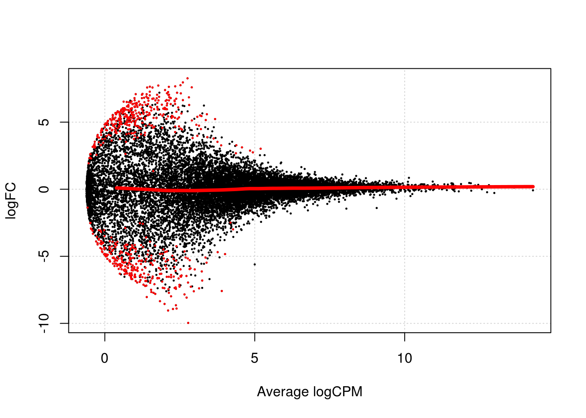

# Dealing with confounders (Reads)


```r
library(scRNA.seq.funcs)
library(RUVSeq)
library(scater, quietly = TRUE)
library(scran)
library(edgeR)
options(stringsAsFactors = FALSE)
reads <- readRDS("blischak/reads.rds")
reads.qc <- reads[fData(reads)$use, pData(reads)$use]
endog_genes <- !fData(reads.qc)$is_feature_control
erccs <- fData(reads.qc)$is_feature_control
```

## Remove Unwanted Variation

### RUVg


```r
ruvg <- RUVg(counts(reads.qc), erccs, k = 1)
set_exprs(reads.qc, "ruvg1") <- ruvg$normalizedCounts
ruvg <- RUVg(counts(reads.qc), erccs, k = 2)
set_exprs(reads.qc, "ruvg2") <- ruvg$normalizedCounts
set_exprs(reads.qc, "ruvg2_logcpm") <- log2(t(t(ruvg$normalizedCounts) / 
                                           colSums(ruvg$normalizedCounts)) + 1)
```

### RUVs


```r
scIdx <- matrix(-1, ncol = max(table(reads.qc$individual)), nrow = 3)
tmp <- which(reads.qc$individual == "NA19098")
scIdx[1, 1:length(tmp)] <- tmp
tmp <- which(reads.qc$individual == "NA19101")
scIdx[2, 1:length(tmp)] <- tmp
tmp <- which(reads.qc$individual == "NA19239")
scIdx[3, 1:length(tmp)] <- tmp
cIdx <- rownames(reads.qc)
ruvs <- RUVs(counts(reads.qc), cIdx, k = 1, scIdx = scIdx, isLog = FALSE)
set_exprs(reads.qc, "ruvs1") <- ruvs$normalizedCounts
ruvs <- RUVs(counts(reads.qc), cIdx, k = 2, scIdx = scIdx, isLog = FALSE)
set_exprs(reads.qc, "ruvs2") <- ruvs$normalizedCounts
set_exprs(reads.qc, "ruvs2_logcpm") <- log2(t(t(ruvs$normalizedCounts) / 
                                           colSums(ruvs$normalizedCounts)) + 1)
```

## Effectiveness 1


```r
plotPCA(
    reads.qc[endog_genes, ],
    colour_by = "batch",
    size_by = "total_features",
    shape_by = "individual",
    exprs_values = "ruvg1") +
    ggtitle("PCA - RUVg normalisation: k = 1")
```


```r
plotPCA(
    reads.qc[endog_genes, ],
    colour_by = "batch",
    size_by = "total_features",
    shape_by = "individual",
    exprs_values = "ruvg2") +
    ggtitle("PCA - RUVg normalisation: k = 2")
```


```r
plotPCA(
    reads.qc[endog_genes, ],
    colour_by = "batch",
    size_by = "total_features",
    shape_by = "individual",
    exprs_values = "ruvs1") +
    ggtitle("PCA - RUVs normalisation: k = 1")
```


```r
plotPCA(
    reads.qc[endog_genes, ],
    colour_by = "batch",
    size_by = "total_features",
    shape_by = "individual",
    exprs_values = "ruvs2") +
    ggtitle("PCA - RUVs normalisation: k = 2")
```


```r
plotPCA(
    reads.qc[endog_genes, ],
    colour_by = "batch",
    size_by = "total_features",
    shape_by = "individual",
    exprs_values = "ruvs2_logcpm") +
    ggtitle("PCA - RUVs normalisation log2-cpm: k = 2")
```


## Effectiveness 2


```r
boxplot(
    list(
        "Raw counts" = calc_cell_RLE(counts(reads.qc), erccs),
        "RUVg (k = 1)" = calc_cell_RLE(assayData(reads.qc)$ruvg1, erccs),
        "RUVg (k = 2)" = calc_cell_RLE(assayData(reads.qc)$ruvg2, erccs),
        "RUVs (k = 1)" = calc_cell_RLE(assayData(reads.qc)$ruvs1, erccs),
        "RUVs (k = 2)" = calc_cell_RLE(assayData(reads.qc)$ruvs2, erccs)
    )
)
```


## Effectiveness 3


```r
keep <- c(
    sample(which(reads.qc$batch == "NA19101.r1"), 20), 
    sample(which(reads.qc$batch == "NA19101.r2"), 20),
    sample(which(reads.qc$batch == "NA19101.r3"), 20)
)
design <- model.matrix(~reads.qc[, keep]$batch)
```

### DE (raw counts)

```r
dge1 <- DGEList(
    counts = counts(reads.qc[, keep]), 
    norm.factors = rep(1, length(keep)),
    group = reads.qc[, keep]$batch
)
dge1 <- estimateDisp(dge1, design = design, trend.method = "none")
plotBCV(dge1)
```


```r
fit1 <- glmFit(dge1, design)
res1 <- glmLRT(fit1)
topTags(res1)
```

```
## Coefficient:  reads.qc[, keep]$batchNA19101.r3 
##                     logFC    logCPM       LR       PValue          FDR
## ENSG00000171246 -8.117162 2.3791711 31.15023 2.388116e-08 0.0003835553
## ENSG00000007129  7.661600 1.9988386 29.17298 6.619591e-08 0.0004597668
## ENSG00000064199  8.068856 3.3638159 28.66874 8.587886e-08 0.0004597668
## ENSG00000078967  6.565486 1.9457791 27.12967 1.902554e-07 0.0007639230
## ENSG00000198108 -6.473693 1.7187245 26.39282 2.785740e-07 0.0008525948
## ENSG00000088538  6.926168 1.6096470 26.13410 3.185087e-07 0.0008525948
## ENSG00000116885  6.608031 1.2052241 25.65904 4.073834e-07 0.0009347121
## ENSG00000214954 -5.536640 0.5842685 24.46575 7.564251e-07 0.0015186179
## ENSG00000124780  6.508126 1.1601171 24.05726 9.351297e-07 0.0016687909
## ERCC-00126      -7.116465 1.5808655 23.53679 1.225478e-06 0.0018012874
```

```r
summary(decideTestsDGE(res1))
```

```
##    [,1] 
## -1   346
## 0  14917
## 1    798
```

```r
plotSmear(
    res1, lowess = TRUE,
    de.tags = rownames(topTags(res1, n = sum(abs(decideTestsDGE(res1))))$table)
)
```


### DE (RUVg, k = 2)

```r
design_ruvg <- model.matrix(~ruvg$W[keep,] + reads.qc[, keep]$batch)
head(design_ruvg)
```

```
##   (Intercept) ruvg$W[keep, ]W_1 ruvg$W[keep, ]W_2
## 1           1       0.005369460      0.0428975290
## 2           1      -0.023333536      0.0767643172
## 3           1      -0.008743794      0.0080827181
## 4           1      -0.006315637      0.0357658720
## 5           1       0.014350935      0.0006437458
## 6           1      -0.028872580     -0.0206250024
##   reads.qc[, keep]$batchNA19101.r2 reads.qc[, keep]$batchNA19101.r3
## 1                                0                                0
## 2                                0                                0
## 3                                0                                0
## 4                                0                                0
## 5                                0                                0
## 6                                0                                0
```

```r
dge_ruvg <- estimateDisp(dge1, design = design_ruvg, trend.method = "none")
plotBCV(dge_ruvg)
```


```r
fit2 <- glmFit(dge_ruvg, design_ruvg)
res2 <- glmLRT(fit2)
topTags(res2)
```

```
## Coefficient:  reads.qc[, keep]$batchNA19101.r3 
##                     logFC   logCPM       LR       PValue          FDR
## ENSG00000078967  7.552083 1.945908 33.10933 8.711959e-09 0.0001083574
## ENSG00000134070  6.531401 1.086677 32.25898 1.349324e-08 0.0001083574
## ENSG00000120051 -5.815165 2.170714 30.09549 4.112868e-08 0.0001617614
## ENSG00000198108 -7.013836 1.718797 29.77956 4.840693e-08 0.0001617614
## ENSG00000112053  6.914798 1.294514 29.70294 5.035846e-08 0.0001617614
## ENSG00000244094  5.180018 0.427055 28.11897 1.140822e-07 0.0002683559
## ENSG00000144810  6.968009 1.097783 27.63562 1.464571e-07 0.0002683559
## ENSG00000206549 -7.172636 1.040664 27.47469 1.591639e-07 0.0002683559
## ENSG00000135116  7.242127 1.853713 27.46031 1.603516e-07 0.0002683559
## ENSG00000064199  8.073816 3.363806 27.38076 1.670854e-07 0.0002683559
```

```r
summary(decideTestsDGE(res2))
```

```
##    [,1] 
## -1   246
## 0  15509
## 1    306
```

```r
plotSmear(
    res2, lowess = TRUE,
    de.tags = rownames(topTags(res2, n = sum(abs(decideTestsDGE(res2))))$table)
)
```


### DE (RUVs, k = 2)

```r
design_ruvs <- model.matrix(~ruvs$W[keep,] + reads.qc[, keep]$batch)
head(design_ruvs)
```

```
##   (Intercept) ruvs$W[keep, ]W_1 ruvs$W[keep, ]W_2
## 1           1         0.2630351         0.1353374
## 2           1         0.3122169         0.1982007
## 3           1         0.2757365         0.1880756
## 4           1         0.3144554         0.1941110
## 5           1         0.3342946         0.1744238
## 6           1         0.2898588         0.2277043
##   reads.qc[, keep]$batchNA19101.r2 reads.qc[, keep]$batchNA19101.r3
## 1                                0                                0
## 2                                0                                0
## 3                                0                                0
## 4                                0                                0
## 5                                0                                0
## 6                                0                                0
```

```r
dge_ruvs <- estimateDisp(dge1, design = design_ruvs, trend.method = "none")
plotBCV(dge_ruvs)
```


```r
fit3 <- glmFit(dge_ruvs, design_ruvs)
res3 <- glmLRT(fit3)
topTags(res3)
```

```
## Coefficient:  reads.qc[, keep]$batchNA19101.r3 
##                     logFC      logCPM       LR       PValue          FDR
## ENSG00000256870  5.428580  0.34128979 54.15772 1.850252e-13 2.622315e-09
## ENSG00000185774  5.558564  0.81803012 52.37980 4.574046e-13 2.622315e-09
## ENSG00000105929  5.543845  0.80878614 52.24535 4.898167e-13 2.622315e-09
## ENSG00000102554  5.187965  0.24717241 51.45840 7.313054e-13 2.936374e-09
## ENSG00000103522  5.120926  0.22265209 50.70572 1.073064e-12 3.446895e-09
## ENSG00000261857  4.750199  0.37293431 44.91272 2.060157e-11 5.514697e-08
## ENSG00000244242  4.134486 -0.05857856 39.68563 2.983124e-10 5.988993e-07
## ENSG00000100055  4.134486 -0.05857856 39.68563 2.983124e-10 5.988993e-07
## ENSG00000197980 -6.550073  0.86332279 39.10788 4.010231e-10 7.156480e-07
## ENSG00000144962 -9.041940  2.13212985 38.87588 4.516258e-10 7.253562e-07
```

```r
summary(decideTestsDGE(res3))
```

```
##    [,1] 
## -1   396
## 0  15291
## 1    374
```

```r
plotSmear(
    res3, lowess = TRUE,
    de.tags = rownames(topTags(res3, n = sum(abs(decideTestsDGE(res3))))$table)
)
```


```r
reads.qc <- scran::computeSumFactors(reads.qc, sizes = 15)
dge_ruvs$samples$norm.factors <- sizeFactors(reads.qc)[keep]
dge_ruvs_sf <- estimateDisp(dge_ruvs, design = design_ruvs, trend.method = "none")
plotBCV(dge_ruvs_sf)
```


```r
fit4 <- glmFit(dge_ruvs_sf, design_ruvs)
res4 <- glmLRT(fit4)
topTags(res4)
```

```
## Coefficient:  reads.qc[, keep]$batchNA19101.r3 
##                     logFC     logCPM       LR       PValue          FDR
## ENSG00000256870  5.339317  0.2303532 53.26681 2.911846e-13 4.676715e-09
## ENSG00000102554  5.105578  0.1327936 50.58535 1.140933e-12 8.940452e-09
## ENSG00000103522  5.040687  0.1073278 49.83779 1.669968e-12 8.940452e-09
## ENSG00000185774  5.319830  0.6236128 48.35489 3.556558e-12 1.222212e-08
## ENSG00000105929  5.305335  0.6146684 48.22253 3.804908e-12 1.222212e-08
## ENSG00000261857  4.526916  0.1942208 41.02419 1.503566e-10 4.024797e-07
## ENSG00000244242  4.080621 -0.1863698 38.90673 4.445458e-10 8.924813e-07
## ENSG00000100055  4.080621 -0.1863698 38.90673 4.445458e-10 8.924813e-07
## ENSG00000197980 -6.526438  0.7425818 37.39760 9.634050e-10 1.719250e-06
## ENSG00000144962 -8.724510  1.7673884 37.17890 1.077736e-09 1.730951e-06
```

```r
summary(decideTestsDGE(res4))
```

```
##    [,1] 
## -1   321
## 0  15380
## 1    360
```

```r
plotSmear(
    res4, lowess = TRUE,
    de.tags = rownames(topTags(res4, n = sum(abs(decideTestsDGE(res4))))$table)
)
```


