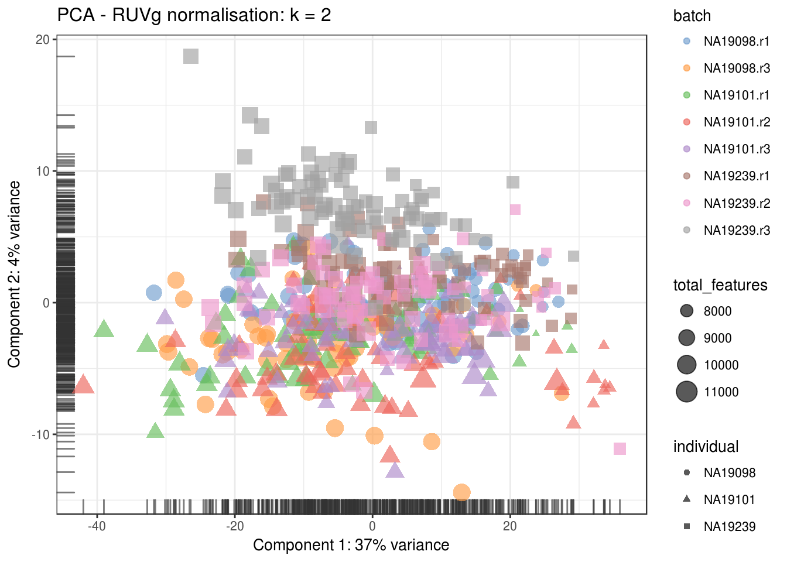
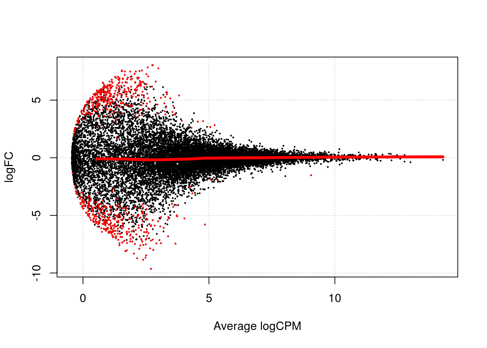

# Dealing with confounders (Reads)


```r
library(scRNA.seq.funcs)
library(RUVSeq)
library(scater, quietly = TRUE)
library(scran)
library(edgeR)
options(stringsAsFactors = FALSE)
reads <- readRDS("blischak/reads.rds")
reads.qc <- reads[fData(reads)$use, pData(reads)$use]
endog_genes <- !fData(reads.qc)$is_feature_control
erccs <- fData(reads.qc)$is_feature_control
```

## Remove Unwanted Variation

### RUVg


```r
ruvg <- RUVg(counts(reads.qc), erccs, k = 1)
set_exprs(reads.qc, "ruvg1") <- ruvg$normalizedCounts
ruvg <- RUVg(counts(reads.qc), erccs, k = 2)
set_exprs(reads.qc, "ruvg2") <- ruvg$normalizedCounts
set_exprs(reads.qc, "ruvg2_logcpm") <- log2(t(t(ruvg$normalizedCounts) / 
                                           colSums(ruvg$normalizedCounts)) + 1)
```

### RUVs


```r
scIdx <- matrix(-1, ncol = max(table(reads.qc$individual)), nrow = 3)
tmp <- which(reads.qc$individual == "NA19098")
scIdx[1, 1:length(tmp)] <- tmp
tmp <- which(reads.qc$individual == "NA19101")
scIdx[2, 1:length(tmp)] <- tmp
tmp <- which(reads.qc$individual == "NA19239")
scIdx[3, 1:length(tmp)] <- tmp
cIdx <- rownames(reads.qc)
ruvs <- RUVs(counts(reads.qc), cIdx, k = 1, scIdx = scIdx, isLog = FALSE)
set_exprs(reads.qc, "ruvs1") <- ruvs$normalizedCounts
ruvs <- RUVs(counts(reads.qc), cIdx, k = 2, scIdx = scIdx, isLog = FALSE)
set_exprs(reads.qc, "ruvs2") <- ruvs$normalizedCounts
set_exprs(reads.qc, "ruvs2_logcpm") <- log2(t(t(ruvs$normalizedCounts) / 
                                           colSums(ruvs$normalizedCounts)) + 1)
```

## Effectiveness 1


```r
plotPCA(
    reads.qc[endog_genes, ],
    colour_by = "batch",
    size_by = "total_features",
    shape_by = "individual",
    exprs_values = "ruvg1") +
    ggtitle("PCA - RUVg normalisation: k = 1")
```


```r
plotPCA(
    reads.qc[endog_genes, ],
    colour_by = "batch",
    size_by = "total_features",
    shape_by = "individual",
    exprs_values = "ruvg2") +
    ggtitle("PCA - RUVg normalisation: k = 2")
```



```r
plotPCA(
    reads.qc[endog_genes, ],
    colour_by = "batch",
    size_by = "total_features",
    shape_by = "individual",
    exprs_values = "ruvs1") +
    ggtitle("PCA - RUVs normalisation: k = 1")
```


```r
plotPCA(
    reads.qc[endog_genes, ],
    colour_by = "batch",
    size_by = "total_features",
    shape_by = "individual",
    exprs_values = "ruvs2") +
    ggtitle("PCA - RUVs normalisation: k = 2")
```


```r
plotPCA(
    reads.qc[endog_genes, ],
    colour_by = "batch",
    size_by = "total_features",
    shape_by = "individual",
    exprs_values = "ruvs2_logcpm") +
    ggtitle("PCA - RUVs normalisation log2-cpm: k = 2")
```


## Effectiveness 2


```r
boxplot(
    list(
        "Raw counts" = calc_cell_RLE(counts(reads.qc), erccs),
        "RUVg (k = 1)" = calc_cell_RLE(assayData(reads.qc)$ruvg1, erccs),
        "RUVg (k = 2)" = calc_cell_RLE(assayData(reads.qc)$ruvg2, erccs),
        "RUVs (k = 1)" = calc_cell_RLE(assayData(reads.qc)$ruvs1, erccs),
        "RUVs (k = 2)" = calc_cell_RLE(assayData(reads.qc)$ruvs2, erccs)
    )
)
```


## Effectiveness 3


```r
keep <- c(
    sample(which(reads.qc$batch == "NA19101.r1"), 20), 
    sample(which(reads.qc$batch == "NA19101.r2"), 20),
    sample(which(reads.qc$batch == "NA19101.r3"), 20)
)
design <- model.matrix(~reads.qc[, keep]$batch)
```

### DE (raw counts)

```r
dge1 <- DGEList(
    counts = counts(reads.qc[, keep]), 
    norm.factors = rep(1, length(keep)),
    group = reads.qc[, keep]$batch
)
dge1 <- estimateDisp(dge1, design = design, trend.method = "none")
plotBCV(dge1)
```


```r
fit1 <- glmFit(dge1, design)
res1 <- glmLRT(fit1, coef = 2)
topTags(res1)
```

```
## Coefficient:  reads.qc[, keep]$batchNA19101.r2 
##                     logFC   logCPM       LR       PValue          FDR
## ENSG00000163106 -3.802246 4.532733 39.04345 4.144778e-10 6.656928e-06
## ENSG00000196139 -8.626757 2.973005 32.80932 1.016564e-08 8.163519e-05
## ENSG00000213145 -7.757697 2.639375 29.71926 4.993620e-08 2.617741e-04
## ENSG00000158406 -8.195130 3.310695 28.75779 8.201927e-08 2.617741e-04
## ENSG00000177283  6.792681 2.993115 28.47904 9.471837e-08 2.617741e-04
## ENSG00000003402 -7.098136 3.512827 28.41720 9.779246e-08 2.617741e-04
## ENSG00000145901  6.690569 2.309618 27.61150 1.482942e-07 2.902840e-04
## ENSG00000175066 -7.750544 2.540060 27.49976 1.571144e-07 2.902840e-04
## ENSG00000112343  7.905666 2.593382 27.29426 1.747294e-07 2.902840e-04
## ENSG00000105146 -7.521403 1.938928 27.22888 1.807384e-07 2.902840e-04
```

```r
summary(decideTestsDGE(res1))
```

```
##    [,1] 
## -1   794
## 0  14403
## 1    864
```

```r
plotSmear(
    res1, lowess = TRUE,
    de.tags = rownames(topTags(res1, n = sum(abs(decideTestsDGE(res1))))$table)
)
```


### DE (RUVg, k = 2)

```r
design_ruvg <- model.matrix(~ruvg$W[keep,] + reads.qc[, keep]$batch)
head(design_ruvg)
```

```
##   (Intercept) ruvg$W[keep, ]W_1 ruvg$W[keep, ]W_2
## 1           1      -0.051262695       0.022687305
## 2           1       0.015736500      -0.028758718
## 3           1       0.024597369      -0.001815257
## 4           1      -0.025856039       0.027531992
## 5           1      -0.002485334       0.039227992
## 6           1      -0.013391953      -0.037040604
##   reads.qc[, keep]$batchNA19101.r2 reads.qc[, keep]$batchNA19101.r3
## 1                                0                                0
## 2                                0                                0
## 3                                0                                0
## 4                                0                                0
## 5                                0                                0
## 6                                0                                0
```

```r
dge_ruvg <- estimateDisp(dge1, design = design_ruvg, trend.method = "none")
plotBCV(dge_ruvg)
```


```r
fit2 <- glmFit(dge_ruvg, design_ruvg)
res2 <- glmLRT(fit2)
topTags(res2)
```

```
## Coefficient:  reads.qc[, keep]$batchNA19101.r3 
##                     logFC    logCPM       LR       PValue          FDR
## ENSG00000183208 -5.012835 0.3240254 43.82658 3.587989e-11 5.762669e-07
## ENSG00000151322 -4.764226 0.2266482 41.78520 1.018718e-10 8.180817e-07
## ENSG00000144229 -4.137757 0.0259158 36.50388 1.523625e-09 8.156981e-06
## ENSG00000142530  7.749828 2.1366300 32.37788 1.269233e-08 5.096290e-05
## ENSG00000100599 -7.189741 1.7890381 30.56343 3.231274e-08 1.037950e-04
## ENSG00000057704 -7.012295 2.3249067 29.10044 6.872136e-08 1.839556e-04
## ENSG00000101605 -5.953749 0.8960903 28.74333 8.263419e-08 1.895982e-04
## ENSG00000176236 -4.447825 1.0399309 27.23554 1.801171e-07 3.616077e-04
## ENSG00000251201 -4.163980 0.7694074 27.00643 2.027798e-07 3.618718e-04
## ENSG00000171992 -5.620429 0.8359307 26.66503 2.419609e-07 3.886135e-04
```

```r
summary(decideTestsDGE(res2))
```

```
##    [,1] 
## -1   411
## 0  15337
## 1    313
```

```r
plotSmear(
    res2, lowess = TRUE,
    de.tags = rownames(topTags(res2, n = sum(abs(decideTestsDGE(res2))))$table)
)
```


### DE (RUVs, k = 2)

```r
design_ruvs <- model.matrix(~ruvs$W[keep,] + reads.qc[, keep]$batch)
head(design_ruvs)
```

```
##   (Intercept) ruvs$W[keep, ]W_1 ruvs$W[keep, ]W_2
## 1           1         0.3411501         0.1898753
## 2           1         0.3228221         0.2084244
## 3           1         0.3257709         0.1987312
## 4           1         0.2879353         0.1807737
## 5           1         0.3760740         0.1978700
## 6           1         0.2840463         0.2189778
##   reads.qc[, keep]$batchNA19101.r2 reads.qc[, keep]$batchNA19101.r3
## 1                                0                                0
## 2                                0                                0
## 3                                0                                0
## 4                                0                                0
## 5                                0                                0
## 6                                0                                0
```

```r
dge_ruvs <- estimateDisp(dge1, design = design_ruvs, trend.method = "none")
plotBCV(dge_ruvs)
```


```r
fit3 <- glmFit(dge_ruvs, design_ruvs)
res3 <- glmLRT(fit3)
topTags(res3)
```

```
## Coefficient:  reads.qc[, keep]$batchNA19101.r3 
##                     logFC     logCPM       LR       PValue          FDR
## ENSG00000165309 -6.787044 0.86934388 58.14815 2.431024e-14 2.350370e-10
## ENSG00000103888 -6.742637 0.84597486 57.78305 2.926804e-14 2.350370e-10
## ENSG00000196735 -6.393815 0.67606875 54.98767 1.212886e-13 6.493385e-10
## ENSG00000137252 -6.151458 0.56580433 53.01296 3.313547e-13 1.327192e-09
## ENSG00000127533 -6.098163 0.54269245 52.57953 4.131724e-13 1.327192e-09
## ENSG00000225556 -5.896019 0.45872117 50.93815 9.532272e-13 2.551630e-09
## ENSG00000203780 -5.819290 0.42749230 50.29805 1.320808e-12 3.030499e-09
## ENSG00000164796 -4.790098 0.08666652 41.69103 1.068984e-10 2.146118e-07
## ENSG00000163431 -5.540807 0.44474658 40.12315 2.384466e-10 4.195718e-07
## ENSG00000094963 -5.514642 0.43297034 39.94484 2.612364e-10 4.195718e-07
```

```r
summary(decideTestsDGE(res3))
```

```
##    [,1] 
## -1   474
## 0  15234
## 1    353
```

```r
plotSmear(
    res3, lowess = TRUE,
    de.tags = rownames(topTags(res3, n = sum(abs(decideTestsDGE(res3))))$table)
)
```




```r
reads.qc <- scran::computeSumFactors(reads.qc, sizes = 15)
dge_ruvs$samples$norm.factors <- sizeFactors(reads.qc)[keep]
dge_ruvs_sf <- estimateDisp(dge_ruvs, design = design_ruvs, trend.method = "none")
plotBCV(dge_ruvs_sf)
```


```r
fit4 <- glmFit(dge_ruvs_sf, design_ruvs)
res4 <- glmLRT(fit4)
topTags(res4)
```

```
## Coefficient:  reads.qc[, keep]$batchNA19101.r3 
##                     logFC     logCPM       LR       PValue          FDR
## ENSG00000165309 -6.710976  0.6602086 55.06470 1.166270e-13 1.124997e-09
## ENSG00000103888 -6.665436  0.6370555 54.70443 1.400905e-13 1.124997e-09
## ENSG00000196735 -6.317337  0.4686949 51.94713 5.701540e-13 3.052414e-09
## ENSG00000137252 -6.074337  0.3593951 50.00081 1.536827e-12 6.136800e-09
## ENSG00000127533 -6.021266  0.3364798 49.57381 1.910466e-12 6.136800e-09
## ENSG00000225556 -5.821003  0.2532023 47.95757 4.355440e-12 1.165879e-08
## ENSG00000203780 -5.744490  0.2222221 47.32764 6.005938e-12 1.378020e-08
## ENSG00000164796 -4.719401 -0.1163760 38.88952 4.484813e-10 9.003823e-07
## ENSG00000163431 -5.269449  0.1448816 37.54351 8.939651e-10 1.438796e-06
## ENSG00000094963 -5.242754  0.1342596 37.36988 9.771959e-10 1.438796e-06
```

```r
summary(decideTestsDGE(res4))
```

```
##    [,1] 
## -1   381
## 0  15316
## 1    364
```

```r
plotSmear(
    res4, lowess = TRUE,
    de.tags = rownames(topTags(res4, n = sum(abs(decideTestsDGE(res4))))$table)
)
```


