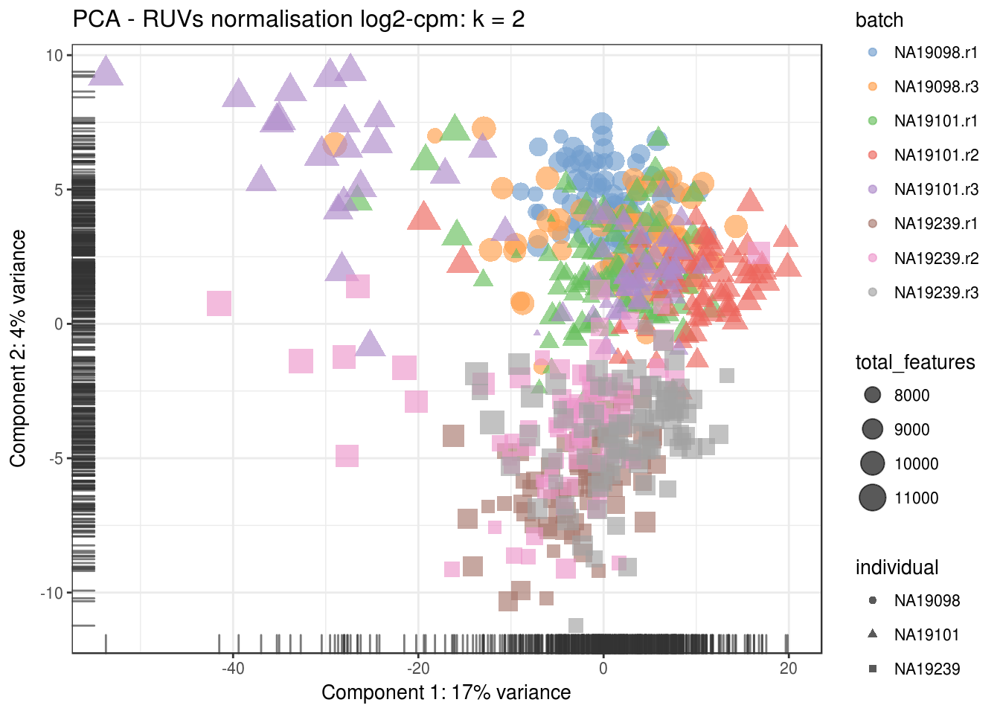

# Dealing with confounders (Reads)


```r
library(scRNA.seq.funcs)
library(RUVSeq)
library(scater, quietly = TRUE)
library(scran)
library(edgeR)
options(stringsAsFactors = FALSE)
reads <- readRDS("blischak/reads.rds")
reads.qc <- reads[fData(reads)$use, pData(reads)$use]
endog_genes <- !fData(reads.qc)$is_feature_control
erccs <- fData(reads.qc)$is_feature_control
```

## Remove Unwanted Variation

### RUVg


```r
ruvg <- RUVg(counts(reads.qc), erccs, k = 1)
set_exprs(reads.qc, "ruvg1") <- ruvg$normalizedCounts
ruvg <- RUVg(counts(reads.qc), erccs, k = 2)
set_exprs(reads.qc, "ruvg2") <- ruvg$normalizedCounts
set_exprs(reads.qc, "ruvg2_logcpm") <- log2(t(t(ruvg$normalizedCounts) / 
                                           colSums(ruvg$normalizedCounts)) + 1)
```

### RUVs


```r
scIdx <- matrix(-1, ncol = max(table(reads.qc$individual)), nrow = 3)
tmp <- which(reads.qc$individual == "NA19098")
scIdx[1, 1:length(tmp)] <- tmp
tmp <- which(reads.qc$individual == "NA19101")
scIdx[2, 1:length(tmp)] <- tmp
tmp <- which(reads.qc$individual == "NA19239")
scIdx[3, 1:length(tmp)] <- tmp
cIdx <- rownames(reads.qc)
ruvs <- RUVs(counts(reads.qc), cIdx, k = 1, scIdx = scIdx, isLog = FALSE)
set_exprs(reads.qc, "ruvs1") <- ruvs$normalizedCounts
ruvs <- RUVs(counts(reads.qc), cIdx, k = 2, scIdx = scIdx, isLog = FALSE)
set_exprs(reads.qc, "ruvs2") <- ruvs$normalizedCounts
set_exprs(reads.qc, "ruvs2_logcpm") <- log2(t(t(ruvs$normalizedCounts) / 
                                           colSums(ruvs$normalizedCounts)) + 1)
```

## Effectiveness 1


```r
plotPCA(
    reads.qc[endog_genes, ],
    colour_by = "batch",
    size_by = "total_features",
    shape_by = "individual",
    exprs_values = "ruvg1") +
    ggtitle("PCA - RUVg normalisation: k = 1")
```


```r
plotPCA(
    reads.qc[endog_genes, ],
    colour_by = "batch",
    size_by = "total_features",
    shape_by = "individual",
    exprs_values = "ruvg2") +
    ggtitle("PCA - RUVg normalisation: k = 2")
```


```r
plotPCA(
    reads.qc[endog_genes, ],
    colour_by = "batch",
    size_by = "total_features",
    shape_by = "individual",
    exprs_values = "ruvs1") +
    ggtitle("PCA - RUVs normalisation: k = 1")
```


```r
plotPCA(
    reads.qc[endog_genes, ],
    colour_by = "batch",
    size_by = "total_features",
    shape_by = "individual",
    exprs_values = "ruvs2") +
    ggtitle("PCA - RUVs normalisation: k = 2")
```


```r
plotPCA(
    reads.qc[endog_genes, ],
    colour_by = "batch",
    size_by = "total_features",
    shape_by = "individual",
    exprs_values = "ruvs2_logcpm") +
    ggtitle("PCA - RUVs normalisation log2-cpm: k = 2")
```



## Effectiveness 2


```r
boxplot(
    list(
        "Raw counts" = calc_cell_RLE(counts(reads.qc), erccs),
        "RUVg (k = 1)" = calc_cell_RLE(assayData(reads.qc)$ruvg1, erccs),
        "RUVg (k = 2)" = calc_cell_RLE(assayData(reads.qc)$ruvg2, erccs),
        "RUVs (k = 1)" = calc_cell_RLE(assayData(reads.qc)$ruvs1, erccs),
        "RUVs (k = 2)" = calc_cell_RLE(assayData(reads.qc)$ruvs2, erccs)
    )
)
```


## Effectiveness 3


```r
keep <- c(
    sample(which(reads.qc$batch == "NA19101.r1"), 20), 
    sample(which(reads.qc$batch == "NA19101.r2"), 20),
    sample(which(reads.qc$batch == "NA19101.r3"), 20)
)
design <- model.matrix(~reads.qc[, keep]$batch)
```

### DE (raw counts)

```r
dge1 <- DGEList(
    counts = counts(reads.qc[, keep]), 
    norm.factors = rep(1, length(keep)),
    group = reads.qc[, keep]$batch
)
dge1 <- estimateDisp(dge1, design = design, trend.method = "none")
plotBCV(dge1)
```


```r
fit1 <- glmFit(dge1, design)
res1 <- glmLRT(fit1)
topTags(res1)
```

```
## Coefficient:  reads.qc[, keep]$batchNA19101.r3 
##                     logFC    logCPM       LR       PValue         FDR
## ENSG00000166548  6.130419 0.8851143 27.94741 1.246576e-07 0.001415225
## ENSG00000170561  6.402725 1.0654872 27.27771 1.762312e-07 0.001415225
## ENSG00000183048  5.386232 0.5233957 26.14663 3.164493e-07 0.001694164
## ENSG00000168476  6.456551 1.6032042 25.20793 5.147009e-07 0.001728444
## ENSG00000185019  6.036866 0.8351019 24.97320 5.813282e-07 0.001728444
## ENSG00000187372 -6.960052 1.4247834 24.77073 6.457049e-07 0.001728444
## ENSG00000164756  6.528408 1.1253271 24.25712 8.429484e-07 0.001934085
## ENSG00000147174 -6.962255 1.4291512 23.71261 1.118474e-06 0.001949980
## ENSG00000100890  6.250330 1.2923611 23.58628 1.194359e-06 0.001949980
## ENSG00000142347 -6.567330 1.5352467 23.37733 1.331382e-06 0.001949980
```

```r
summary(decideTestsDGE(res1))
```

```
##    [,1] 
## -1   386
## 0  15017
## 1    658
```

```r
plotSmear(
    res1, lowess = TRUE,
    de.tags = rownames(topTags(res1, n = sum(abs(decideTestsDGE(res1))))$table)
)
```


### DE (RUVg, k = 2)

```r
design_ruvg <- model.matrix(~ruvg$W[keep,] + reads.qc[, keep]$batch)
head(design_ruvg)
```

```
##   (Intercept) ruvg$W[keep, ]W_1 ruvg$W[keep, ]W_2
## 1           1        0.01656193      -0.008540817
## 2           1        0.01651320       0.054319696
## 3           1        0.05502781       0.058770627
## 4           1        0.03900543       0.008739589
## 5           1        0.03572731      -0.019621075
## 6           1       -0.02014722       0.118496638
##   reads.qc[, keep]$batchNA19101.r2 reads.qc[, keep]$batchNA19101.r3
## 1                                0                                0
## 2                                0                                0
## 3                                0                                0
## 4                                0                                0
## 5                                0                                0
## 6                                0                                0
```

```r
dge_ruvg <- estimateDisp(dge1, design = design_ruvg, trend.method = "none")
plotBCV(dge_ruvg)
```


```r
fit2 <- glmFit(dge_ruvg, design_ruvg)
res2 <- glmLRT(fit2)
topTags(res2)
```

```
## Coefficient:  reads.qc[, keep]$batchNA19101.r3 
##                     logFC     logCPM       LR       PValue          FDR
## ENSG00000105371 -6.488616 1.75829641 30.97481 2.613989e-08 0.0002991988
## ENSG00000183048  5.466434 0.52331508 30.28719 3.725780e-08 0.0002991988
## ENSG00000185245 -4.175930 0.15463259 28.85623 7.795478e-08 0.0003539499
## ENSG00000215014 -5.118183 0.96366627 28.61399 8.834173e-08 0.0003539499
## ENSG00000152766 -4.061796 0.10940933 28.10207 1.150826e-07 0.0003539499
## ENSG00000172346 -4.021023 0.09400893 27.83335 1.322271e-07 0.0003539499
## ENSG00000147174 -7.068188 1.42930220 26.83883 2.211484e-07 0.0004253165
## ENSG00000257335 -5.961143 1.01965515 26.55852 2.556743e-07 0.0004253165
## ENSG00000134138 -6.258082 1.21897463 26.43975 2.718868e-07 0.0004253165
## ENSG00000105383 -4.769462 0.27731884 26.40583 2.767038e-07 0.0004253165
```

```r
summary(decideTestsDGE(res2))
```

```
##    [,1] 
## -1   409
## 0  15364
## 1    288
```

```r
plotSmear(
    res2, lowess = TRUE,
    de.tags = rownames(topTags(res2, n = sum(abs(decideTestsDGE(res2))))$table)
)
```


### DE (RUVs, k = 2)

```r
design_ruvs <- model.matrix(~ruvs$W[keep,] + reads.qc[, keep]$batch)
head(design_ruvs)
```

```
##   (Intercept) ruvs$W[keep, ]W_1 ruvs$W[keep, ]W_2
## 1           1         0.3393820         0.2006604
## 2           1         0.2929812         0.1749449
## 3           1         0.3008299         0.1209562
## 4           1         0.3437096         0.2013995
## 5           1         0.3725096         0.1874279
## 6           1         0.2961611         0.1507961
##   reads.qc[, keep]$batchNA19101.r2 reads.qc[, keep]$batchNA19101.r3
## 1                                0                                0
## 2                                0                                0
## 3                                0                                0
## 4                                0                                0
## 5                                0                                0
## 6                                0                                0
```

```r
dge_ruvs <- estimateDisp(dge1, design = design_ruvs, trend.method = "none")
plotBCV(dge_ruvs)
```


```r
fit3 <- glmFit(dge_ruvs, design_ruvs)
res3 <- glmLRT(fit3)
topTags(res3)
```

```
## Coefficient:  reads.qc[, keep]$batchNA19101.r3 
##                     logFC    logCPM       LR       PValue          FDR
## ENSG00000101844 -8.482010 2.2663030 30.55207 3.250255e-08 0.0003634148
## ENSG00000213658 -7.478753 2.4010382 28.48461 9.444621e-08 0.0003634148
## ENSG00000124575 -7.398875 3.1336278 28.39393 9.897522e-08 0.0003634148
## ENSG00000111424 -6.260436 0.8800090 28.25649 1.062578e-07 0.0003634148
## ENSG00000183048  5.549179 0.5232937 28.13007 1.134295e-07 0.0003634148
## ENSG00000170561  6.419549 1.0654159 27.78229 1.357629e-07 0.0003634148
## ENSG00000198939  6.221539 1.7138714 26.84011 2.210025e-07 0.0005070745
## ENSG00000091664 -5.871182 0.6582352 25.92175 3.555400e-07 0.0007137909
## ENSG00000136449  5.778496 1.1503742 25.33284 4.824258e-07 0.0008609157
## ENSG00000012822  6.932509 2.0996773 24.51995 7.354442e-07 0.0011811969
```

```r
summary(decideTestsDGE(res3))
```

```
##    [,1] 
## -1   279
## 0  15429
## 1    353
```

```r
plotSmear(
    res3, lowess = TRUE,
    de.tags = rownames(topTags(res3, n = sum(abs(decideTestsDGE(res3))))$table)
)
```


```r
reads.qc <- scran::computeSumFactors(reads.qc, sizes = 15)
dge_ruvs$samples$norm.factors <- sizeFactors(reads.qc)[keep]
dge_ruvs_sf <- estimateDisp(dge_ruvs, design = design_ruvs, trend.method = "none")
plotBCV(dge_ruvs_sf)
```


```r
fit4 <- glmFit(dge_ruvs_sf, design_ruvs)
res4 <- glmLRT(fit4)
topTags(res4)
```

```
## Coefficient:  reads.qc[, keep]$batchNA19101.r3 
##                     logFC    logCPM       LR       PValue          FDR
## ENSG00000101844 -8.527250 2.1307827 29.24823 6.367435e-08 0.0005452711
## ENSG00000183048  5.916540 0.3590364 28.88925 7.663711e-08 0.0005452711
## ENSG00000170561  6.822329 0.9411411 28.19748 1.095469e-07 0.0005452711
## ENSG00000198939  6.546384 1.4899410 27.33649 1.709546e-07 0.0005452711
## ENSG00000111424 -6.409088 0.7033182 27.27968 1.760514e-07 0.0005452711
## ENSG00000213658 -7.613052 2.2251007 26.99768 2.037001e-07 0.0005452711
## ENSG00000124575 -7.210225 3.0549597 25.53112 4.353053e-07 0.0009548824
## ENSG00000136449  6.011440 0.8117463 25.36021 4.756279e-07 0.0009548824
## ENSG00000091664 -6.020202 0.4713913 25.04706 5.594799e-07 0.0009984230
## ENSG00000012822  7.214811 1.6654151 24.34647 8.047388e-07 0.0012744248
```

```r
summary(decideTestsDGE(res4))
```

```
##    [,1] 
## -1   232
## 0  15456
## 1    373
```

```r
plotSmear(
    res4, lowess = TRUE,
    de.tags = rownames(topTags(res4, n = sum(abs(decideTestsDGE(res4))))$table)
)
```


