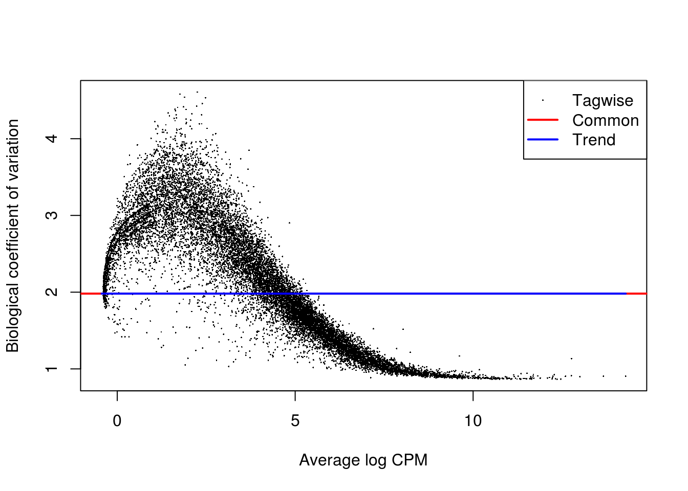
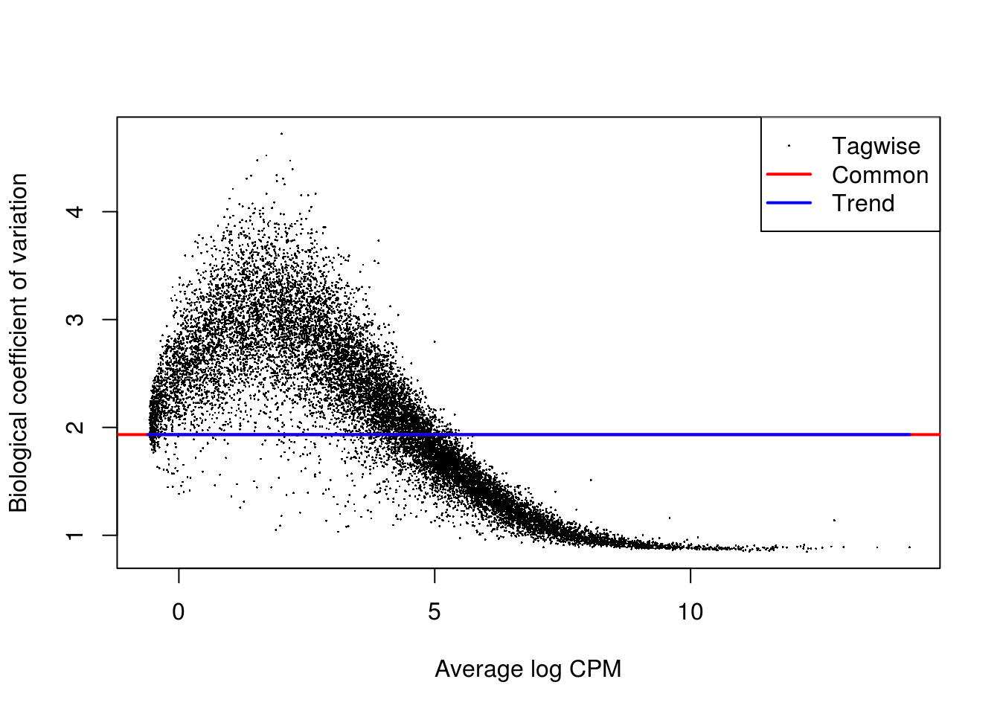

# Dealing with confounders (Reads)


```r
library(scRNA.seq.funcs)
library(RUVSeq)
library(scater, quietly = TRUE)
library(scran)
library(edgeR)
options(stringsAsFactors = FALSE)
reads <- readRDS("blischak/reads.rds")
reads.qc <- reads[fData(reads)$use, pData(reads)$use]
endog_genes <- !fData(reads.qc)$is_feature_control
erccs <- fData(reads.qc)$is_feature_control
```

## Remove Unwanted Variation

### RUVg


```r
ruvg <- RUVg(counts(reads.qc), erccs, k = 1)
set_exprs(reads.qc, "ruvg1") <- ruvg$normalizedCounts
ruvg <- RUVg(counts(reads.qc), erccs, k = 2)
set_exprs(reads.qc, "ruvg2") <- ruvg$normalizedCounts
set_exprs(reads.qc, "ruvg2_logcpm") <- log2(t(t(ruvg$normalizedCounts) / 
                                           colSums(ruvg$normalizedCounts)) + 1)
```

### RUVs


```r
scIdx <- matrix(-1, ncol = max(table(reads.qc$individual)), nrow = 3)
tmp <- which(reads.qc$individual == "NA19098")
scIdx[1, 1:length(tmp)] <- tmp
tmp <- which(reads.qc$individual == "NA19101")
scIdx[2, 1:length(tmp)] <- tmp
tmp <- which(reads.qc$individual == "NA19239")
scIdx[3, 1:length(tmp)] <- tmp
cIdx <- rownames(reads.qc)
ruvs <- RUVs(counts(reads.qc), cIdx, k = 1, scIdx = scIdx, isLog = FALSE)
set_exprs(reads.qc, "ruvs1") <- ruvs$normalizedCounts
ruvs <- RUVs(counts(reads.qc), cIdx, k = 2, scIdx = scIdx, isLog = FALSE)
set_exprs(reads.qc, "ruvs2") <- ruvs$normalizedCounts
set_exprs(reads.qc, "ruvs2_logcpm") <- log2(t(t(ruvs$normalizedCounts) / 
                                           colSums(ruvs$normalizedCounts)) + 1)
```

## Effectiveness 1


```r
plotPCA(
    reads.qc[endog_genes, ],
    colour_by = "batch",
    size_by = "total_features",
    shape_by = "individual",
    exprs_values = "ruvg1") +
    ggtitle("PCA - RUVg normalisation: k = 1")
```


```r
plotPCA(
    reads.qc[endog_genes, ],
    colour_by = "batch",
    size_by = "total_features",
    shape_by = "individual",
    exprs_values = "ruvg2") +
    ggtitle("PCA - RUVg normalisation: k = 2")
```


```r
plotPCA(
    reads.qc[endog_genes, ],
    colour_by = "batch",
    size_by = "total_features",
    shape_by = "individual",
    exprs_values = "ruvs1") +
    ggtitle("PCA - RUVs normalisation: k = 1")
```


```r
plotPCA(
    reads.qc[endog_genes, ],
    colour_by = "batch",
    size_by = "total_features",
    shape_by = "individual",
    exprs_values = "ruvs2") +
    ggtitle("PCA - RUVs normalisation: k = 2")
```


```r
plotPCA(
    reads.qc[endog_genes, ],
    colour_by = "batch",
    size_by = "total_features",
    shape_by = "individual",
    exprs_values = "ruvs2_logcpm") +
    ggtitle("PCA - RUVs normalisation log2-cpm: k = 2")
```


## Effectiveness 2


```r
boxplot(
    list(
        "Raw counts" = calc_cell_RLE(counts(reads.qc), erccs),
        "RUVg (k = 1)" = calc_cell_RLE(assayData(reads.qc)$ruvg1, erccs),
        "RUVg (k = 2)" = calc_cell_RLE(assayData(reads.qc)$ruvg2, erccs),
        "RUVs (k = 1)" = calc_cell_RLE(assayData(reads.qc)$ruvs1, erccs),
        "RUVs (k = 2)" = calc_cell_RLE(assayData(reads.qc)$ruvs2, erccs)
    )
)
```


## Effectiveness 3


```r
keep <- c(
    sample(which(reads.qc$batch == "NA19101.r1"), 20), 
    sample(which(reads.qc$batch == "NA19101.r2"), 20),
    sample(which(reads.qc$batch == "NA19101.r3"), 20)
)
design <- model.matrix(~reads.qc[, keep]$batch)
```

### DE (raw counts)

```r
dge1 <- DGEList(
    counts = counts(reads.qc[, keep]), 
    norm.factors = rep(1, length(keep)),
    group = reads.qc[, keep]$batch
)
dge1 <- estimateDisp(dge1, design = design, trend.method = "none")
plotBCV(dge1)
```



```r
fit1 <- glmFit(dge1, design)
res1 <- glmLRT(fit1)
topTags(res1)
```

```
## Coefficient:  reads.qc[, keep]$batchNA19101.r3 
##                     logFC    logCPM       LR       PValue          FDR
## ENSG00000121898  7.304143 2.1689781 29.82644 4.725051e-08 0.0005367483
## ENSG00000186684  7.256534 1.5928799 29.15426 6.683871e-08 0.0005367483
## ENSG00000101670  6.352315 2.6696877 26.26993 2.968753e-07 0.0012376781
## ENSG00000148331  6.062976 1.5627290 25.58049 4.243074e-07 0.0012376781
## ENSG00000168143  6.521742 1.0627775 25.51913 4.380173e-07 0.0012376781
## ENSG00000157680  6.202292 1.7281651 25.41476 4.623665e-07 0.0012376781
## ENSG00000171246 -6.828155 1.2883263 24.56634 7.179505e-07 0.0014496432
## ENSG00000196167 -7.185007 1.5524003 24.52647 7.329597e-07 0.0014496432
## ENSG00000198075  6.065113 0.7723609 24.32840 8.123273e-07 0.0014496432
## ENSG00000183153  7.027571 1.4257743 23.90609 1.011511e-06 0.0015853989
```

```r
summary(decideTestsDGE(res1))
```

```
##    [,1] 
## -1   468
## 0  14971
## 1    622
```

```r
plotSmear(
    res1, lowess = TRUE,
    de.tags = rownames(topTags(res1, n = sum(abs(decideTestsDGE(res1))))$table)
)
```


### DE (RUVg, k = 2)

```r
design_ruvg <- model.matrix(~ruvg$W[keep,] + reads.qc[, keep]$batch)
head(design_ruvg)
```

```
##   (Intercept) ruvg$W[keep, ]W_1 ruvg$W[keep, ]W_2
## 1           1       0.054015398      -0.031853433
## 2           1      -0.002485334       0.039227992
## 3           1      -0.005307869      -0.010459320
## 4           1       0.051020472      -0.008166728
## 5           1       0.018056681      -0.028121003
## 6           1       0.023338833      -0.039468559
##   reads.qc[, keep]$batchNA19101.r2 reads.qc[, keep]$batchNA19101.r3
## 1                                0                                0
## 2                                0                                0
## 3                                0                                0
## 4                                0                                0
## 5                                0                                0
## 6                                0                                0
```

```r
dge_ruvg <- estimateDisp(dge1, design = design_ruvg, trend.method = "none")
plotBCV(dge_ruvg)
```


```r
fit2 <- glmFit(dge_ruvg, design_ruvg)
res2 <- glmLRT(fit2)
topTags(res2)
```

```
## Coefficient:  reads.qc[, keep]$batchNA19101.r3 
##                     logFC    logCPM       LR       PValue         FDR
## ENSG00000121898  7.284315 2.1688670 28.98384 7.298443e-08 0.001028256
## ENSG00000186684  7.166860 1.5926674 26.68743 2.391729e-07 0.001028256
## ENSG00000138642  7.343005 1.6580725 25.76563 3.854917e-07 0.001028256
## ENSG00000157680  6.392156 1.7279783 25.20518 5.154354e-07 0.001028256
## ENSG00000148331  5.649798 1.5630045 24.94988 5.884028e-07 0.001028256
## ENSG00000171246 -6.500603 1.2886556 24.93818 5.919849e-07 0.001028256
## ENSG00000174059  5.380954 0.4182353 24.92384 5.964037e-07 0.001028256
## ENSG00000167216  7.021435 1.3415505 24.86059 6.162953e-07 0.001028256
## ENSG00000101670  6.384006 2.6697235 24.63475 6.929078e-07 0.001028256
## ENSG00000163431 -6.396432 1.3614040 24.62810 6.953059e-07 0.001028256
```

```r
summary(decideTestsDGE(res2))
```

```
##    [,1] 
## -1   386
## 0  15397
## 1    278
```

```r
plotSmear(
    res2, lowess = TRUE,
    de.tags = rownames(topTags(res2, n = sum(abs(decideTestsDGE(res2))))$table)
)
```


### DE (RUVs, k = 2)

```r
design_ruvs <- model.matrix(~ruvs$W[keep,] + reads.qc[, keep]$batch)
head(design_ruvs)
```

```
##   (Intercept) ruvs$W[keep, ]W_1 ruvs$W[keep, ]W_2
## 1           1         0.4046564         0.1473477
## 2           1         0.3760740         0.1978700
## 3           1         0.2841090         0.2127923
## 4           1         0.3904875         0.1400878
## 5           1         0.3199385         0.2077939
## 6           1         0.3140148         0.1752826
##   reads.qc[, keep]$batchNA19101.r2 reads.qc[, keep]$batchNA19101.r3
## 1                                0                                0
## 2                                0                                0
## 3                                0                                0
## 4                                0                                0
## 5                                0                                0
## 6                                0                                0
```

```r
dge_ruvs <- estimateDisp(dge1, design = design_ruvs, trend.method = "none")
plotBCV(dge_ruvs)
```


```r
fit3 <- glmFit(dge_ruvs, design_ruvs)
res3 <- glmLRT(fit3)
topTags(res3)
```

```
## Coefficient:  reads.qc[, keep]$batchNA19101.r3 
##                     logFC     logCPM       LR       PValue          FDR
## ENSG00000167363  6.126875  1.0335233 45.22071 1.760339e-11 2.827281e-07
## ENSG00000256870  4.868432  0.2889005 36.61846 1.436645e-09 1.153698e-05
## ENSG00000143340  4.669483  0.1998786 35.23225 2.926368e-09 1.566680e-05
## ENSG00000137198 -6.047055  0.8133525 32.95224 9.445080e-09 3.792436e-05
## ENSG00000167524 -5.864140  0.7111733 32.21095 1.383093e-08 4.442772e-05
## ENSG00000115718 -6.853634  1.1804401 29.81049 4.764066e-08 1.275261e-04
## ENSG00000244242  3.699876 -0.1262039 28.38039 9.966987e-08 1.953813e-04
## ENSG00000186684  7.436034  1.5926251 28.12084 1.139719e-07 1.953813e-04
## ENSG00000103888  3.657937 -0.1366837 28.07971 1.164201e-07 1.953813e-04
## ENSG00000124491 -6.419673  0.9342024 27.99468 1.216495e-07 1.953813e-04
```

```r
summary(decideTestsDGE(res3))
```

```
##    [,1] 
## -1   319
## 0  15363
## 1    379
```

```r
plotSmear(
    res3, lowess = TRUE,
    de.tags = rownames(topTags(res3, n = sum(abs(decideTestsDGE(res3))))$table)
)
```


```r
reads.qc <- scran::computeSumFactors(reads.qc, sizes = 15)
dge_ruvs$samples$norm.factors <- sizeFactors(reads.qc)[keep]
dge_ruvs_sf <- estimateDisp(dge_ruvs, design = design_ruvs, trend.method = "none")
plotBCV(dge_ruvs_sf)
```



```r
fit4 <- glmFit(dge_ruvs_sf, design_ruvs)
res4 <- glmLRT(fit4)
topTags(res4)
```

```
## Coefficient:  reads.qc[, keep]$batchNA19101.r3 
##                     logFC      logCPM       LR       PValue          FDR
## ENSG00000167363  6.254080  0.87748834 45.14646 1.828362e-11 2.936533e-07
## ENSG00000256870  4.996089  0.07137394 36.63314 1.425867e-09 1.145042e-05
## ENSG00000143340  4.796169 -0.02752662 35.25981 2.885248e-09 1.544666e-05
## ENSG00000137198 -6.189258  0.65353986 32.56109 1.155039e-08 4.525395e-05
## ENSG00000167524 -6.110761  0.56272766 32.17515 1.408815e-08 4.525395e-05
## ENSG00000115718 -6.855424  0.88199994 29.25219 6.354449e-08 1.700980e-04
## ENSG00000244242  3.821270 -0.39586442 28.46240 9.553574e-08 2.191999e-04
## ENSG00000103888  3.778991 -0.40787687 28.16367 1.114777e-07 2.202169e-04
## ENSG00000186684  7.689144  1.54931220 27.96701 1.234016e-07 2.202169e-04
## ENSG00000124491 -6.304395  0.72396836 27.06381 1.968487e-07 3.161587e-04
```

```r
summary(decideTestsDGE(res4))
```

```
##    [,1] 
## -1   272
## 0  15416
## 1    373
```

```r
plotSmear(
    res4, lowess = TRUE,
    de.tags = rownames(topTags(res4, n = sum(abs(decideTestsDGE(res4))))$table)
)
```


