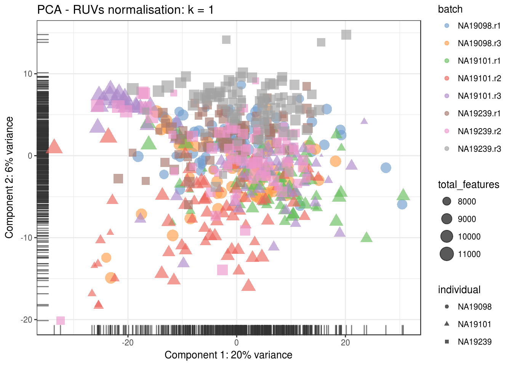

# Dealing with confounders (Reads)


```r
library(scRNA.seq.funcs)
library(RUVSeq)
library(scater, quietly = TRUE)
library(scran)
library(edgeR)
options(stringsAsFactors = FALSE)
reads <- readRDS("blischak/reads.rds")
reads.qc <- reads[fData(reads)$use, pData(reads)$use]
endog_genes <- !fData(reads.qc)$is_feature_control
erccs <- fData(reads.qc)$is_feature_control
```

## Remove Unwanted Variation

### RUVg


```r
ruvg <- RUVg(counts(reads.qc), erccs, k = 1)
set_exprs(reads.qc, "ruvg1") <- ruvg$normalizedCounts
ruvg <- RUVg(counts(reads.qc), erccs, k = 2)
set_exprs(reads.qc, "ruvg2") <- ruvg$normalizedCounts
set_exprs(reads.qc, "ruvg2_logcpm") <- log2(t(t(ruvg$normalizedCounts) / 
                                           colSums(ruvg$normalizedCounts)) + 1)
```

### RUVs


```r
scIdx <- matrix(-1, ncol = max(table(reads.qc$individual)), nrow = 3)
tmp <- which(reads.qc$individual == "NA19098")
scIdx[1, 1:length(tmp)] <- tmp
tmp <- which(reads.qc$individual == "NA19101")
scIdx[2, 1:length(tmp)] <- tmp
tmp <- which(reads.qc$individual == "NA19239")
scIdx[3, 1:length(tmp)] <- tmp
cIdx <- rownames(reads.qc)
ruvs <- RUVs(counts(reads.qc), cIdx, k = 1, scIdx = scIdx, isLog = FALSE)
set_exprs(reads.qc, "ruvs1") <- ruvs$normalizedCounts
ruvs <- RUVs(counts(reads.qc), cIdx, k = 2, scIdx = scIdx, isLog = FALSE)
set_exprs(reads.qc, "ruvs2") <- ruvs$normalizedCounts
set_exprs(reads.qc, "ruvs2_logcpm") <- log2(t(t(ruvs$normalizedCounts) / 
                                           colSums(ruvs$normalizedCounts)) + 1)
```

## Effectiveness 1


```r
plotPCA(
    reads.qc[endog_genes, ],
    colour_by = "batch",
    size_by = "total_features",
    shape_by = "individual",
    exprs_values = "ruvg1") +
    ggtitle("PCA - RUVg normalisation: k = 1")
```


```r
plotPCA(
    reads.qc[endog_genes, ],
    colour_by = "batch",
    size_by = "total_features",
    shape_by = "individual",
    exprs_values = "ruvg2") +
    ggtitle("PCA - RUVg normalisation: k = 2")
```


```r
plotPCA(
    reads.qc[endog_genes, ],
    colour_by = "batch",
    size_by = "total_features",
    shape_by = "individual",
    exprs_values = "ruvs1") +
    ggtitle("PCA - RUVs normalisation: k = 1")
```



```r
plotPCA(
    reads.qc[endog_genes, ],
    colour_by = "batch",
    size_by = "total_features",
    shape_by = "individual",
    exprs_values = "ruvs2") +
    ggtitle("PCA - RUVs normalisation: k = 2")
```


```r
plotPCA(
    reads.qc[endog_genes, ],
    colour_by = "batch",
    size_by = "total_features",
    shape_by = "individual",
    exprs_values = "ruvs2_logcpm") +
    ggtitle("PCA - RUVs normalisation log2-cpm: k = 2")
```


## Effectiveness 2


```r
boxplot(
    list(
        "Raw counts" = calc_cell_RLE(counts(reads.qc), erccs),
        "RUVg (k = 1)" = calc_cell_RLE(assayData(reads.qc)$ruvg1, erccs),
        "RUVg (k = 2)" = calc_cell_RLE(assayData(reads.qc)$ruvg2, erccs),
        "RUVs (k = 1)" = calc_cell_RLE(assayData(reads.qc)$ruvs1, erccs),
        "RUVs (k = 2)" = calc_cell_RLE(assayData(reads.qc)$ruvs2, erccs)
    )
)
```


## Effectiveness 3


```r
keep <- c(
    sample(which(reads.qc$batch == "NA19101.r1"), 20), 
    sample(which(reads.qc$batch == "NA19101.r2"), 20),
    sample(which(reads.qc$batch == "NA19101.r3"), 20)
)
design <- model.matrix(~reads.qc[, keep]$batch)
```

### DE (raw counts)

```r
dge1 <- DGEList(
    counts = counts(reads.qc[, keep]), 
    norm.factors = rep(1, length(keep)),
    group = reads.qc[, keep]$batch
)
dge1 <- estimateDisp(dge1, design = design, trend.method = "none")
plotBCV(dge1)
```


```r
fit1 <- glmFit(dge1, design)
res1 <- glmLRT(fit1)
topTags(res1)
```

```
## Coefficient:  reads.qc[, keep]$batchNA19101.r3 
##                     logFC    logCPM       LR       PValue         FDR
## ENSG00000165115 -7.792113 2.3887218 26.19783 3.081679e-07 0.002884342
## ENSG00000140280  7.300312 1.6569522 25.85753 3.675684e-07 0.002884342
## ENSG00000105877 -6.966115 1.4022300 24.36423 7.973575e-07 0.002884342
## ENSG00000155542  7.637098 2.0975586 23.91593 1.006354e-06 0.002884342
## ENSG00000087116 -5.697505 0.6201158 23.87020 1.030550e-06 0.002884342
## ENSG00000144476  7.094743 1.5421854 23.78440 1.077520e-06 0.002884342
## ENSG00000177483 -5.788801 0.6504550 23.05738 1.572381e-06 0.002949070
## ENSG00000165105 -6.407054 1.0143121 22.94208 1.669570e-06 0.002949070
## ENSG00000057704 -7.953420 2.2337620 22.72356 1.870600e-06 0.002949070
## ENSG00000105642  6.306497 0.9597862 22.47384 2.130253e-06 0.002949070
```

```r
summary(decideTestsDGE(res1))
```

```
##    [,1] 
## -1   541
## 0  14783
## 1    737
```

```r
plotSmear(
    res1, lowess = TRUE,
    de.tags = rownames(topTags(res1, n = sum(abs(decideTestsDGE(res1))))$table)
)
```


### DE (RUVg, k = 2)

```r
design_ruvg <- model.matrix(~ruvg$W[keep,] + reads.qc[, keep]$batch)
head(design_ruvg)
```

```
##   (Intercept) ruvg$W[keep, ]W_1 ruvg$W[keep, ]W_2
## 1           1       -0.01544610        0.04957296
## 2           1        0.01829566        0.06354737
## 3           1        0.01814940       -0.06327037
## 4           1       -0.02585604        0.02753199
## 5           1       -0.01483137        0.05209915
## 6           1        0.01188452        0.06237138
##   reads.qc[, keep]$batchNA19101.r2 reads.qc[, keep]$batchNA19101.r3
## 1                                0                                0
## 2                                0                                0
## 3                                0                                0
## 4                                0                                0
## 5                                0                                0
## 6                                0                                0
```

```r
dge_ruvg <- estimateDisp(dge1, design = design_ruvg, trend.method = "none")
plotBCV(dge_ruvg)
```


```r
fit2 <- glmFit(dge_ruvg, design_ruvg)
res2 <- glmLRT(fit2)
topTags(res2)
```

```
## Coefficient:  reads.qc[, keep]$batchNA19101.r3 
##                     logFC    logCPM       LR       PValue          FDR
## ENSG00000143127  6.393263 1.3905478 27.77041 1.365996e-07 0.0008543374
## ENSG00000151014 -7.739377 1.4502069 26.67914 2.402013e-07 0.0008543374
## ENSG00000204538 -5.703323 0.6028395 26.50373 2.630294e-07 0.0008543374
## ENSG00000165959 -8.137890 2.2748771 26.16507 3.134420e-07 0.0008543374
## ENSG00000083844 -7.456655 1.0307443 26.04695 3.332154e-07 0.0008543374
## ENSG00000140280  7.452433 1.6571621 25.84269 3.704051e-07 0.0008543374
## ENSG00000165698 -6.119602 0.8832588 25.19172 5.190466e-07 0.0008543374
## ENSG00000105877 -6.746347 1.4023211 25.05371 5.575546e-07 0.0008543374
## ENSG00000153208  8.123110 2.7499421 24.97353 5.812274e-07 0.0008543374
## ENSG00000161381  6.157689 1.0884471 24.95866 5.857296e-07 0.0008543374
```

```r
summary(decideTestsDGE(res2))
```

```
##    [,1] 
## -1   252
## 0  15547
## 1    262
```

```r
plotSmear(
    res2, lowess = TRUE,
    de.tags = rownames(topTags(res2, n = sum(abs(decideTestsDGE(res2))))$table)
)
```


### DE (RUVs, k = 2)

```r
design_ruvs <- model.matrix(~ruvs$W[keep,] + reads.qc[, keep]$batch)
head(design_ruvs)
```

```
##   (Intercept) ruvs$W[keep, ]W_1 ruvs$W[keep, ]W_2
## 1           1         0.3093128         0.1938905
## 2           1         0.2871249         0.2263144
## 3           1         0.2702873         0.2169784
## 4           1         0.2879353         0.1807737
## 5           1         0.2947330         0.1690802
## 6           1         0.3544075         0.2425527
##   reads.qc[, keep]$batchNA19101.r2 reads.qc[, keep]$batchNA19101.r3
## 1                                0                                0
## 2                                0                                0
## 3                                0                                0
## 4                                0                                0
## 5                                0                                0
## 6                                0                                0
```

```r
dge_ruvs <- estimateDisp(dge1, design = design_ruvs, trend.method = "none")
plotBCV(dge_ruvs)
```


```r
fit3 <- glmFit(dge_ruvs, design_ruvs)
res3 <- glmLRT(fit3)
topTags(res3)
```

```
## Coefficient:  reads.qc[, keep]$batchNA19101.r3 
##                     logFC    logCPM       LR       PValue          FDR
## ENSG00000111424 -6.201651 0.8462288 46.63224 8.563976e-12 5.114170e-08
## ENSG00000197980 -6.186708 0.8368680 46.52578 9.042109e-12 5.114170e-08
## ENSG00000154227 -6.170589 0.8274457 46.41815 9.552649e-12 5.114170e-08
## ENSG00000138823 -5.642913 0.5232302 42.63487 6.597285e-11 2.648975e-07
## ENSG00000267882 -4.751404 0.1288729 36.21474 1.767284e-09 5.676868e-06
## ENSG00000117152  6.604074 1.1446503 33.76140 6.230290e-09 1.667745e-05
## ENSG00000184564  6.232844 0.8503488 32.35087 1.286993e-08 2.952913e-05
## ENSG00000165046 -5.249966 0.4359222 30.27018 3.758596e-08 7.446001e-05
## ENSG00000167759 -6.817094 1.3172810 29.99466 4.332372e-08 7.446001e-05
## ENSG00000165115 -8.845112 2.3887858 29.86329 4.636076e-08 7.446001e-05
```

```r
summary(decideTestsDGE(res3))
```

```
##    [,1] 
## -1   334
## 0  15368
## 1    359
```

```r
plotSmear(
    res3, lowess = TRUE,
    de.tags = rownames(topTags(res3, n = sum(abs(decideTestsDGE(res3))))$table)
)
```


```r
reads.qc <- scran::computeSumFactors(reads.qc, sizes = 15)
dge_ruvs$samples$norm.factors <- sizeFactors(reads.qc)[keep]
dge_ruvs_sf <- estimateDisp(dge_ruvs, design = design_ruvs, trend.method = "none")
plotBCV(dge_ruvs_sf)
```


```r
fit4 <- glmFit(dge_ruvs_sf, design_ruvs)
res4 <- glmLRT(fit4)
topTags(res4)
```

```
## Coefficient:  reads.qc[, keep]$batchNA19101.r3 
##                     logFC       logCPM       LR       PValue          FDR
## ENSG00000111424 -6.281451  0.746154188 45.81432 1.300094e-11 7.757951e-08
## ENSG00000197980 -6.266449  0.736500540 45.70864 1.372164e-11 7.757951e-08
## ENSG00000154227 -6.250268  0.726781398 45.60179 1.449091e-11 7.757951e-08
## ENSG00000138823 -5.720215  0.411697275 41.84588 9.875881e-11 3.965413e-07
## ENSG00000267882 -4.824953 -0.001287811 35.47194 2.587517e-09 8.311623e-06
## ENSG00000117152  6.628645  0.996321024 32.89300 9.737339e-09 2.606523e-05
## ENSG00000184564  6.275212  0.786215495 31.91089 1.614099e-08 3.703434e-05
## ENSG00000167759 -6.954394  1.078941938 29.29779 6.206642e-08 1.246061e-04
## ENSG00000165115 -8.928370  2.273562041 28.70860 8.412926e-08 1.360266e-04
## ENSG00000165046 -5.099561  0.288130401 28.41678 9.781367e-08 1.360266e-04
```

```r
summary(decideTestsDGE(res4))
```

```
##    [,1] 
## -1   292
## 0  15428
## 1    341
```

```r
plotSmear(
    res4, lowess = TRUE,
    de.tags = rownames(topTags(res4, n = sum(abs(decideTestsDGE(res4))))$table)
)
```


