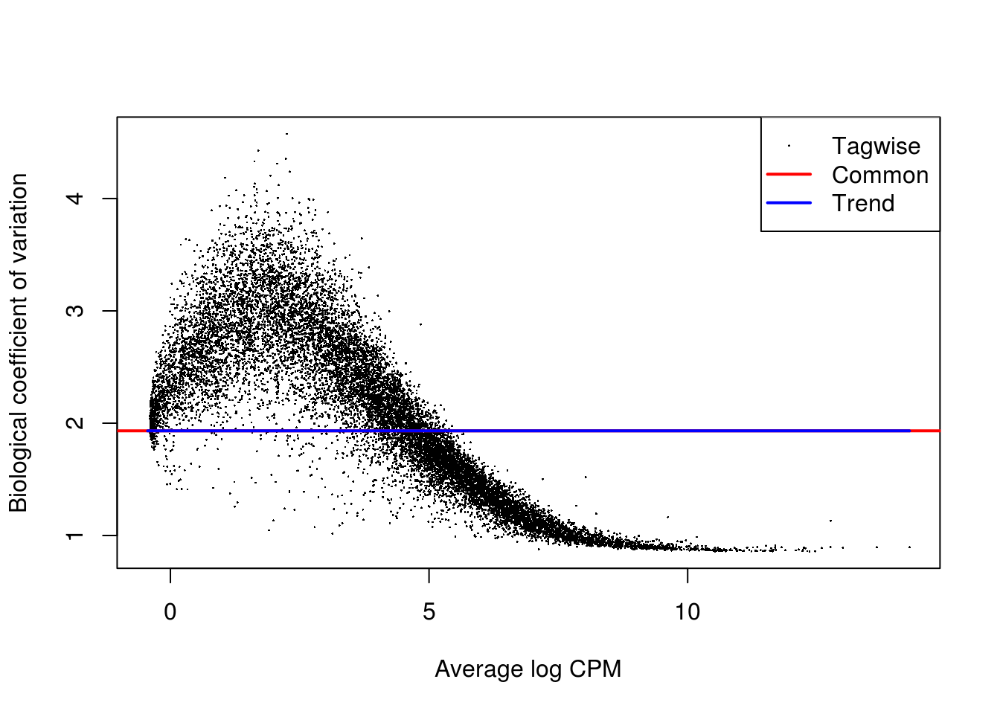

# Confounders Removal (Reads)


```r
library(scRNA.seq.funcs)
library(RUVSeq)
library(scater, quietly = TRUE)
library(scran)
library(edgeR)
options(stringsAsFactors = FALSE)
reads <- readRDS("blischak/reads.rds")
reads.qc <- reads[fData(reads)$use, pData(reads)$use]
endog_genes <- !fData(reads.qc)$is_feature_control
erccs <- fData(reads.qc)$is_feature_control
```

## Remove Unwanted Variation

### RUVg


```r
ruvg <- RUVg(counts(reads.qc), erccs, k = 1)
set_exprs(reads.qc, "ruvg1") <- ruvg$normalizedCounts
ruvg <- RUVg(counts(reads.qc), erccs, k = 2)
set_exprs(reads.qc, "ruvg2") <- ruvg$normalizedCounts
```

### RUVs


```r
scIdx <- matrix(-1, ncol = max(table(reads.qc$individual)), nrow = 3)
tmp <- which(reads.qc$individual == "NA19098")
scIdx[1, 1:length(tmp)] <- tmp
tmp <- which(reads.qc$individual == "NA19101")
scIdx[2, 1:length(tmp)] <- tmp
tmp <- which(reads.qc$individual == "NA19239")
scIdx[3, 1:length(tmp)] <- tmp
cIdx <- rownames(reads.qc)
ruvs <- RUVs(counts(reads.qc), cIdx, k = 1, scIdx = scIdx, isLog = FALSE)
set_exprs(reads.qc, "ruvs1") <- ruvs$normalizedCounts
ruvs <- RUVs(counts(reads.qc), cIdx, k = 2, scIdx = scIdx, isLog = FALSE)
set_exprs(reads.qc, "ruvs2") <- ruvs$normalizedCounts
```

## Effectiveness 1


```r
plotPCA(
    reads.qc[endog_genes, ],
    colour_by = "batch",
    size_by = "total_features",
    shape_by = "individual",
    exprs_values = "ruvg1") +
    ggtitle("PCA - RUVg normalisation: k = 1")
```


```r
plotPCA(
    reads.qc[endog_genes, ],
    colour_by = "batch",
    size_by = "total_features",
    shape_by = "individual",
    exprs_values = "ruvg2") +
    ggtitle("PCA - RUVg normalisation: k = 2")
```


```r
plotPCA(
    reads.qc[endog_genes, ],
    colour_by = "batch",
    size_by = "total_features",
    shape_by = "individual",
    exprs_values = "ruvs1") +
    ggtitle("PCA - RUVs normalisation: k = 1")
```


```r
plotPCA(
    reads.qc[endog_genes, ],
    colour_by = "batch",
    size_by = "total_features",
    shape_by = "individual",
    exprs_values = "ruvs2") +
    ggtitle("PCA - RUVs normalisation: k = 2")
```


## Effectiveness 2


```r
boxplot(
    list(
        "Raw counts" = calc_cell_RLE(counts(reads.qc), erccs),
        "RUVg (k = 1)" = calc_cell_RLE(assayData(reads.qc)$ruvg1, erccs),
        "RUVg (k = 2)" = calc_cell_RLE(assayData(reads.qc)$ruvg2, erccs),
        "RUVs (k = 1)" = calc_cell_RLE(assayData(reads.qc)$ruvs1, erccs),
        "RUVs (k = 2)" = calc_cell_RLE(assayData(reads.qc)$ruvs2, erccs)
    )
)
```


## Effectiveness 3


```r
keep <- reads.qc$individual == "NA19101"
design <- model.matrix(~reads.qc[, keep]$batch)
```

### DE (raw counts)

```r
dge1 <- DGEList(
    counts = counts(reads.qc[, keep]), 
    norm.factors = rep(1, sum(keep)),
    group = reads.qc[, keep]$batch
)
dge1 <- estimateDisp(dge1, design = design, trend.method = "none")
plotBCV(dge1)
```


```r
fit1 <- glmFit(dge1, design)
res1 <- glmLRT(fit1, coef = 2)
topTags(res1)
```

```
## Coefficient:  reads.qc[, keep]$batchNA19101.r2 
##                      logFC     logCPM        LR       PValue          FDR
## ENSG00000131969 -2.0462361  3.3152995 126.74461 2.112865e-29 3.393473e-25
## ENSG00000214265 -1.1929359  9.7573801  98.25598 3.676487e-23 2.952403e-19
## ENSG00000185885 -1.5830185  9.1429849  81.15518 2.086710e-19 1.117155e-15
## ENSG00000145423  1.1677007  8.7231604  77.54436 1.297749e-18 5.192514e-15
## ENSG00000163106 -2.6710548  4.5581559  77.11057 1.616498e-18 5.192514e-15
## ENSG00000068697 -1.0540166  8.3633336  61.65412 4.094104e-15 1.095923e-11
## ENSG00000009724  5.4392089  0.6053418  49.86491 1.647038e-12 3.779011e-09
## ENSG00000034510 -0.7014902 10.2408912  48.81733 2.809464e-12 5.640350e-09
## ENSG00000196139 -6.8039302  2.3181183  45.82142 1.295391e-11 2.311698e-08
## ENSG00000179218  0.9319769  7.8195229  45.60701 1.445238e-11 2.321197e-08
```

```r
summary(decideTestsDGE(res1))
```

```
##    [,1] 
## -1   921
## 0  14061
## 1   1079
```

```r
plotSmear(
    res1, 
    de.tags = rownames(topTags(res1, n = sum(abs(decideTestsDGE(res1))))$table)
)
```


### DE (RUVg, k = 2)

```r
dge2 <- DGEList(
    counts = get_exprs(reads.qc[, keep], "ruvg2"), 
    norm.factors = rep(1, sum(keep)),
    group = reads.qc[, keep]$batch
)
dge2 <- estimateDisp(dge2, design = design, trend.method = "none")
plotBCV(dge2)
```



```r
fit2 <- glmFit(dge2, design)
res2 <- glmLRT(fit2, coef = 2)
topTags(res2)
```

```
## Coefficient:  reads.qc[, keep]$batchNA19101.r2 
##                      logFC     logCPM        LR       PValue          FDR
## ENSG00000131969 -2.2659545  3.3359537 142.70285 6.826561e-33 1.096414e-28
## ENSG00000214265 -1.1290104  9.7556111  89.32727 3.346148e-21 2.687124e-17
## ENSG00000034510 -0.8504042 10.2337621  72.01413 2.136618e-17 1.143874e-13
## ENSG00000163106 -2.4787319  4.5086449  68.57213 1.223206e-16 4.911478e-13
## ENSG00000124766 -0.8081967 10.5770154  62.05914 3.332959e-15 9.525912e-12
## ENSG00000185885 -1.3404173  9.1256019  61.93012 3.558650e-15 9.525912e-12
## ENSG00000068697 -1.0152507  8.3589850  57.44066 3.483310e-14 7.992205e-11
## ENSG00000170561  5.9385992  1.2069205  52.30620 4.748736e-13 9.533681e-10
## ENSG00000127184 -0.5832958 10.9312778  49.44570 2.039389e-12 3.639402e-09
## ENSG00000009724  5.3696791  0.5613772  48.95032 2.625282e-12 4.216465e-09
```

```r
summary(decideTestsDGE(res2))
```

```
##    [,1] 
## -1   917
## 0  14101
## 1   1043
```

```r
plotSmear(
    res2, 
    de.tags = rownames(topTags(res2, n = sum(abs(decideTestsDGE(res2))))$table)
)
```


### DE (RUVs, k = 2)

```r
dge3 <- DGEList(
    counts = get_exprs(reads.qc[, keep], "ruvs2"), 
    norm.factors = rep(1, sum(keep)),
    group = reads.qc[, keep]$batch
)
dge3 <- estimateDisp(dge3, design = design, trend.method = "none")
plotBCV(dge3)
```


```r
fit3 <- glmFit(dge3, design)
res3 <- glmLRT(fit3, coef = 2)
topTags(res3)
```

```
## Coefficient:  reads.qc[, keep]$batchNA19101.r2 
##                      logFC    logCPM        LR       PValue          FDR
## ENSG00000214265 -1.3781622  8.435883 160.00508 1.128594e-36 1.812635e-32
## ENSG00000228253 -0.9477729 13.924467 151.12906 9.821543e-35 7.887190e-31
## ENSG00000212907 -1.1834265 10.545232 149.34982 2.404782e-34 1.287440e-30
## ENSG00000134294 -1.2490067  9.338988 134.42726 4.405702e-31 1.768999e-27
## ENSG00000068697 -1.2504182  7.938624 118.76700 1.177833e-27 3.783436e-24
## ENSG00000198712 -0.7888317 15.608017 114.27837 1.132412e-26 3.031279e-23
## ENSG00000131969 -1.8912883  4.029449 112.77846 2.412830e-26 5.536067e-23
## ERCC-00096       0.5438156 15.377868 103.72967 2.318918e-24 4.655519e-21
## ENSG00000124766 -0.8271225  9.875554  96.41088 9.335275e-23 1.665932e-19
## ERCC-00002       0.5835928 15.896390  88.48745 5.115840e-21 8.216551e-18
```

```r
summary(decideTestsDGE(res3))
```

```
##    [,1] 
## -1  1533
## 0  14221
## 1    307
```

```r
plotSmear(
    res3, 
    de.tags = rownames(topTags(res3, n = sum(abs(decideTestsDGE(res3))))$table)
)
```


