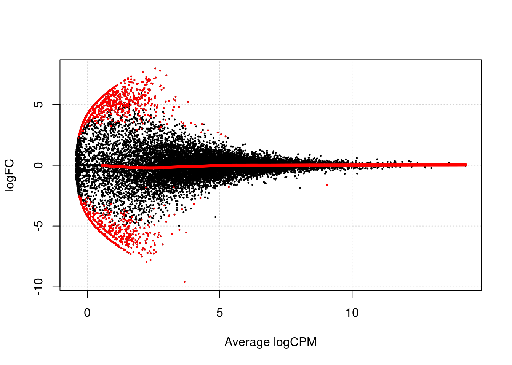

# Dealing with confounders (Reads)


```r
library(scRNA.seq.funcs)
library(RUVSeq)
library(scater, quietly = TRUE)
library(scran)
library(edgeR)
options(stringsAsFactors = FALSE)
reads <- readRDS("blischak/reads.rds")
reads.qc <- reads[fData(reads)$use, pData(reads)$use]
endog_genes <- !fData(reads.qc)$is_feature_control
erccs <- fData(reads.qc)$is_feature_control
```

## Remove Unwanted Variation

### RUVg


```r
ruvg <- RUVg(counts(reads.qc), erccs, k = 1)
set_exprs(reads.qc, "ruvg1") <- ruvg$normalizedCounts
ruvg <- RUVg(counts(reads.qc), erccs, k = 2)
set_exprs(reads.qc, "ruvg2") <- ruvg$normalizedCounts
set_exprs(reads.qc, "ruvg2_logcpm") <- log2(t(t(ruvg$normalizedCounts) / 
                                           colSums(ruvg$normalizedCounts)) + 1)
```

### RUVs


```r
scIdx <- matrix(-1, ncol = max(table(reads.qc$individual)), nrow = 3)
tmp <- which(reads.qc$individual == "NA19098")
scIdx[1, 1:length(tmp)] <- tmp
tmp <- which(reads.qc$individual == "NA19101")
scIdx[2, 1:length(tmp)] <- tmp
tmp <- which(reads.qc$individual == "NA19239")
scIdx[3, 1:length(tmp)] <- tmp
cIdx <- rownames(reads.qc)
ruvs <- RUVs(counts(reads.qc), cIdx, k = 1, scIdx = scIdx, isLog = FALSE)
set_exprs(reads.qc, "ruvs1") <- ruvs$normalizedCounts
ruvs <- RUVs(counts(reads.qc), cIdx, k = 2, scIdx = scIdx, isLog = FALSE)
set_exprs(reads.qc, "ruvs2") <- ruvs$normalizedCounts
set_exprs(reads.qc, "ruvs2_logcpm") <- log2(t(t(ruvs$normalizedCounts) / 
                                           colSums(ruvs$normalizedCounts)) + 1)
```

## Effectiveness 1


```r
plotPCA(
    reads.qc[endog_genes, ],
    colour_by = "batch",
    size_by = "total_features",
    shape_by = "individual",
    exprs_values = "ruvg1") +
    ggtitle("PCA - RUVg normalisation: k = 1")
```


```r
plotPCA(
    reads.qc[endog_genes, ],
    colour_by = "batch",
    size_by = "total_features",
    shape_by = "individual",
    exprs_values = "ruvg2") +
    ggtitle("PCA - RUVg normalisation: k = 2")
```


```r
plotPCA(
    reads.qc[endog_genes, ],
    colour_by = "batch",
    size_by = "total_features",
    shape_by = "individual",
    exprs_values = "ruvs1") +
    ggtitle("PCA - RUVs normalisation: k = 1")
```


```r
plotPCA(
    reads.qc[endog_genes, ],
    colour_by = "batch",
    size_by = "total_features",
    shape_by = "individual",
    exprs_values = "ruvs2") +
    ggtitle("PCA - RUVs normalisation: k = 2")
```


```r
plotPCA(
    reads.qc[endog_genes, ],
    colour_by = "batch",
    size_by = "total_features",
    shape_by = "individual",
    exprs_values = "ruvs2_logcpm") +
    ggtitle("PCA - RUVs normalisation log2-cpm: k = 2")
```


## Effectiveness 2


```r
boxplot(
    list(
        "Raw counts" = calc_cell_RLE(counts(reads.qc), erccs),
        "RUVg (k = 1)" = calc_cell_RLE(assayData(reads.qc)$ruvg1, erccs),
        "RUVg (k = 2)" = calc_cell_RLE(assayData(reads.qc)$ruvg2, erccs),
        "RUVs (k = 1)" = calc_cell_RLE(assayData(reads.qc)$ruvs1, erccs),
        "RUVs (k = 2)" = calc_cell_RLE(assayData(reads.qc)$ruvs2, erccs)
    )
)
```


## Effectiveness 3


```r
keep <- c(
    sample(which(reads.qc$batch == "NA19101.r1"), 20), 
    sample(which(reads.qc$batch == "NA19101.r2"), 20),
    sample(which(reads.qc$batch == "NA19101.r3"), 20)
)
design <- model.matrix(~reads.qc[, keep]$batch)
```

### DE (raw counts)

```r
dge1 <- DGEList(
    counts = counts(reads.qc[, keep]), 
    norm.factors = rep(1, length(keep)),
    group = reads.qc[, keep]$batch
)
dge1 <- estimateDisp(dge1, design = design, trend.method = "none")
plotBCV(dge1)
```


```r
fit1 <- glmFit(dge1, design)
res1 <- glmLRT(fit1)
topTags(res1)
```

```
## Coefficient:  reads.qc[, keep]$batchNA19101.r3 
##                     logFC    logCPM       LR       PValue         FDR
## ENSG00000137573 -7.909508 2.5856585 28.32163 1.027418e-07 0.001074317
## ENSG00000154645  7.445194 2.8665074 27.37270 1.677831e-07 0.001074317
## ENSG00000180938  7.048657 1.5534772 26.59188 2.512975e-07 0.001074317
## ENSG00000113369  7.192863 3.4165594 26.47075 2.675592e-07 0.001074317
## ENSG00000167394  6.435089 1.2303118 25.89923 3.597118e-07 0.001155466
## ENSG00000132481 -6.969242 1.4367953 25.03349 5.634316e-07 0.001508212
## ENSG00000142910  6.143836 0.9292303 23.78570 1.076794e-06 0.002470626
## ENSG00000183454 -5.996570 1.0650176 22.75445 1.840771e-06 0.002663403
## ENSG00000140945  7.393902 1.7599277 22.58021 2.015497e-06 0.002663403
## ENSG00000196167 -7.118859 1.5550767 22.50988 2.090651e-06 0.002663403
```

```r
summary(decideTestsDGE(res1))
```

```
##    [,1] 
## -1   474
## 0  14794
## 1    793
```

```r
plotSmear(
    res1, lowess = TRUE,
    de.tags = rownames(topTags(res1, n = sum(abs(decideTestsDGE(res1))))$table)
)
```



### DE (RUVg, k = 2)

```r
design_ruvg <- model.matrix(~ruvg$W[keep,] + reads.qc[, keep]$batch)
head(design_ruvg)
```

```
##   (Intercept) ruvg$W[keep, ]W_1 ruvg$W[keep, ]W_2
## 1           1      -0.020946537      -0.020047056
## 2           1       0.008931452       0.004583123
## 3           1      -0.031307228      -0.057449367
## 4           1      -0.014831372       0.052099146
## 5           1      -0.007980392       0.018899126
## 6           1      -0.043849638       0.027039666
##   reads.qc[, keep]$batchNA19101.r2 reads.qc[, keep]$batchNA19101.r3
## 1                                0                                0
## 2                                0                                0
## 3                                0                                0
## 4                                0                                0
## 5                                0                                0
## 6                                0                                0
```

```r
dge_ruvg <- estimateDisp(dge1, design = design_ruvg, trend.method = "none")
plotBCV(dge_ruvg)
```


```r
fit2 <- glmFit(dge_ruvg, design_ruvg)
res2 <- glmLRT(fit2)
topTags(res2)
```

```
## Coefficient:  reads.qc[, keep]$batchNA19101.r3 
##                     logFC    logCPM       LR       PValue          FDR
## ENSG00000101605 -5.131713 0.8781842 37.43419 9.455008e-10 1.518569e-05
## ENSG00000157343  5.775405 1.3437040 35.75704 2.235226e-09 1.794998e-05
## ENSG00000187479  5.488312 0.7054321 33.09826 8.761703e-09 4.597673e-05
## ENSG00000174482  5.140557 0.8213360 32.23282 1.367613e-08 4.597673e-05
## ENSG00000163352  5.028497 0.4422049 31.81675 1.694252e-08 4.597673e-05
## ENSG00000183578  4.983634 0.4190151 31.55492 1.938784e-08 4.597673e-05
## ENSG00000123901  5.484698 1.3010160 31.49083 2.003842e-08 4.597673e-05
## ENSG00000167664  4.787929 0.3222700 30.40118 3.513136e-08 7.053059e-05
## ENSG00000101883  4.761098 0.5575620 30.09642 4.110884e-08 7.336102e-05
## ENSG00000221947  4.601616 0.2384918 29.30598 6.180469e-08 9.926452e-05
```

```r
summary(decideTestsDGE(res2))
```

```
##    [,1] 
## -1   355
## 0  15273
## 1    433
```

```r
plotSmear(
    res2, lowess = TRUE,
    de.tags = rownames(topTags(res2, n = sum(abs(decideTestsDGE(res2))))$table)
)
```


### DE (RUVs, k = 2)

```r
design_ruvs <- model.matrix(~ruvs$W[keep,] + reads.qc[, keep]$batch)
head(design_ruvs)
```

```
##   (Intercept) ruvs$W[keep, ]W_1 ruvs$W[keep, ]W_2
## 1           1         0.3439868         0.1636682
## 2           1         0.3622493         0.2150420
## 3           1         0.2907188         0.2065969
## 4           1         0.2947330         0.1690802
## 5           1         0.3521279         0.2034467
## 6           1         0.3458953         0.2243103
##   reads.qc[, keep]$batchNA19101.r2 reads.qc[, keep]$batchNA19101.r3
## 1                                0                                0
## 2                                0                                0
## 3                                0                                0
## 4                                0                                0
## 5                                0                                0
## 6                                0                                0
```

```r
dge_ruvs <- estimateDisp(dge1, design = design_ruvs, trend.method = "none")
plotBCV(dge_ruvs)
```


```r
fit3 <- glmFit(dge_ruvs, design_ruvs)
res3 <- glmLRT(fit3)
topTags(res3)
```

```
## Coefficient:  reads.qc[, keep]$batchNA19101.r3 
##                     logFC    logCPM       LR       PValue          FDR
## ENSG00000196735 -6.627814 0.6698358 40.61413 1.854611e-10 2.945612e-06
## ENSG00000088386 -7.022287 0.9018009 38.23570 6.269486e-10 2.945612e-06
## ENSG00000171246 -8.878301 2.5124354 37.99784 7.082312e-10 2.945612e-06
## ENSG00000137252 -6.367665 0.5580119 37.76730 7.970687e-10 2.945612e-06
## ENSG00000159714  5.583884 0.4357527 37.49387 9.170077e-10 2.945612e-06
## ENSG00000127533 -6.254513 0.5302622 36.13569 1.840454e-09 4.926589e-06
## ENSG00000103888 -6.824078 0.8399809 35.18949 2.991338e-09 6.863413e-06
## ENSG00000137857  5.031047 0.2044464 33.83035 6.013348e-09 1.207255e-05
## ENSG00000205147  4.979481 0.1850485 33.47823 7.206600e-09 1.286058e-05
## ENSG00000256043 -8.005974 1.4609944 33.26228 8.052966e-09 1.293387e-05
```

```r
summary(decideTestsDGE(res3))
```

```
##    [,1] 
## -1   317
## 0  15405
## 1    339
```

```r
plotSmear(
    res3, lowess = TRUE,
    de.tags = rownames(topTags(res3, n = sum(abs(decideTestsDGE(res3))))$table)
)
```


```r
reads.qc <- scran::computeSumFactors(reads.qc, sizes = 15)
dge_ruvs$samples$norm.factors <- sizeFactors(reads.qc)[keep]
dge_ruvs_sf <- estimateDisp(dge_ruvs, design = design_ruvs, trend.method = "none")
plotBCV(dge_ruvs_sf)
```


```r
fit4 <- glmFit(dge_ruvs_sf, design_ruvs)
res4 <- glmLRT(fit4)
topTags(res4)
```

```
## Coefficient:  reads.qc[, keep]$batchNA19101.r3 
##                     logFC    logCPM       LR       PValue          FDR
## ENSG00000196735 -6.618391 0.4597559 39.15887 3.906847e-10 3.270591e-06
## ENSG00000159714  5.851501 0.5711040 39.07769 4.072711e-10 3.270591e-06
## ENSG00000088386 -7.054948 0.6929213 37.00938 1.175624e-09 5.582321e-06
## ENSG00000137252 -6.370105 0.3485425 36.68241 1.390280e-09 5.582321e-06
## ENSG00000171246 -8.603616 2.5028361 35.90728 2.069342e-09 6.647141e-06
## ENSG00000137857  5.298101 0.2662884 35.39045 2.698070e-09 7.222285e-06
## ENSG00000205147  5.246250 0.2400972 35.03528 3.237851e-09 7.390771e-06
## ENSG00000127533 -6.254604 0.3217455 34.78534 3.681350e-09 7.390771e-06
## ENSG00000103888 -6.843206 0.6291574 34.15122 5.099120e-09 9.099664e-06
## ENSG00000250120  5.074331 0.1587281 33.87962 5.862965e-09 9.416508e-06
```

```r
summary(decideTestsDGE(res4))
```

```
##    [,1] 
## -1   277
## 0  15471
## 1    313
```

```r
plotSmear(
    res4, lowess = TRUE,
    de.tags = rownames(topTags(res4, n = sum(abs(decideTestsDGE(res4))))$table)
)
```


