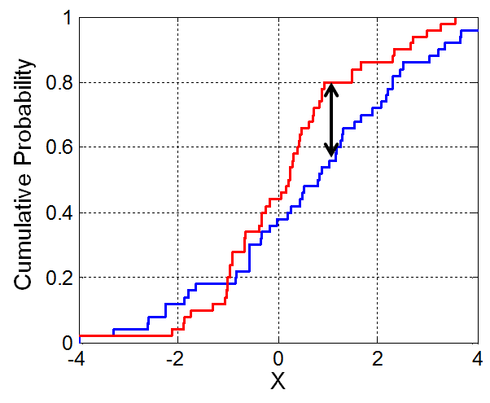

# DE in a synthetic dataset


```r
library(scRNA.seq.funcs)
library(DESeq2)
library(scde)
library(ROCR)
library(limma)
set.seed(1)
```

## Dataset

We start by generating samples using the Poisson-Beta distribution,
using 100 genes from 50 cells. To simulate the second experimental
condition we select one of the three parameters for each gene and
modify it by multiplying by a normally distributed random factor.


## DE in scRNA-seq

For bulk data, each gene is represented by a single value and to
identify DEGs we need to identify those genes where the difference in
expression between two conditions is sufficiently large. Replicates
are needed for us to be able to assess the fold-change as well as its
significance.

For single-cell data, the situation is more complicated; instead of
comparing two means we are faced with the task of comparing two
probability distributions. There are many different functions
available for comparing two probability distributions (e.g. [Total
variation
distance](https://en.wikipedia.org/wiki/Total_variation_distance_of_probability_measures)
and [Kullback-Leibler divergence](https://en.wikipedia.org/wiki/Kullback%E2%80%93Leibler_divergence)),
and since they emphasize different features, they have different
properties.

To establish a ground-truth, we arbitrarily assign genes where one of
the parameters has changed by more than a factor of 4 as being true
positives. Remaining genes are considered not significantly changed.


## Kolmogorov-Smirnov test

The types of test that are easiest to work with are non-parametric
ones. The most commonly used non-parametric test is the
[Kolmogorov-Smirnov test](https://en.wikipedia.org/wiki/Kolmogorov%E2%80%93Smirnov_test) (KS-test) and we can use it to compare the distributions for each gene
in the two conditions.

The KS-test quantifies the distance between the empirical cummulative distributions of the expression of each gene in each of the two populations. It is sensitive to changes in mean experssion and changes in variability. However it assumes data is continuous and may perform poorly when data contains a large number of identical values (eg. zeros).

<div class="figure" style="text-align: center">

<p class="caption">(\#fig:ks-statistic)Illustration of the two-sample Kolmogorov–Smirnov statistic. Red and blue lines each correspond to an empirical distribution function, and the black arrow is the two-sample KS statistic. (taken from [here](https://en.wikipedia.org/wiki/Kolmogorov%E2%80%93Smirnov_test))</p>
</div>


Using the standard p-value cut-off .05, we can find out how many genes
that were called as significantly different.


```
## 4 11 14 15 24 28 31 35 39 54 55 56 58 61 67 68 70 75 83 84 87 92 93 95 97 99
```

```
## 13 28 31 35 40 55 56 61 67 84 87 97
```

```
## 28 31 35 55 56 61 67 84 87 97
```

## Performance of KS test

The genes identified by the KS-test differs substantially from the
ground truth. Instead of considering the absolute number of identified
genes, it is often more informative to consider [False positive rate](https://en.wikipedia.org/wiki/False_positive_rate) (FPR) and the
[True positive rate](https://en.wikipedia.org/wiki/Sensitivity_and_specificity)
(TPR). The False positive rate is defined as FPR = FP/(FP + TP) and
the True positive rate as TPR = TP/(TP + FN), where FP is the number
of false positives, TN the number of true negatives, TP the number of
true negatives and FN the number of false negatives.


```
## 0.3846154 0.02702703
```

As you can see, the p-value cut-off .05 results in a low TPR and a
high FPR. That is, the test has failed to identify many of the genes
that were truly changed and many of the changed genes were not
detected.

Clearly, there is a trade-off between TPR and FPR. If one is willing
to accept a higher FPR, then one will be able to achieve a higher
TPR. The relationship between FPR and TPR is typically shown as a
receiver-operator-characteristic (ROC) curve. To generate and plot the
ROC curve, we need to change the p-value cut-off. 

To facilitate the plotting, we use the package "ROCR"

<div class="figure" style="text-align: center">

<p class="caption">(\#fig:synthetic-roc-curve-ks)Different distributions of read counts for a single genes across 50 cells based on the Poisson-Beta model corresponding to different paramete sets</p>
</div>

Often we are interested in comparing several ROC curves. To carry out
such a comparison, we need to summarize the entire curve using only
one scalar value. This can be achieved by calculating the area under
the ROC curve (AUROC). Since an ROC curve has to stay above the
diagonal (why?) the AUROC will be between .5 and 1.


```
## [1] 0.7837838
```

__Exercise__: Compare the AUC values when you change some of the
parameters in the analysis, e.g. number of cells, number of genes,
threshold for considering a gene differentially expressed,
distribution of parameter values, distribution of fold-changes. What
factors make it easy or hard to identify differentially expressed
genes?

## DESeq2

One could still apply bulk DE methods to scRNA-seq data. One of the most popular methods for differential expression analysis for bulk RNA-Seq data is [DESeq2](https://bioconductor.org/packages/release/bioc/html/DESeq2.html). DESeq2 estimates the variability of each gene using a quadratic relationship between mean expression and variability across all samples fit using Bayesian statistics. It then tests for a difference in mean expression across groups based on a negative binomial distribution.

Let's try it out on our synthetic dataset:


Check the performance of DESeq2:

<div class="figure" style="text-align: center">

<p class="caption">(\#fig:synthetic-roc-curve-deseq)Different distributions of read counts for a single genes across 50 cells based on the Poisson-Beta model corresponding to different paramete sets</p>
</div>

```
## [1] 0.8503119
```

__Exercise:__ Based on the AUC-value, does DESeq or the KS-test seem
more accurate? Can you find a parameter regime where the ranking is
changed?

## SCDE

There are yet much fewer methods available for scRNA-seq data than for bulk data, but one better known method is [SCDE](http://hms-dbmi.github.io/scde/index.html). SCDE uses Bayesian statistics to fit a zero-inflated negative binomial distribution to the expression of each gene and tests for differences in mean expression level between groups.
We can use it on the synthetic data:


__Exercise:__ Calculate an AUROC value and compare to the other methods.

__Our answer__:


```
## [1] 0.7830042
```

## Comparison of the methods

From the above analyses it is clear that none of the three methods (KS, DESeq2 and SCDE) is
able to reliably find the majority of the DE genes. A popular strategy
in this situation is to combine two or more methods, in the hope that
genes that were identified by more than method are more likely to be
true positives.


```
## 0.1538462 0
```

The more stringent approach results in a lower FPR at the cost of a lower TPR.

__Exercise:__ Calculate the TPR and FPR for the case when we require two
out of three methods to agree.

## Beyond changes in the mean

In the realm of single-cell analyses, differential expression is no
longer restricted to changes in the mean. As we saw in the previous
chapter, it is possible to change the shape of the distribution
without changing its mean.

__Exercise:__ Repeat the analysis above, but this time only change the
variance, but not the mean. To generate the synthetic data, use the
following command:

```r
nGenes <- 1e2
nCells <- 50
mult <- 2^(rnorm(nGenes, 0, 2))
synData <- scRNA.seq.funcs::GeneratePoiBetaSamples(
    ks = 10^(rnorm(nGenes, 3, .5)),
    as = 10^(rnorm(nGenes, -1, .5)),
    bs = 10^(rnorm(nGenes, 0, .5)),
    mult,
    nGenes,
    nCells,
    meanFixed = TRUE
)
g <- synData$sample1
g2 <- synData$sample2
```

__Our answer__:


```
## [1] 0.8460339
```


```
## [1] 0.4982175
```


```
## [1] 0.4993316
```

Which method
performs the best? Why do some methods perform differently for this
scenario? What are the properties of the genes that are identified as
DE?
